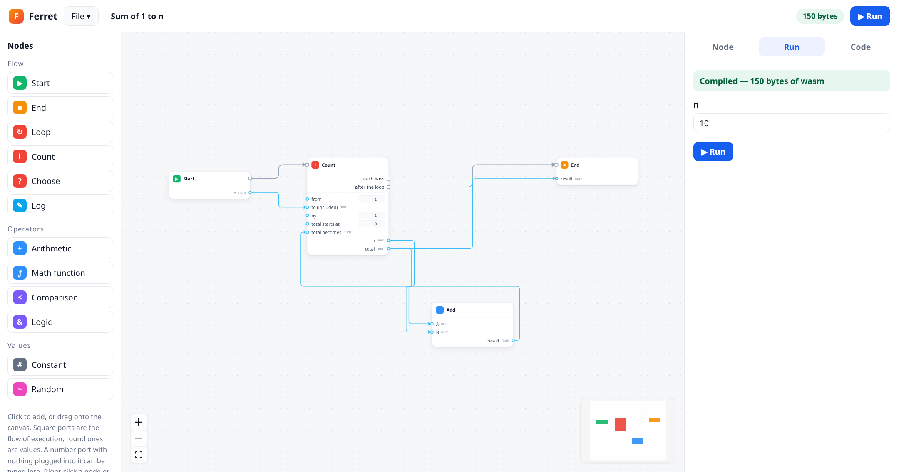

# Ferret

A node-based editor in the browser, and a compiler that turns the graph you
draw into a real WebAssembly module and runs it on the spot.

The point of the exercise is that there is no interpreter behind the canvas.
Dragging an edge changes a graph; the graph is lowered to a small structured
IR, and the IR is written out as `\0asm` bytes by hand — sections, LEB128
lengths, opcodes and all. The page then hands those bytes to
`WebAssembly.instantiate` and calls the exported function. What runs is what
the compiler emitted.



The compiler is OCaml. It builds twice: as `ferretc`, a command-line compiler
that reads a graph and writes a `.wasm` file, and — through js\_of\_ocaml — as a
script the editor loads, so the browser and the terminal run the same code.

## Running it

```
cd editor
npm install
npm run dev
```

`npm run dev` builds the OCaml compiler to JavaScript first (so you need an
opam switch with `yojson` and `js_of_ocaml`), drops it in `editor/public/`, and
then starts Vite on <http://localhost:5173>.

**File** in the toolbar starts a new flow, opens a `.json` one, saves the
current one, or loads an example. What it saves is the same file `ferretc`
takes on the command line, so a flow drawn in the editor can be compiled from
a terminal without a conversion step. Whatever you last edited is kept in the
browser and comes back on reload.

Without the editor:

```
dune test
dune exec compiler/bin/ferretc.exe -- examples/collatz.json -o collatz.wasm
dune exec compiler/bin/ferretc.exe -- --emit wat examples/collatz.json
dune exec compiler/bin/ferretc.exe -- --emit ir examples/sum.json
```

The host has to supply both imports; `compiler/test/run_wasm.mjs` shows the
whole of what that takes.

## The graph is the program

A graph has two kinds of edge, drawn differently and checked separately.

**Exec edges** — square ports — say what happens next. Execution starts at the
one Start node and follows them. **Data edges** — round ports — say where a
value comes from, and are pulled backwards from whatever needs them.

| node | what it is |
| --- | --- |
| Start | the entry point; its inputs are the exported function's parameters |
| End | return a value |
| Count | a loop that keeps the counter for you: `from`, `to`, `by` |
| Loop | the general loop, whose condition is whatever you plug in |
| Choose | the only branch: one of two values, by a condition |
| Log | call the imported `env.log` with a value |
| Constant, Random, Arithmetic, Math function, Comparison, Logic | the expression nodes |

Choose has no square ports, so it is an expression like the rest of them; it
sits under Flow in the palette because since the exec-side `if` went away it
is the only way to branch, and that is where you go looking for one.

An operator node takes the name of the operator it is set to: the palette
offers Arithmetic, and the card reads Multiply once you pick `×`.

A number port with nothing plugged into it is a place to type a number, so a
one-off constant does not need a node of its own; the Constant node is for
when the same number is wanted in several places.

Every value is an `f64`, except conditions, which are `i32` used as booleans.
Mixing the two is what the type check catches: a loop's `while` port will not
accept a number, and End's `result` will not accept a comparison.

## No assignment, and one node that holds state

There is nothing in the graph that writes a variable. A value either arrives
along an edge or comes out of a loop, and Choose — condition, value if true,
value if false — is how a value depends on a test.

That leaves the question of how a loop gets anywhere, and the answer is that
the loop node carries the state itself. It declares named slots; each slot
gets a `starts at` input, a `becomes` input and an output for its current
value. The condition and the next-value expressions read the outputs, so the
picture has a cycle in it exactly where the program does. The loop node is the
phi, written down:

```
current value ──> ...expression nodes... ──> becomes
```

All of a loop's next values are computed from the state as it stood at the top
of the iteration, and applied together, so two slots that refer to each other
behave the way simultaneous assignment does rather than depending on the order
the editor happens to list them in. The `each pass` chain runs before that,
with the values the iteration started with.

Counting is the case that gets tedious written that way — a slot, a
comparison and an increment for something a `for` says in one line — so Count
is the same node with one slot it owns. It runs from `from` up to and
including `to`, gains `by` each pass, and offers the counter as an output;
state slots sit beside it for whatever the count is adding up. Sum of 1 to n
is four nodes with it and six without.

Which way it counts follows from the step. When `by` is a literal, which it
nearly always is, the compiler knows the sign and the loop tests one thing —
`i <= to` or `i >= to`. When it is worked out at run time, the test becomes
`(i - to) * by <= 0`, which reads the same either way.

Because the only branch is an expression and the only loop is one node, the
exec edges form a straight chain with loop bodies hanging off it. The back end
therefore needs no control-flow graph, no dominators and no relooper to
rebuild the `block`/`loop`/`br` nesting wasm requires. Wiring two chains into
one node is rejected rather than structured after the fact.

## The pipeline

| module | what it does |
| --- | --- |
| `compiler/lib/graph.ml` | reads React Flow's own save format; ports are `sourceHandle`/`targetHandle` |
| `compiler/lib/lower.ml` | validates, type checks, and lowers the graph to the IR |
| `compiler/lib/ir.ml` | one function: `f64` parameters, typed locals, structured statements |
| `compiler/lib/wasm.ml` | the binary writer — LEB128, sections, opcodes |
| `compiler/lib/emit.ml` | IR to a module |
| `compiler/lib/wat.ml` | the same instruction stream as text, for the editor's Code tab |

Lowering is two walks over the same graph. The forward walk follows exec edges
from Start and turns each node into a statement; the backward walk follows data
edges from an input port and builds an expression tree, refusing to loop. The
backward walk stops at a loop's current-value output, which is a local — that is what
keeps the cycle in the picture from being a cycle in the recursion.

The IR below is an ordinary imperative core with assignment and `while`, so
the locals, the temporaries that make a loop's updates simultaneous, and the
`_next` names in the wat all appear during lowering. None of them exist in the
graph.

Errors are collected rather than thrown at the first one, and each carries the
id of the node that caused it, so the editor can outline the offending node
and print the message underneath it. The editor recompiles on every edit,
which is what makes that feel like a linter rather than a build step.

A node whose output feeds several inputs is computed once, into a local, and
read from there. With no way to name an intermediate value in the graph,
sending one output to many places is how you are meant to work, and expanding
it at every use doubles the emitted code at every level: a chain of twenty
nodes wired that way took five seconds and twelve megabytes before this, and
219 bytes after.

What makes hoisting sound is that it is scoped to a *group* — one statement,
a loop's condition, a loop's whole set of next values — and a group never
writes a local that its own expressions read. Nothing is shared across
groups, so a value read on either side of a loop's update is read twice, as
it must be.

The one expression that needs a scratch local of its own is `%`, which wasm
has no instruction for: it becomes `x - trunc(x / y) * y`, with each operand
parked in a local so neither runs twice.

The generated module imports `env.log` and `env.random`, and exports `main`.
Nothing else: no memory, no table, no globals.

## Whole numbers

Every number used to be an f64. Now the lowering types them: a literal that is
whole is an i64, and so is anything built only out of those. A value widens
where it meets an f64 — a start node's inputs arrive from the host as f64, a
quotient is not whole even when both ends are, and `log`, `end` and a
breakpoint all hand f64s back — and it never narrows.

```
fun main() -> f64 {
  var i : int = 0
  i = 0
  while (i < 10) {          <- i64.lt_s
    log float((i % 3))      <- i64.rem_s, then one convert for the host
    i = (i + 1)             <- i64.add
  }
  return (float(i) / 2)
}
```

A loop's slot cannot be typed by looking at it once, because its next value
reads the slot. So the whole lowering is its own fixpoint: it starts by
assuming every slot is whole and runs again whenever that turns out to be too
narrow. An assumption only ever loosens, so it settles in at most one pass per
slot. That is why the collatz example ends up with `steps` as an i64 and `cur`
as an f64 — `cur` starts from the function's parameter, and halving it would
not stay whole anyway.

What it buys, in bytes:

| | every number an f64 | whole numbers as i64 |
| --- | --- | --- |
| Sum of 1 to n | 169 | **150** |
| Collatz steps | 242 | **237** |
| π by throwing darts | 290 | **261** |
| the typing fixture above | 188 | **147** |

An `f64.const` is nine bytes and an `i64.const` is two, which is most of it,
and `%` on whole numbers is one instruction instead of the eight and two
scratch locals it takes to fake on floats.

Two things change beyond speed and size, and both are the point rather than an
accident. `sum(100000)` is 5,000,050,000, which is past what an i32 holds —
that is why the whole-number type is i64 and not i32. And an i64 stays exact
past 2^53, where an f64 starts rounding, so an integer program is now more
accurate, not less; the one place it is worse is that `%` by zero traps
instead of producing a NaN.

## The one impure node

Random is the only expression that is not a function of its inputs, which
makes the two places that assume purity worth spelling out.

Sharing decides how often it is drawn. A node's output feeding several inputs
is computed once, so **the node is the draw**: wire one Random into both sides
of a multiply and you square one number, rather than multiplying two different
ones. Two Random nodes are two draws. That is what the π example relies on.

Choose evaluates both arms, because it compiles to wasm's `select` rather than
a branch. A Random in the arm that is not taken is still drawn. Nothing else
in an expression can trap or be observed, so this is the only case where that
matters.

`random(min, max)` is `min + random() * (max - min)`, which reads `min` twice;
as with `%`, it is parked in a scratch local first, unless it is already a
literal or a local.

## Breakpoints

Right-click a node and add a breakpoint, and the compiler plants a call to a
third import, `env.watch(index, value) -> value`, where that node's value is
worked out. The call hands the number to the page and gives it straight back,
so the program computes what it would have computed either way; what changes
is that the page now sees it.

Where the call goes follows from the sharing rule. A node that feeds several
inputs is computed once, so its breakpoint is hit once per evaluation rather
than once per reader. A breakpoint on a loop is different: it reports every
slot of its state from the top of each iteration, rather than every time a
slot is read, which is the thing you actually want to watch.

`--emit ir` shows exactly where they landed:

```
loop {
  watch#0(cur)
  watch#1(steps)
  exit unless (cur != 1)
  log cur
  cur_next = watch#2((if ((cur % 2) == 0) then (cur / 2) else ((3 * cur) + 1)))
  ...
```

The compiler returns the table those indices point into — node id and label
per index — so the Run panel can name what it stopped at.

Stopping at one is the awkward part. A wasm call is synchronous: the only way
to hold a program inside one is to hold the thread it runs on, so the worker
blocks in `Atomics.wait` on a `SharedArrayBuffer` the page can write to, and
Continue is a store and a notify. That needs the page to be cross-origin
isolated, which is why the Vite config sends COOP and COEP. Served without
those headers everything still works, minus the stopping: the run reports each
hit and finishes, and the panel says so. The runaway-loop clock is stopped
while a breakpoint holds the run, so thinking at one is not mistaken for
hanging.

## Running what was generated

The editor instantiates the module in a Web Worker rather than on the UI
thread. A Loop node is enough to write a loop that never ends, and a worker
can be killed after three seconds; a hung tab cannot.

## What is deliberately missing

There is one function and no calls, so there is no recursion and no function
section worth the name. There are no arrays, strings or memory — every value
is a number. Beyond the sharing described above there is no optimiser: the
emitter is a direct syntax-directed walk of the IR, so `x + 0` survives into
the bytes.
