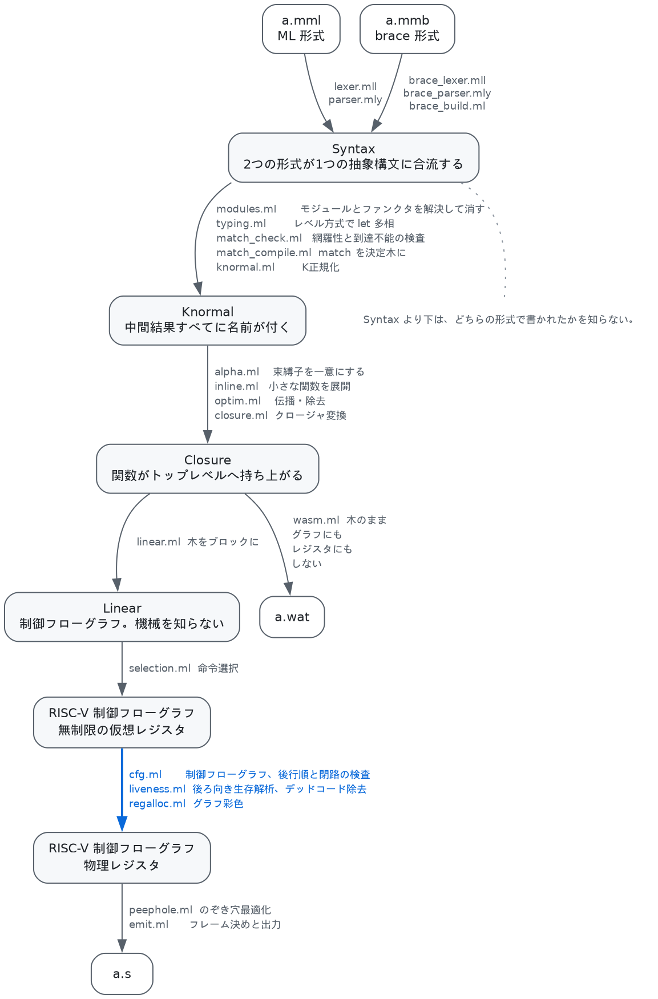

# 0. プログラムが機械語になるまで

1本のプログラムが全パスを通り抜けるまでを、各パス1段落ずつで追います。ここで全体の形を
つかんでから、1章以降でパスごとの中身に入ります（[目次](index.md)）。



**`Syntax` より下は、そのプログラムがどちらの形で書かれたかを知りません。** 2つの構文が
1つの抽象構文に合流するのがこの図のいちばんの要点です。

## 題材

リストの総和です。データ型、パターンマッチ、再帰呼び出し、ヒープ確保という、
このコンパイラの主な機構がひととおり入る最小の例です。

```
type chain = Nil | Cons of int * chain

let rec sum l =
  match l with
  | Nil -> 0
  | Cons (x, rest) -> x + sum rest
in
print_int (sum (Cons (1, Cons (2, Nil))));
print_newline ()
```

**構文解析**（[詳説](01-syntax.md)）。`type` 宣言は本体より前にまとめて置くので、本体を読む
時点でコンストラクタ表が完成しています。`Cons (1, rest)` は「`Cons` を1個の括弧付きタプルに
適用したもの」として読み、アクションでコンストラクタに畳み直します。

**名前解決**（[詳説](02-modules.md)）。この例にモジュールはないので素通りします。

**型推論**（[詳説](03-typing.md)）。`sum : chain -> int` が付きます。`chain` は公称型なので、
`match` のコンストラクタがどの型のものかもここで決まります。

**パターンマッチ**（[詳説](04-matching.md)）。`match` が決定木になります。網羅されているので
警告は出ません。

**K正規化**（[詳説](05-knormal.md)）。`match` はもう存在せず、タグの読み出しと比較と分岐です。

```
$ martenmlc --dump-knf -o /dev/null examples/sum.mml
let rec sum.18 l.19 =
  let t.8.21 : int =
    l.19[0]                    ← タグの読み出し
  in
  let t.9.22 : int =
    0
  in
  if t.8.21 = t.9.22 then      ← タグ 0 なら Nil
    0
  else
    let fld.6.23 : int =
      l.19[1]                  ← x
    in
    let fld.7.24 : chain =
      l.19[2]                  ← rest
    in
    let t.10.27 : int =
      sum.18 fld.7.24
    in
    fld.6.23 + t.10.27
in
```

**インライン展開**（[詳説](05-knormal.md#3-インライン展開--inlineml)）。ここでは何も起きません。
`sum` は自分を呼ぶので対象外です。展開されるのは小さな非再帰関数だけで、この題材には1つも
ありません。

**クロージャ変換**（[詳説](06-closure.md)）。`sum` は何も捕獲しないので、再帰呼び出しは
ラベルへの直接呼び出しです。クロージャは1つも作られません。

```
$ martenmlc --dump-closure -o /dev/null examples/sum.mml
    let t.10.27 : int =
      call martenml_sum_18 (fld.7.24)   ← 直接呼び出し
```

**線形IR**（[詳説](07-selection.md)）。木がブロックになります。ここまでは対象機械を
何も知りません。

```
$ martenmlc --dump-linear -o /dev/null examples/sum.mml
  martenml_sum_18:
    t.8.21 <- l.19[0]
    t.9.22 <- 0
    if t.8.21 = t.9.22 then .Lthen36 else .Lelse37   ← 枝が2つのブロックに
```

**命令選択**（[詳説](07-selection.md)）。同じグラフが RISC-V になります。入口で callee-saved
12本を仮想レジスタへ写し、各 `ret` の直前で書き戻すコードが入ります。

```
$ martenmlc --dump-riscv -o /dev/null examples/sum.mml
function martenml_sum_18 (20 registers, 0 spill slots)
  martenml_sum_18:
    mv v0, s0            ┐ callee-saved を仮想レジスタに退避
    ...                  │ （12本ぶん）
    mv v11, s11          ┘
    mv v12, a0           ← 引数
    ld v13, 0(v12)
    beq v13, zero, .Lthen36 else .Lelse37
```

**レジスタ割り付け**（[詳説](08-regalloc.md)）。41個の `mv` が41個とも融合で消え、代わりに
呼び出しをまたいで生きる `x` がスタックに落ちます。

```
$ martenmlc --dump-regalloc -o /dev/null examples/sum.mml
martenml_sum_18: 2 round(s), 41/41 moves coalesced, 1 spill slot(s) [spilled v16]
```

**のぞき穴最適化とアセンブリ出力**（[詳説](09-emit.md)）。17命令になりました。

```
martenml_sum_18:
	addi sp, sp, -16
	sd ra, 8(sp)
	ld t0, 0(a0)             ← タグ
	bne t0, zero, .Lelse37   ← 条件を反転して .Lthen36 へ落とす
.Lthen36:
	li a0, 0
	ld ra, 8(sp)
	addi sp, sp, 16
	ret
.Lelse37:
	ld t0, 8(a0)             ← x
	sd t0, 0(sp)             ← スピル。呼び出しをまたぐので
	ld a0, 16(a0)            ← rest（そのまま引数レジスタへ）
	call martenml_sum_18
	ld t0, 0(sp)
	add a0, t0, a0
	ld ra, 8(sp)
	addi sp, sp, 16
	ret
```

`sum` は callee-saved を1本も使わないので退避が一切なく、`rest` は読み出した先がそのまま
引数レジスタ `a0` です。

## もう1つの出口

図の分岐に気づいたかもしれません。**クロージャ変換のあと、WebAssembly へ抜ける道が
あります**（[詳説](10-wasm.md)）。線形IRも命令選択もレジスタ割り付けも通りません。wasm は
制御フローが構造化されていて `if` が `if` のまま書け、ローカルをいくらでも宣言できるので、
**上の4段が丸ごと不要になる**からです。同じ `sum` がこうなります。

```
$ martenmlc -target wasm examples/sum.mml
    local.get $t.8.21
    local.get $t.9.22
    i64.eq
    if (result i64)          ← ブロックにならない
      i64.const 0
    else
      ...
```

例題18本はどちらの対象でも走り、**同じゴールデンファイル**と突き合わせています。

## 参考文献

各パスの文献は、それぞれの文書の末尾にあります。全体の並び — K正規化・α変換・インライン
展開・最適化・クロージャ変換と、既知関数の楽観的な判定 — は次に倣っています。

- E. Sumii, [*MinCaml: a simple and efficient compiler for a minimal functional
  language*][mincaml], FDPE 2005（[PDF][mincaml-pdf]）。バックエンドは別物で、こちらは
  AST を辿るのではなく制御フローグラフを作ります。

[mincaml]: https://doi.org/10.1145/1085114.1085122
[mincaml-pdf]: https://esumii.github.io/min-caml/paper.pdf

---

[目次](index.md) ／ [1. 構文解析 →](01-syntax.md) ／ [10. もう1つのバックエンド](10-wasm.md)
