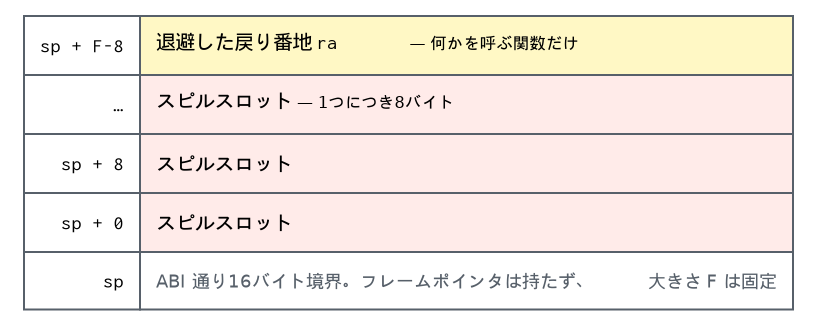

# のぞき穴最適化とアセンブリ出力 — `peephole.ml`, `emit.ml`

割り付けが終わって、仮想レジスタが物理レジスタになったあとの2つのパスです。**実レジスタに
なって初めて見えるもの**を片づけてから、フレームを決めて印字します。

## 1. のぞき穴最適化 — `peephole.ml`

レジスタが実レジスタになって初めて見えるものがあります。

- スピルは値を書いてすぐ読み戻すことがある（`sd t0, 0(sp)` の数命令あとに `ld t1, 0(sp)`）
- 融合しきれなかった `mv` が、別名で同じ値を写しているだけのことがある
- 同じ定数・同じアドレス・同じ計算が、同じブロックで二度出ることがある

どれも基本ブロック1つの中の事実です。ブロックを前から1回走査し、憶えながら書き換えます。
憶えるのは4つ — どのレジスタが同じ値を持つか、どの定数がもう作ってあるか、どのメモリ位置に
何を書いたか、どの計算をもう済ませたか。

| 見つけたもの | すること |
|---|---|
| 直前に書いた位置からの読み出し | `mv` に置き換える（同じレジスタなら削除） |
| すでに同じ値を持つレジスタへの `mv` | 削除 |
| すでに作ってある定数・アドレスの再作成 | 削除 |
| 直前と同じ算術 | `mv` に置き換える |
| ジャンプするだけのブロック | 分岐先を飛ばす（下） |

エイリアシングは保守的に扱います。**別のベース経由のストアが来たら、そのブロックで憶えて
いたメモリの事実は捨てます。** 2つのポインタが同じ場所を指しているかどうかは分からない
からです。同じベースで違うオフセットだけは残します。このコンパイラが出すアクセスはすべて8の
倍数の位置にある64ビット語なので、重なりようがありません。

呼び出しに出会ったら、憶えていることを全部捨てます。呼ばれた側は caller-saved レジスタも
メモリも書けるからです。

### 飛ばしたブロックは消える

本体が空で `Jump` するだけのブロックは、そこへ飛ぶ側が**行き先を読み替えれば飛ばせます**。
両方の枝が同じ場所に着いたら、`Branch` は `Jump` になります。

読み替えたあと、**もとのブロックへの入口が1つもなくなることがあります。** 到達できなく
なったブロックはそこで落とします。判定は[7章 §2](selection.md#2-グラフを歩く--cfgml)の
`Cfg` で、入口から歩けたかどうかを見るだけです。

例題群で**5箇所**。多くはありませんが、放っておくと生存解析が到達しないコードのために
レジスタを取り合わせます。条件が最初から分かっている枝のほうは、ブロックになる前に
[5章 §4](knormal.md#4-最適化--optimml)が落としています。

### ブロックの外へは広げていない

事実をブロックの境界で捨てずに、前任者全員が一致しているものだけ引き継ぐこともできます。
制御フローグラフに閉路がないので、逆後行順に1パス、不動点なしで済みます。

**やっていないのは、測ると取り分が小さいからです。** 例題18ファイルで26命令、0.5%です。
しかもその大半は**通ってきた経路では実際には壊していない callee-saved の復帰**で、これは
**シュリンクラッピング**（退避・復帰を実際に要る区間まで縮める）の領分です。そちらなら
命令がそもそも出てきません。出してから消すほうを足しても、後始末が増えるだけです。

事実を記録するときに落とし穴が1つあります。**行き先が被演算子でもある命令については、何も
記録してはいけません。** `mul t0, t0, t1` から「t0 は t0 * t1 を持つ」と憶えたとします。
そのキーに書いてある t0 は、書き込まれた**後**の t0 です。次に同じ形の乗算が来たとき、
すり替わった値を返してしまいます。`3 * r * r` が `3 * r` になる類の間違いで、
`tests/cases/codegen.mml` がこの場合を含んでいます。

## 2. アセンブリ出力 — `emit.ml`

### ブロックの並べ替え

印字の直前に、ブロックの順を決め直します（`Riscv.relayout`）。**終端命令が次のブロックへ
落ちれば、ジャンプ命令が1つ出ずに済む**からです。`emit.ml` は行き先が次なら `Jump` を
印字せず、`Branch` は偽の枝が次に来るよう条件を反転します。

グラフは[7章 §2](selection.md#2-グラフを歩く--cfgml)の `Cfg` で、落ちる先の好みだけを
`Riscv.relayout` が渡します。入口から辺をたどってトレースを作り、**そのブロックからしか
入れない後続**にだけ延ばします。合流点まで引きずると、他の前任者がジャンプする羽目に
なるからです。

正直に書くと、**今のコードでは1バイトも変わりません**。命令選択が既にトレースと同じ順で
ブロックを吐いているからです。合流点の条件を外して枝を貪欲にたどると、かえって悪化します。
例題42ファイルの無条件ジャンプが 20 から 28 に増えます。それでもこのパスに意味があるのは、
フォールスルーの質が「命令選択がどの順で吐くか」に依存しなくなるからです。

### フレームと印字

ここに来る時点で全レジスタは物理レジスタなので、あとはフレームを決めて印字するだけです。
フレームポインタは持たず、固定サイズで `sp` 相対です。



割り付けから外してあるレジスタが2本あり、ここで使われます。`t5` は命令の12ビット即値に
収まらないオフセットを作るため、`t6` はクロージャを呼び先へ運ぶためです。

最終形はこうなります。

```
martenml_sum_18:
	addi sp, sp, -16
	sd ra, 8(sp)
	ld t0, 0(a0)             ← タグ
	bne t0, zero, .Lelse37   ← 条件を反転して .Lthen36 へ落とす
.Lthen36:
	li a0, 0
	ld ra, 8(sp)
	addi sp, sp, 16
	ret
.Lelse37:
	ld t0, 8(a0)             ← x
	sd t0, 0(sp)             ← スピル。呼び出しをまたぐので
	ld a0, 16(a0)            ← rest（そのまま引数レジスタへ）
	call martenml_sum_18
	ld t0, 0(sp)
	add a0, t0, a0
	ld ra, 8(sp)
	addi sp, sp, 16
	ret
```

17命令。`sum` は callee-saved を1本も使わないので退避が一切なく、`rest` は読み出した先が
そのまま引数レジスタ `a0` です。分岐は、次に置かれるブロックへ落ちるように条件を反転して
あります（`beq ... .Lthen` ではなく `bne ... .Lelse`）。

`main` の末尾も見ておく価値があります。

```
	call martenml_sum_18
	call martenml_print_int     ← sum の結果は a0、print_int の引数も a0。移動なし
	li a0, 0
	...
	tail martenml_print_newline ← 末尾呼び出し。フレームを畳んでジャンプ
```

定数コンストラクタは読み取り専用データになります。

```
	.section .rodata
	.p2align 3
	# chain.Nil
martenml_const_Nil_3:
	.quad 0
```

## 3. 呼び出し規約

RISC-V の標準規約に1つ足しただけです。

| | |
|---|---|
| `a0`–`a7` | 引数と戻り値（最大8個。それ以上はタプルにしてください） |
| `ra` | 戻り番地。何かを呼ぶ関数はプロローグで退避 |
| `t6` | クロージャ経由の呼び出しで、クロージャ自身を運ぶ |
| `t5` | アセンブリ出力の作業用（大きなオフセットの合成） |

残る25本、`a0`–`a7`・`t0`–`t4`・`s0`–`s11` が、アロケータの使えるレジスタです。

末尾呼び出しは本物です。フレームを畳んでからジャンプするので、末尾再帰で書いたループは
スタックを消費しません。`examples/tour.mml` の `count 1 1000000 0` がそれを踏んでいます。

---


## 4. 実行時表現

すべて64ビット1ワードです。

| | |
|---|---|
| `int` / `bool` / `unit` | 値そのもの（`unit` は 0、`true` は 1） |
| タプル | ヒープブロック `[e0 \| e1 \| ...]` |
| コンストラクタ | ヒープブロック `[タグ \| 引数...]`。`Cons (l, v, r)` は `[1 \| l \| v \| r]` |
| 定数コンストラクタ | `.rodata` に1つだけ置いた `[タグ]` のアドレス |
| リスト | 組み込みだが表現は同じ。`[]` は共有された `[0]`、`x :: xs` は `[1 \| x \| xs]` |
| 文字列 | `[長さ \| バイト列...]`。不変で、同じ内容のリテラルは1つのブロックを共有 |
| クロージャ | ヒープブロック `[コードポインタ \| 捕獲した値...]` |
| 配列 | ヒープブロック。長さは持たない |

定数コンストラクタまでボックス化すると、間接参照1回ぶん OCaml より遅くなります。その代わり
**バックエンドは「このワードはポインタか？」を一度も問わずに済みます。**
多相がタダで手に入るのも同じ理由です。

文字列だけがバイト単位でアクセスされます。`s.[i]` はこのコンパイラが**唯一バイト幅の
ロード（`lbu`）を出す場所**で、それ以外はすべて語単位です。のぞき穴最適化のメモリに関する
推論は「どのアクセスも8の倍数位置にある語」を前提にしているので、バイトロードはその推論に
一切参加させていません。

ヒープは `runtime/martenml_runtime.c` のバンプアロケータで、解放はしません。GC を入れるには
コンパイラがポインタの在処を記述する必要があり、それはこのコンパイラが取り組んでいる
主題とは別のプロジェクトです。

## 参考文献

- [RISC-V ABIs Specification][psabi]（riscv-non-isa）。引数は `a0`–`a7`、`s0`–`s11` は
  呼ばれた側が保存、スタックは16バイト境界。§3 で足した1本を除いて、このとおりです。

[psabi]: https://riscv-non-isa.github.io/riscv-elf-psabi-doc/

## 実装の地図

| | |
|---|---|
| `peephole.ml` | 基本ブロックを前から1回走査し、憶えながら書き換えます |
| `peephole.ml` 147–186行 | `thread_jumps` — ジャンプの読み替えと、到達できなくなったブロックの削除 |
| `cfg.ml` 98–129行 | `layout` — フォールスルーを増やすブロック順 |
| `riscv.ml` 282–294行 | `relayout` — 落ちる先の好みを渡して並べ直す |
| `emit.ml` | フレーム決め、命令の印字、`.rodata` の定数 |
| `runtime/martenml_runtime.c` | 入口、ヒープ、`print_*`、`match failure` |

---

[← 8. レジスタ割り付け](regalloc.md) ／ [目次](index.md) ／ [10. もう1つのバックエンド →](wasm.md)
