# グラフ彩色によるレジスタ割り付け

`selection.ml` が吐くのは無制限の仮想レジスタの上のコードで、正しいけれど実行できません。
それを実行できるものに変えるのが `regalloc.ml` で、このコンパイラの他の部分はここに食わせる
ために存在しています。

理論は [Chaitin][chaitin] と [Briggs ら][briggs]、実装の形は
[George と Appel の反復融合][iterated]（iterated register coalescing）、およびそれを
教科書の形にした [Appel の *Modern Compiler Implementation*][appel] 11章に従っています。

以下、題材は[パイプライン解説](pipeline.md)と同じ `examples/sum.mml` です。

全体の流れを先に示します。4つの判定が縦に並んでいるのは `regalloc.ml` の `work ()` の
`if ... else if ...` の連鎖そのもので、**上ほど優先**します。細部は §3 以降で。


---

## 1. 問題

**同時に生きている値は同じレジスタに置けない**。それだけです。

これをグラフにします。節点はレジスタ（仮想・物理の両方）、辺は「この2つは同時に生きている」。
すると割り付けは、隣り合う節点が同じ色にならないように K 色で塗る問題になります。K は機械が
持つレジスタの本数、ここでは25です。

```
a0–a7   8本   引数と戻り値。呼び出しで壊れる
t0–t4   5本   一時。呼び出しで壊れる
s0–s11 12本   呼ばれた側が保存する義務を負う
────────────
       25本  = K
```

`zero`・`ra`・`sp`・`gp`・`tp` と、予約した `t5`（アセンブリ出力の作業用）・`t6`（クロージャ運搬用）は
色になりません。これらは命令には現れますが、彩色には一切参加しません。

## 2. 干渉グラフを作る

`sum` の `.Lelse37` ブロックを後ろから辿ってみます（割り付け前のコード）。

```
.Lelse37:
    ld v16, 8(v12)          ; x
    ld v17, 16(v12)         ; rest
    mv a0, v17
    call martenml_sum_18(a0)
    mv v18, a0
    add v19, v16, v18
    mv a0, v19
    mv s0, v0 … mv s11, v11 ; callee-saved の復帰
    ret a0
```

`ret` は `a0` と callee-saved 12本を読むので、そこから生存集合は `{a0, s0..s11}` で始まります。
逆順に、命令ごとに「**定義される節点と、その時点で生きている全節点のあいだに辺を張る**」を
繰り返します。

ここで `mv` だけは例外です。`mv d, s` は d と s を干渉させません。同じ値なのだから同じ
レジスタでよく、その自由が次節の融合を可能にします。

辿り終えると `v16`（`x`）の隣接はこうなります。

| 相手 | 本数 | 理由 |
|---|---|---|
| `v0`–`v11` | 12 | 入口で退避した callee-saved の値。関数全体で生きている |
| `v12`, `v17`, `v18` | 3 | `v16` が生きているあいだに定義される |
| `a0`–`a7`, `t0`–`t4` | 13 | **`call` が caller-saved を全部定義する** |

合計28本。K = 25 を超えているので、`v16` は「隣接が K 未満なら必ず塗れる」という条件には
当てはまりません。

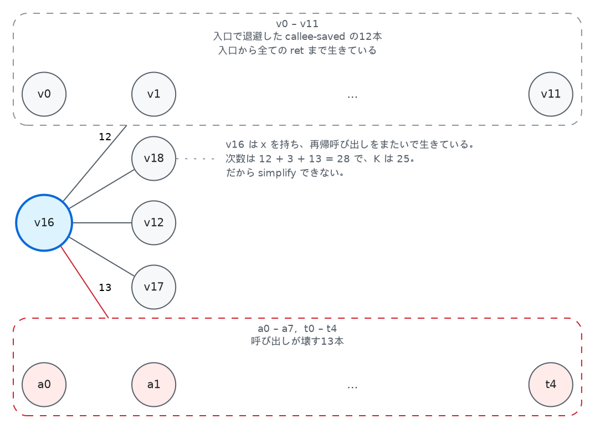

破線の枠へ伸びる1本の辺は、**枠の中の各節点への辺**を表します（`12` と `13` はその本数）。

最後の行が重要です。呼び出しは caller-saved レジスタをすべて破壊するので、**呼び出しをまたいで
生きる値はそれら全部と干渉する**。この辺のおかげで、そういう値は自動的に callee-saved
レジスタか、スタックへ追いやられます。アロケータの中に「呼び出し規約」という名前の特別扱いは
1行もありません。

## 3. 次数が K 未満なら必ず塗れる — simplify と select

グラフを K 色で塗るのは一般には難しい問題ですが、[Kempe][kempe] が示した次の事実が実用を
可能にします。

> **隣接が K 未満の節点は、残りのグラフに何が起きようと必ず塗れる。**

隣接する節点が K−1 個以下なら、K 色のうち少なくとも1色は必ず余るからです。これを2つの操作に
します。

- **simplify** — 隣接が K 未満の節点をグラフから外し、スタックに積みます。外すというのは
  その節点の色を決めるのを最後に回すという意味で、値が消えるわけではありません。グラフの
  ほうで変わるのは隣の次数が1ずつ減ることだけです（`decrement_degree`）。次数が K 以上で手が出せなかった
  節点も、隣が1つ外れれば K−1 になって外せます。減った隣を見るだけでよく、残り全体を
  測り直す必要はありません。
- **select** — グラフが空になったらスタックを逆に降ろし、隣が使っていない色を与えます。
  逆順であることが効きます。外した時点で隣は K 個未満だったので、戻すときにグラフにいる隣が
  それより増えていることはなく、色は必ず余ります。

物理レジスタは**あらかじめ色が塗られた次数無限の節点**として置いてあります。次数が無限なので
simplify で外れることはなく、`v16` を塗る段では `a0`–`a7` と `t0`–`t4` が既に埋まっていること
が分かります。

## 4. 融合 — このアロケータが元を取るところ

命令選択は `mv` を大量に出します。引数ごと、結果ごと、callee-saved レジスタごと。`sum` の
割り付け前のコードには41個ありました。素朴に彩色すればそれが41個の `mv` 命令として残ります。

**融合**は `mv d, s` の両端を1つの節点に融合します。融合できれば d と s は同じレジスタになり、
`mv` は消えます。

`mv` には向きがありますが、**融合の判定はそれを見ません**。同じレジスタに入るかどうかを
決めるだけなので、どちらから読んでも同じです。残る名前のほうには決まりがあって、片方が
物理レジスタならそちらを残し、そうでなければ行き先側を残します（`coalesce` の `u, v`）。
図で move を向きのない破線にしてあるのはこのためで、命令そのものはラベルに書いてあります。

ただし無条件に融合すると次数の高い節点ができ、塗れたはずのグラフが塗れなくなります。そこで
**融合しても悪化しないと証明できるときだけ**融合します。証明の道具が2つあります。

- **Briggs** — 融合後の節点の隣接のうち、次数が K 以上のものが K 個未満なら安全。
- **George** — 片方が物理レジスタ `r` のとき、もう片方のすべての隣接が「次数 K 未満」か
  「もともと `r` と干渉している」なら安全。

どちらも通らない move は**保留**にしておき、simplify が進んで次数が下がったら再検討します。

## 5. freeze — move を諦める

保留のままだと行き詰まることがあります。**move を持つ節点は、次数が K 未満でも simplify に
回りません**（`regalloc.ml:233` の `make_worklists`）。融合できるかもしれない相手を先に外して
しまうと融合の機会が消えるので、作業リストを分けてあるからです。ところが判定がどちらも通らないまま move が残ると、
その節点は次数が低いのに simplify されません。simplify と融合の両方が空、という状態です。

そこで **freeze** です。節点を1つ選び、それが関わる move を全部諦めます。諦めるというのは、その move を生きている集合から
落とすことです。`node_moves` から見えなくなるので、その節点は move を持たないただの節点と
して simplify に回ります。move の相手側も、これで move を1つも持たなく
なり次数が K 未満なら、一緒に simplify へ移ります（`regalloc.ml:326` の `freeze_moves`）。

**諦めた move は消えません。** `mv` 命令としてそのまま出力に残ります。freeze が捨てているのは
融合の機会だけで、正しさには何も触りません。これがないと、次数が低いだけの節点をスピルする
はめになります。メモリに触るほうがはるかに高くつきます。

freeze が融合より後ろに置かれているのはこのためです。simplify も融合も尽きて、他に打つ手が
なくなってから、1つだけ諦める。

## 6. スピル

simplify も融合も freeze もできなくなることがあります。残った節点がすべて K 以上の隣接を
持つ状態です。こうなったら、どれか1つを選んで「**これは塗れないだろう**」と賭け、外して
先に進みます。

選ぶのは**使われる回数が少なく、干渉が多い値**です。長くレジスタを占有するわりに働かない
ものから落とす、という素直な指標（使用・定義の回数 ÷ 次数の最小）です。

賭けが当たって select で色が付けば、それで終わり。付かなかったら、その値に**スタックスロットを
割り当て、触る命令の直前で読み・直後で書く**ようにプログラムを書き換えて、全部やり直します。

**スピルした値の置き場所は、その時点からメモリです。** 途中までレジスタに載せておいて混んで
きたら明け渡す、という動き方はしません。定義された命令の直後に書き出し、使う命令の直前に
読み戻します。レジスタに載っているのは触る命令1つのあいだだけで、それ以外の区間はスタックに
あります。丸ごとレジスタか丸ごとメモリかの二択で、その中間がないという話は §13 にも書いて
あります。

読み書きに使うのは、**あらかじめ確保したスクラッチではありません**。触る命令1つにつき仮想
レジスタを新しく作ります（`fresh_reg`）。1本を使い回すと、スピルした値どうしがその1本を
取り合うことになり、抜け出そうとしている状況に戻ってしまいます。新しく作れば、それぞれの
生存区間は**命令1つ分**に収まり、同時に生きている値としか干渉しようがないので必ず塗れます。
そのうえで**二度とスピル候補にしない印**を付けてあるので、次のラウンドは確実に前進します。

`sum` のラウンド数が 2 なのは、1回目で `v16` の賭けを外し、書き換えて2回目で成功したからです。
1回目と2回目のコードを並べます。

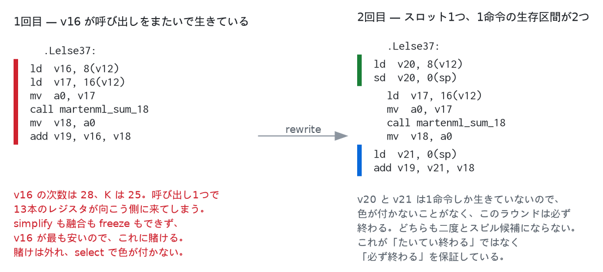

書き換えが変えているのは生存区間の長さです。`v16` は呼び出しをまたいで6命令ぶん生きて
いました。書き換え後の `v20` と `v21` はそれぞれ1命令です。1命令しか生きていない値は、その
命令の中で同時に生きている値としか干渉しないので、次数が K に届きません。

書き換えは命令ごとに機械的に行うので、**定義のすぐ後で使う値には無駄が出ます**。定義の直後に
書き出し、使用の直前に読み戻すので、その2つが隣り合うとこうなります。

```
    sd t0, 0(sp)      ← 定義の直後に書き出し
    ld t1, 0(sp)      ← 使用の直前に読み戻し
```

書いた番地をそのまま読んでいるだけです。これを片づけるのが[のぞき穴最適化](emit.md)で、
`ld` を `mv t1, t0` に置き換えます。行き先が書いたときと同じレジスタなら、
命令ごと消えます。**割り付けが終わってからでないとできません。** 番地もレジスタも、
この時点で初めて決まるからです。

一方、`sum` のスピルは書き込みと読み出しのあいだに**呼び出しを挟みます**。のぞき穴最適化は
呼び出しに出会うと憶えていることを全部捨てるので、この `ld` は残ります。そして**残るのが
正しい**です。呼び出しは caller-saved レジスタを壊すので、値は本当にメモリから読み直すしか
ありません。のぞき穴最適化が消せるのは「書いたばかりで、まだ誰も壊していない」場合だけです。

結果を見ると気づくことがあります。

```
.Lelse37:
	ld t0, 8(a0)      ; x
	sd t0, 0(sp)      ; ← スピル
	ld a0, 16(a0)     ; rest
	call martenml_sum_18
	ld t0, 0(sp)      ; ← 復元
	add a0, t0, a0
```

`x` は呼び出しをまたぐので callee-saved レジスタに入れることもできたはずです。ですがそうすると
そのレジスタの元の値を退避する必要があります。**プロローグとエピローグで1回ずつメモリに
触る**ので、スピルとまったく同じ費用です。12本の callee-saved を使いたい値（`v0`–`v11`）と `x` の
計13個が、12本のレジスタを取り合っています。どうやっても1つはメモリに行きます。どれを落としても
費用が同じなので、この結果は取りうる最良のものです。

これで5つの操作が出そろいました。simplify → 融合 → freeze → スピル → select をこの優先順で
交互に繰り返すのが「反復」融合です。

## 7. 実例 — 8つの値を3レジスタに

5つの操作がどう噛み合うかを、1つの関数で最初から最後まで追います。以下のグラフ・次数・手順は
すべて `tests/walkthrough.exe` の出力で、手で解いたものではありません。

```
$ dune exec tests/walkthrough.exe
```

実際の関数では K を8より小さくできません（引数レジスタ8本は呼び出し規約のために常に
割り当て可能）。K = 25 のグラフは紙に載りません。そこでこのプログラムは、コマンドラインでは
指定できない**3レジスタの機械**でアロケータを直接動かします。

題材はこの1ブロックです。値は4つ同時に生きていて、機械は3本しかありません。

```
    ld  v0, 64(sp)
    ld  v1, 72(sp)
    ld  v2, 80(sp)
    ld  v3, 88(sp)
    add v4, v2, v3
    mv  v5, v4         ← 両端を融合できる move
    mv  v7, v0         ← 融合できない move
    add v6, v7, v5
    sd  v6, 96(sp)
    add a0, v7, v1
    ret a0
```

`build` が作るグラフです。丸の下段が次数で、**赤が K 以上（そのままでは外せない）、緑が
K 未満**。破線が2本の move です。

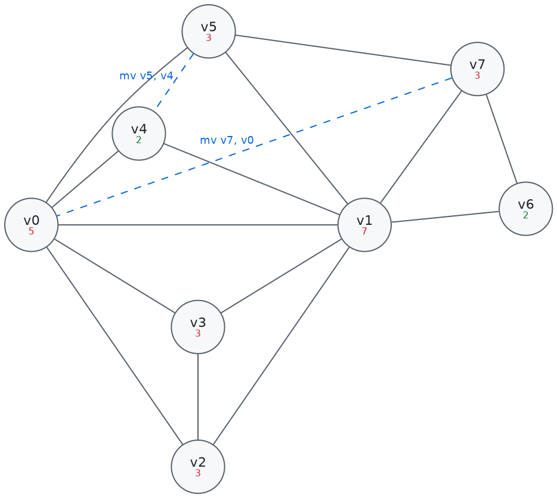

**1. simplify v6。** 次数が K 未満で、しかも move を持たない節点は `v6` だけです。外すと隣の
`v1` が 7 → 6、`v7` が 3 → 2 に下がります。**`v7` はこれで K 未満になりました。** 外した
拍子に別の節点が動けるようになる、という連鎖の1回目です。

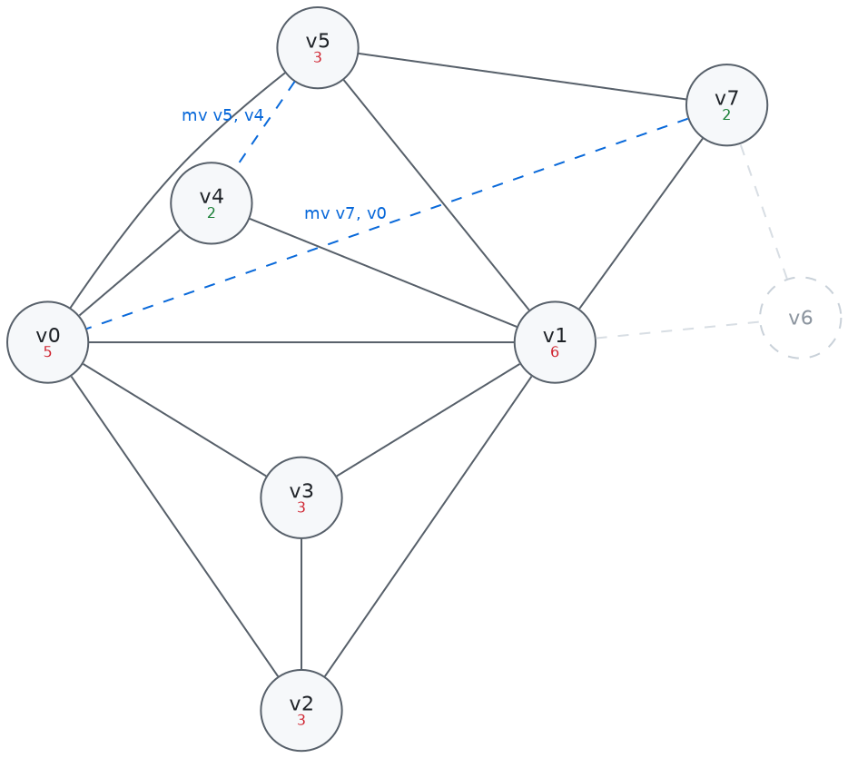

**2. 融合の判定が2回。** simplify できる節点はもうありません（`v4` と `v7` は次数2ですが
move を持つので freeze 側の作業リストです）。そこで move を見にいきます。

- `v7 -- v0` — 融合したとして、その隣接のうち次数が K 以上のものを数えると
  `v1`・`v2`・`v3`・`v5` の4つ。3以上あるので Briggs は通りません。`v7` は物理レジスタでは
  ないので George も使えず、**保留**に回ります。
- `v5 -- v4` — こちらは `v0` と `v1` の2つだけ。2 < 3 で通るので**融合**します。`v4` が
  `v5` に吸収されて `v5・v4` の1つになり、`v0` は 5 → 4、`v1` は 6 → 5 に下がります。
  アロケータはこの節点を `v5` と呼びますが、図では元の2つが分かるように書いてあります。

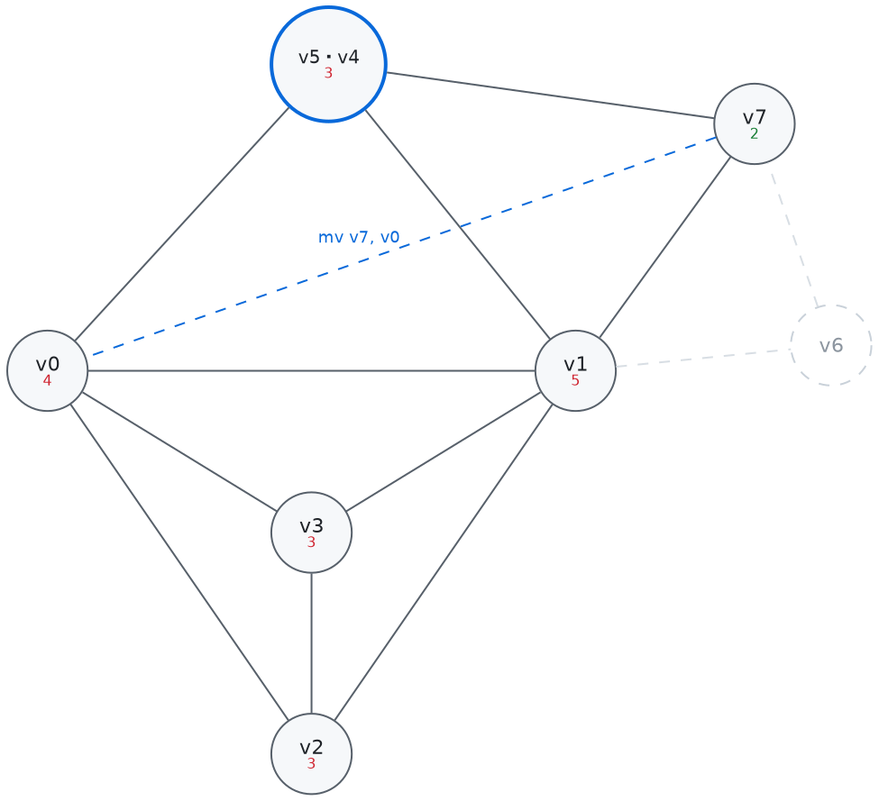

**3. freeze v7。** move がなくなり、simplify も空のままです。`v7` は次数2なのに、保留中の
move を持っているせいで動けません。ここで freeze が効きます。`v7` の move を諦めれば、
`v7` はただの節点になります。**この `mv` は消えず、命令として出力に残ります。**

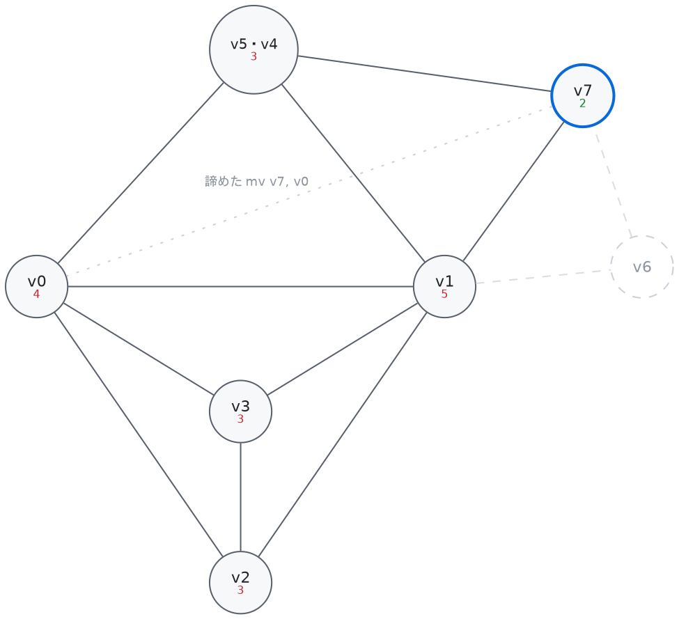

**4. simplify が2回、そして行き詰まり。** `v7` を外すと `v1` が 5 → 4、`v5・v4` が 3 → 2。
続けて `v5・v4` を外すと `v0` と `v1` が 3 に下がります。残ったのは `v0`・`v1`・`v2`・`v3`
の4つで、**どれも次数3の完全グラフ**。K = 3 では4色ないと塗れません。simplify も融合も freeze も
できません。

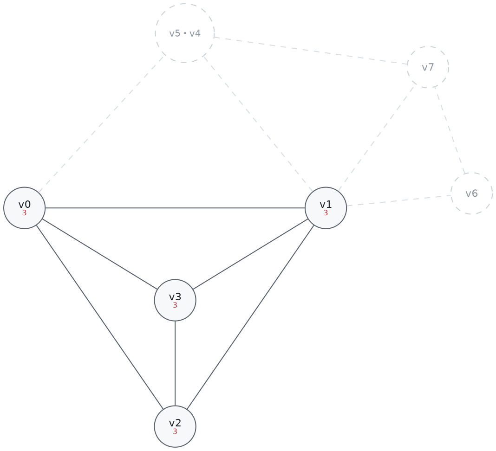

**5. select_spill v0。** 使用回数 ÷ 次数がいちばん小さい `v0`（0.67）に「塗れないだろう」と
賭けて外します。外した拍子に残りの次数が落ち、`v1`・`v2`・`v3` が連鎖して外れます。

**6. 色を配る。** スタックを逆に降ろすと `v3`・`v2`・`v1` が3色を取ります。`v0` の番には隣が
3色とも使っていて**空きがありません**。賭けは外れです。

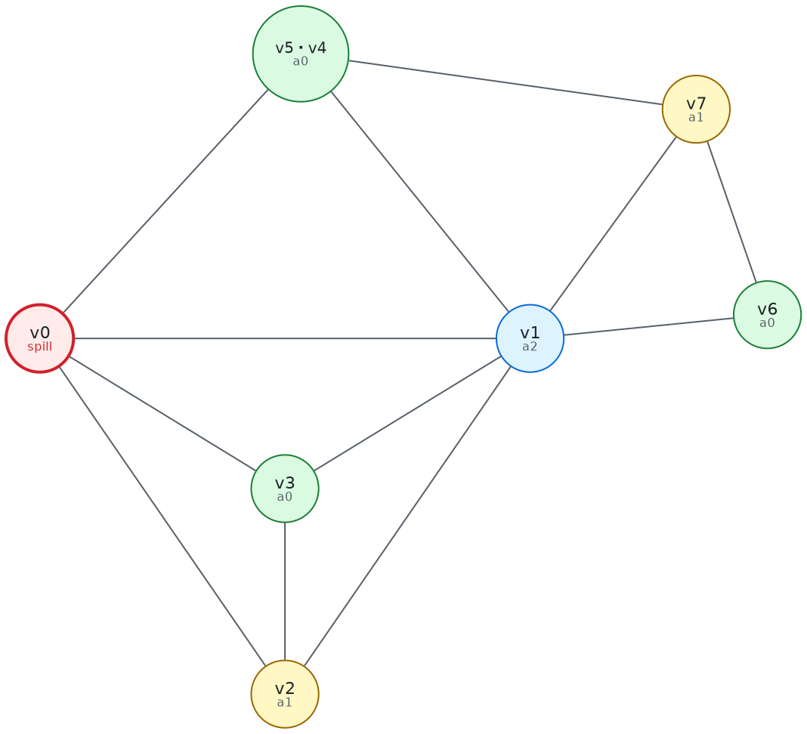

**7. rewrite。** `v0` にスタックスロットを1つ与え、触る命令の直前に `ld`・直後に `sd` を
挟みます（§6）。`v0` を触るのは定義と使用の2箇所なので、一時変数が2つできます。この関数は
`v0`–`v7` の8本を使っていたので、新しい番号は `v8` と `v9` です。

```
    ld  v8, 64(sp)     ┐ v0 の定義。すぐ書き出す
    sd  v8, 0(sp)      ┘
    ld  v1, 72(sp)
    ld  v2, 80(sp)
    ld  v3, 88(sp)
    add v4, v2, v3
    mv  v5, v4
    ld  v9, 0(sp)      ┐ v0 の使用。直前に読み戻す
    mv  v7, v9         ┘
    add v6, v7, v5
    sd  v6, 96(sp)
    add a0, v7, v1
    ret a0
```

**8. 2周目のグラフ。** 作り直すと様子が変わっています。

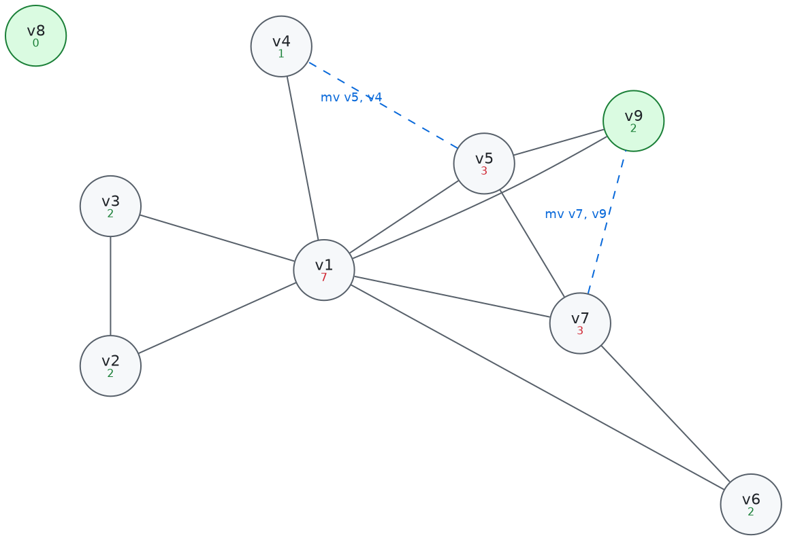

**`v0` はもう節点ではありません。** 値は `0(sp)` にあり、書き換えでどの命令からも消えた
ので、レジスタを争う相手ではなくなりました。次数5だった位置を埋めているのが新しい `v8` と
`v9`（緑）で、どちらも `ld` と `sd` のあいだにしか生きていないため次数は 0 と 2 です。

（`tests/walkthrough.exe` の出力には `graph v0 degree 0` と `assign v0 -> a0` が残ります。
アロケータの配列は `num_regs` で確保するので、使われなくなった番号の行も一緒に回ります。
色は付きますが、その色を書き込む命令はもうありません。）

**9. simplify が4回。** `v2`・`v3`・`v6`・`v8` はどれも次数が K 未満で move も持たないので、
そのまま外れます。ハブの `v1` が 7 → 4 に落ち、`v7` も 3 → 2 になりました。1周目で
`v0` が居座っていた分の圧力がなくなっています。

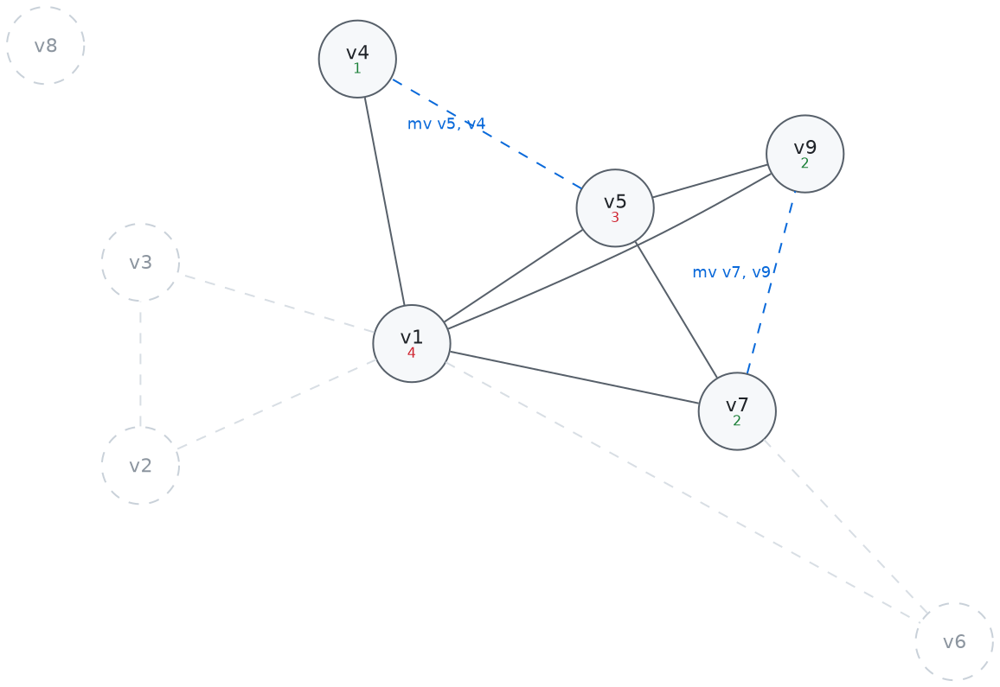

**10. 諦めた move が融合される。** 1周目に freeze した
`mv v7, v0` は、書き換えで `mv v7, v9` になっています。融合後の隣接のうち次数が K 以上の
ものを数えると `v1` の1つだけ。1 < 3 で **Briggs が通ります**。1周目は4つあって落ちた判定が、
`v0` の長い生存区間がスタックへ移ったことで変わりました。**freeze はその周で諦めるだけで、
永久に捨てるわけではありません。**

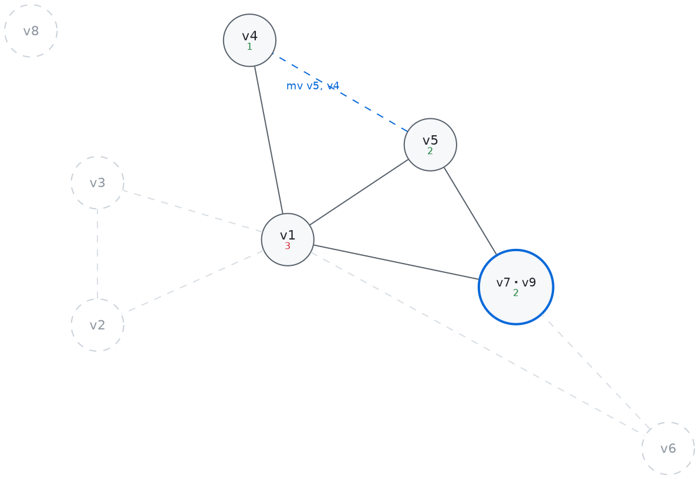

**11. 残りは連鎖で片づく。** `v7・v9` を外すと `v1` が 2、続けて `v1` を外すと `v5` と `v4` が 0
になります。`mv v5, v4` も融合され、最後の1つが外れてグラフが空になります。スタックを
逆に降ろすと、**今度は全員に色が付きます**。

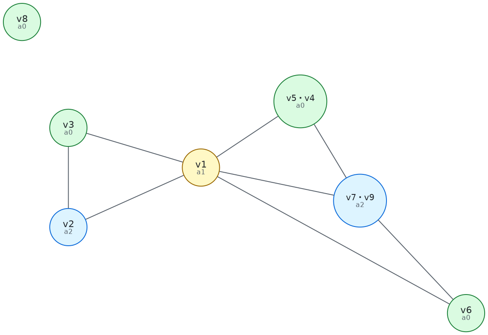

スピルは起きず、2周目で終わりです。

```
walkthrough: 2 round(s), 2/2 moves coalesced, 1 spill slot(s) [spilled v0]
```

出てきたコードです。3本のレジスタと1つのスロットに収まり、`mv` は1つも残っていません
（ハーネスが動かすのは割り付けまでなので、のぞき穴最適化は通っていません）。

```
    ld  a0, 64(sp)
    sd  a0, 0(sp)      ← v0 のスピル
    ld  a1, 72(sp)
    ld  a2, 80(sp)
    ld  a0, 88(sp)
    add a0, a2, a0
    ld  a2, 0(sp)      ← v0 の復元
    add a0, a2, a0
    sd  a0, 96(sp)
    add a0, a2, a1
    ret a0
```

実物でも同じです。`sum` では41個の move が41個とも消えました。

```
$ martenmlc --dump-regalloc -o /dev/null examples/sum.mml
martenml_sum_18: 2 round(s), 41/41 moves coalesced, 1 spill slot(s) [spilled v16]
```

何も要らない関数だと、全体が畳まれます。

```
$ echo 'let rec f a b = a * b + a in print_int (f 2 3)' > /tmp/leaf.mml
$ ./martenml -inline 0 -S /tmp/leaf.mml
martenml_f_5:
	mul t0, a0, a1
	add a0, t0, a0
	ret
```

割り付け前は16本の仮想レジスタと12本の callee-saved 退避があり、そのすべてが消えています。
（`-inline 0` を付けているのは関数を残すためです。既定では
[インライン展開](knormal.md#3-インライン展開--inlineml)が `f` を畳んでしまい、
プログラム全体が `li a0, 8` と `tail martenml_print_int` の2命令になります。）

## 8. callee-saved の退避は、スピルそのもの

`selection.ml` は、関数の入口で callee-saved レジスタ12本を仮想レジスタにコピーし、各 `ret` の
直前で書き戻すコードを出します。

```
martenml_sum_18:
    mv v0, s0
    ...
    mv v11, s11
    …本体…
    mv s0, v0
    ...
    mv s11, v11
    ret a0
```

そのうえで、`ret` と末尾呼び出しは callee-saved レジスタを**読む**ものとして扱います
（`Riscv.terminator_uses`）。呼び出し元の値がそこに戻っていなければならない地点だからです。

あとはアロケータに任せます。この `mv` の組がどちらに転ぶかで、退避が出るかどうかが
決まります。


- 関数がそのレジスタを他に使わなければ、`mv v_i, s_i` は融合で消え、`mv s_i, v_i` も消える。
  **葉関数は何も払いません。**
- 使いたければ `v_i` がスピルされる。そのスピルは `sd s_i, N(sp)` と `ld s_i, N(sp)` になる
  — つまり**退避と復帰そのもの**です。

「5本使う関数はちょうど5本ぶん払う」が、専用のコードなしに出てきます。同じプログラムの2つの
関数で対照的に現れます。

```
martenml_sum_18: 41/41 moves coalesced, 1 spill slot(s) [spilled v16]
martenml_main:   30/31 moves coalesced, 3 spill slot(s) [spilled v0 v1 v2]
```

`sum` は callee-saved を1本も使わないので退避ゼロ。`main` は呼び出しをまたぐ値が3つあるので
`s0`/`s1`/`s2` を使い、その3本ぶんの退避（`v0`/`v1`/`v2` のスピル）が出ています。

```
martenml_main:
	addi sp, sp, -32
	sd ra, 24(sp)
	sd s0, 0(sp)      ┐
	sd s1, 8(sp)      │ v0 v1 v2 のスピル = s0 s1 s2 の退避
	sd s2, 16(sp)     ┘
	li s1, 1
	li s2, 2
	la s0, martenml_const_Nil_3
	...
```

## 9. caller-saved は退避しない — 干渉として出す

呼び出し規約の残り半分です。`a0`–`a7` と `t0`–`t6`、それに `ra` は**呼ばれた側が壊してよい**
レジスタで、必要なら呼ぶ側が退避します。名前のとおり "caller saves" です。

**このコンパイラは、そのための退避を1命令も出しません。**代わりに §2 の1行だけがあります。

```ocaml
(* A call destroys every caller-saved register: a value that has to survive
   it therefore interferes with all of them ... *)
| Call _ -> Array.to_list !caller_saved
```

`call` は caller-saved レジスタ全部を**定義する**、と言っているだけです。あとは生存解析と
干渉グラフが仕事をします。呼び出しをまたいで生きる値は、その時点で生きているので、
定義される13本すべてと辺を張ります。**そうなった値は caller-saved レジスタに置けません。**
残る行き先は callee-saved レジスタ（§8）か、スタックです。

### 素朴な実装との違い

素直に "caller saves" を実装すると、呼び出しの前に生きている値を全部書き出し、後で読み直す
コードが**呼び出し地点ごとに**出ます。ここではそれが出ません。

- 呼び出しを**またがない**値は、何も払いません。素朴な実装は呼び出し地点で一律に払います
- またぐ値も、callee-saved レジスタに入れば**呼び出し地点では無料**です。代金は関数の入口と
  出口で1度だけ、§8 の仕組みで払います
- 本当にレジスタが足りないときだけスタックに落ちます

どれを退避するかを**呼び出し地点ごとの局所的な判断ではなく、関数全体を見た彩色**が決めて
いる、と言い換えてもいいです。アロケータの中に「呼び出し規約」という名前の特別扱いは
1行もありません。

### 帳尻

例題群のスピル枠254個の内訳が、そのまま答えになっています。

| | |
|---|---|
| callee-saved の退避 | 167 |
| 本物のレジスタ不足 | 87 |

上の167は「呼び出しをまたぐ値のために callee-saved レジスタを使った回数」です。§8 のとおり
その退避はスピルとして出るので、**アセンブリの `sd sN, N(sp)` を数えると同じ167**になります。
下の87が、callee-saved 12本でも足りず**スタックまで落ちた値**です。

### 割り付けから外してある2本

`t5` と `t6` も caller-saved ですが、アロケータには渡していません（§1）。`t6` はクロージャを
呼び先へ運び、`t5` は大きなオフセットの合成に使います。**割り付けの対象でないので、
呼び出しで壊れても誰も困りません。**

`ra` も caller-saved で、これだけはアロケータの管理外で明示的に退避されます。何かを呼ぶ関数
なら、`emit.ml` がプロローグで `sd ra` を出します（`Riscv.is_leaf` が偽のとき）。戻り番地は
彩色の対象になる値ではないからです。

## 10. レジスタを減らす — `-nregs`

`-nregs n` は割り当て可能なレジスタを n 本に絞ります。引数レジスタ `a0`–`a7` は呼び出し規約が
成り立たなくなるので常に残し、削るのはそれ以外です（下限10本）。

これは意地悪のためではなくテストのためにあります。**すべての例題は25本と10本の両方でビルドされ、
出力が一致することを要求されます**（`tests/run.sh`）。スピル処理を検査する手段がこれです。

`sum` は3本しか要らないので、10本に絞っても生成コードは1バイトも変わりません。変わるのは
`main` のほうです。

```
--- 25本                          --- 10本
	sd s0, 0(sp)                    	li t0, 1
	sd s1, 8(sp)                    	sd t0, 0(sp)
	sd s2, 16(sp)                   	li t0, 2
	li s1, 1                        	sd t0, 8(sp)
	li s2, 2                        	la t0, martenml_const_Nil_3
	la s0, martenml_const_Nil_3     	sd t0, 16(sp)
	...                             	...
	sd s2, 8(a0)                    	ld t0, 8(sp)
	sd s0, 16(a0)                   	sd t0, 8(a0)
```

**10本のときは callee-saved が1本も残りません。** 常に残す `a0`–`a7` に足せるのが2本だけで、
足される順に `t0`・`t1` — どちらも caller-saved だからです。呼び出しをまたぐ値の行き先が
§9 の2つのうち片方しかなくなるので、そういう値は**必ずスタックへ落ちます**。遅くはなりますが、
答えは同じです。

| `-nregs` | caller-saved | callee-saved |
|---|---|---|
| 10 | 10 | **0** |
| 12 | 12 | **0** |
| 15 | 13 | 2 |
| 20 | 13 | 7 |
| 25 | 13 | 12 |

テストが `-nregs 10` を走らせる理由がこの表の1行目です。**呼び出しをまたぐ値を持つ関数は、
そこでは必ずスピルを通ります。**（`sum` のように呼び出しをまたぐ値がなければ、10本でも
1バイトも変わりません。）

意図的に負荷をかけた例が `examples/pressure.mml` です。16個の値が、いずれも同じ16回の
呼び出しをまたいで生き続けるように書いてあります。

```
$ ./martenml --dump-regalloc examples/pressure.mml
martenml_blend_49:       1 round(s), 27/27 moves coalesced, 0 spill slot(s)
martenml_pressure_60:    2 round(s), 46/75 moves coalesced, 16 spill slot(s)
martenml_accumulate_108: 2 round(s), 42/44 moves coalesced, 2 spill slot(s)
martenml_main:           1 round(s), 26/26 moves coalesced, 0 spill slot(s)
```

16スロット。callee-saved が12本しかないところに、呼び出しをまたぐ値が16個あるためです。

## 11. この実装で効いている単純化

**MartenML の関数の制御フローグラフには閉路がありません。** ソース上のループは
再帰呼び出しであり、呼び出しは関数から出ていくからです。

そのおかげで2つ楽をしています。

- 後ろ向きの生存解析が1回の逆順走査で収束します（一般の不動点ループとして書いてはありますが、
  実際には回りません）。
- **スピル費用の重み付けにループ深さの推定が要りません。** 普通のコンパイラは「ループの中で
  使われる値は10倍重い」といった補正を入れますが、ここでは全基本ブロックが本当に等価なので、
  使用回数をそのまま数えるのが正確です。

より大きな言語に移すなら最初に壊れるのがここです。

## 12. 集合の持ち方 — ビット行列

ここまではアルゴリズムの話で、以下は表現の話です。このパスの速さはほぼここで決まります。

作業リストも隣接も、聞かれることは4つだけです。これは入っているか、最小の要素は何か、順に
見たい、和集合。しかも要素はどれも密な範囲の添字です。平衡木（`Set.Make(Int)`）はこれらに
O(log n) で答えますが、更新のたびに木を作り直します。1要素1ビットなら、答えるのはワード
演算1つで、集合ができたあとは何も確保しません。

`bitset.ml` に載せているのは次のものです。

- 4つの作業リスト（simplify・freeze・spill・spilled）と、move の2つの集合
- 各節点の `move_list`
- 干渉そのもの — 節点ごとに n ビットの行を持ち、辺は両向きに立てます

効くのは3つ目です。辺の持ち方には `(u, v)` を鍵にした `Hashtbl` と隣接集合という手も
ありますが、ビット行なら「この2つは干渉するか」が配列参照とシフト1つで済み、鍵の組み立ても
ハッシュも要りません。隣接をたどるのも同じ行を読むだけです。

`adjacent` と `node_moves` は集合を作って返さず、行を順に見て飛ばします。順序は同じで、
確保が起きません。Briggs の判定だけは本物の和集合が要るので、使い回しの作業用の行に
組み立てています。

### `Stack` も `Queue` も出てきません

作業リストと呼んでいますが、**待ち行列ではありません。**出し入れの順に意味はなく、要るのは
「入っているか」「1つ取り出す」「順に見る」です。`Queue` は先頭を返すだけで**所属を答え
られず**、しかも融合で節点が消えるたびに中身を消す手段がありません。`Stack` も同じです。

取り出しは `Bitset.min_elt`、つまり**添字が最小のもの**です。任意でよいところをあえて
決め打ちにしてあるのは、**同じ入力に同じ出力を返させるため**です。§7 の通し例が毎回同じ
手順を踏むのも、42ファイルの生成物が実行のたびに一致するのも、これが理由です。

本物のスタックは1つだけあります。simplify が外した節点を積む `select_stack` で、これは
`int list ref` です。**OCaml ではリストがスタックそのもの**なので、可変の箱で包む理由が
ありません。

深さ優先探索（`cfg.ml`）も明示的なスタックを持ちません。再帰なので呼び出しスタックが
それにあたります。

実測です（`-inline 0`、ほかは既定、7回の最小値。生成アセンブリは42ファイルすべて1バイトも変わりません）。
下の4つは、1つの関数の中に n 個の値を作り、全部が同じ呼び出しをまたぐように書いた合成例です。

| | 木 | ビット | |
|---|---|---|---|
| `examples/sum.mml` | 3.8 ms | 2.4 ms | 1.6× |
| `examples/queens.mml` | 6.5 ms | 4.0 ms | 1.6× |
| `examples/pressure.mml` | 5.7 ms | 3.7 ms | 1.5× |
| `examples/sort.mml` | 7.8 ms | 4.1 ms | 1.9× |
| 合成、値120個 | 46.5 ms | 10.1 ms | 4.6× |
| 合成、値200個 | 71.1 ms | 17.6 ms | 4.0× |
| 合成、値400個 | 271.5 ms | 46.8 ms | 5.8× |
| 合成、値800個 | 1320.6 ms | 143.8 ms | **9.2×** |

グラフが大きいほど差が開きます。木の側は節点数に対して超線形に崩れます。

メモリも減りました。干渉行列は n² ビット、つまり関数の大きさの2乗です。それでも実測は
下がります。密なグラフでは辺の数がそもそも n² のオーダーで、`Hashtbl` の1エントリはビット
1つよりはるかに大きいからです。

| ピーク RSS | 木 | ビット |
|---|---|---|
| 合成、値400個 | 48.2 MB | 10.0 MB |
| 合成、値800個 | 176.9 MB | 14.2 MB |

逆転するのは、節点が非常に多くてしかもグラフが疎なときです。ここのグラフは疎ではありません。
呼び出しをまたぐ値は caller-saved レジスタ13本すべてと一度に干渉するからです（§2）。節点が
数万に届く言語に移すなら、まずここを疑うべきです。

速くなったあとも、時間の大半は割り付けです。値800個の例は全体144 ms のうち割り付けが120 ms
で、その多くは `build` です。密なグラフの辺は本当に n² 本あるので、そこは表現では消えません。

## 13. していないこと

### 弦グラフとして塗る

いちばん大きな取りこぼしがここだと思っています。**このコンパイラの干渉グラフは、すでに
弦グラフです。**

§11 のとおり関数の制御フローグラフに閉路がありません。合流点も少なく、例題群を数えると
527ブロック中**15箇所**だけです。つまりグラフはほぼ木で、木の上の生存区間は**部分木**に
なります。そして部分木の交差グラフは弦グラフだ、というのが Gavril の定理です。

弦グラフには**完全消去順序**があります。頂点を並べたとき、各頂点の「自分より後ろの隣接点」が
クリークになっている順序のことです。**MCS（最大濃度探索）** はそれを O(V+E) で見つけます。
番号の付いた隣接点がいちばん多い未番号の頂点を選ぶ、を繰り返すだけで、その逆順が完全消去順序に
なります。完全消去順序の逆順に貪欲彩色すると、使う色数はちょうど最大クリーク — **最適**です。

干渉グラフの最大クリークは、ある地点で同時に生きている値の最大数（MaxLive）です。だから

> **MaxLive ≤ K なら、スピルは1つも要らない。**

いまの simplify は「次数が K 未満の節点」を任意に選んで積みます。弦グラフでも**この規則は
完全消去順序より早く詰まることがある**ので、要らないスピルが出ている可能性があります。
選ぶ順を MCS の逆順にするだけです。

SSA形式のプログラムの干渉グラフが弦グラフになる、というのが Hack–Goos と Bouchez らの
結果で、彩色が多項式時間で済む代わりに難しさが融合とスピルへ移る、という話につながります。
**この実装は SSA でなくてもそこに居ます。**

やらない理由は2つあります。**融合が節点を併合するので、併合後のグラフは弦グラフとは限りません。**
順序をいつ決めるかを考える必要があります。そしてもう1つ、**効果を測っていません。** スピル
254枠のうち167枠は §8 の callee-saved の退避で、設計どおりの動作です。残る87枠のうち何枠が
MaxLive > K で本当に避けられないのかが分かっていません。全部避けられないなら、入れても0です。

**最初の一手は MaxLive を測って K と比べることで、それは安く済みます。**

### その他

- **生存区間の分割（live-range splitting）** がありません。値は「全体をレジスタに置く」か
  「全体をスタックに置く」かの二択です。分割できれば、混んでいる区間だけメモリに逃がせます。
- **再実体化（rematerialization）** もありません。`li a0, 5` のように再計算のほうが安い値でも、
  スピルすればメモリに書きます。ただし数えてみると、スピルした254枠のうち定数やアドレスを
  持つものは10枠に届きません。ここは入れても取り分がありません。
- スピル選択は使用回数 ÷ 次数の一発勝負で、選び直しはしません。
- 融合は Briggs と George の保守的な判定のみです。楽観的融合（融合してから駄目なら剥がす）は
  実装していません。
- 命令スケジューリングはしません。割り付けの前後どちらでもやっていないので、ロード直後の
  使用が並んだままです。

いずれも「入れれば良くなるがアルゴリズムの骨格は変わらない」種類のもので、骨格のほうを読める
ようにするのがこの実装の目的です。

## 参考文献

- R. E. Tarjan, M. Yannakakis, [*Simple linear-time algorithms to test chordality of
  graphs*][mcs], SIAM J. Comput. 13(3), 1984。§13 の MCS。
- F. Gavril, *The intersection graphs of subtrees in trees are exactly the chordal
  graphs*, JCTB 16(1), 1974。§13 で「木なら弦グラフ」と言っている根拠。
- S. Hack, G. Goos, [*Optimal register allocation for SSA-form programs in polynomial
  time*][hack], Inf. Process. Lett. 98(4), 2006。SSA なら弦グラフになる、という側。
- A. B. Kempe, *On the geographical problem of the four colours*, American Journal
  of Mathematics 2(3), 1879. 「隣接が K 未満の節点は必ず塗れる」の出どころ。
  [PDF][kempe]（Internet Archive）
- G. J. Chaitin, *Register allocation and spilling via graph coloring*,
  SIGPLAN Notices 17(6), 1982. グラフ彩色によるレジスタ割り付けそのもの。[ACM][chaitin]
- P. Briggs, K. D. Cooper, L. Torczon,
  [*Improvements to graph coloring register allocation*][briggs],
  ACM TOPLAS 16(3), 1994. 保守的融合（Briggs の判定）と楽観的スピル。
- L. George, A. W. Appel, [*Iterated register coalescing*][iterated],
  ACM TOPLAS 18(3), 1996. **この実装が従っているアルゴリズム。** George の判定と、
  simplify・融合・freeze を交互に回す形。
- A. W. Appel, [*Modern Compiler Implementation in ML*][appel], Cambridge
  University Press, 1998, 11章. 上の論文を擬似コードに落としたもので、
  **`regalloc.ml` の worklist の構成はこれに直接対応します**（読まれない集合を
  落とした点は本文のとおり）。リンク先は著者自身のページで、目次・正誤表があります。

[kempe]: https://archive.org/details/jstor-2369235
[chaitin]: https://dl.acm.org/doi/10.1145/872726.806984
[briggs]: https://doi.org/10.1145/177492.177575
[iterated]: https://doi.org/10.1145/229542.229546
[appel]: https://www.cs.princeton.edu/~appel/modern/ml/index.html
[mcs]: https://doi.org/10.1137/0213035
[hack]: https://doi.org/10.1016/j.ipl.2006.01.008

## 実装の地図

`regalloc.ml` は `allocate` 1つの中に閉じています。集合は `bitset.ml` で、§12 のとおりです。
`Regalloc.trace` に関数を差すと各ステップが報告され、§7 の通し例（`tests/walkthrough.ml`）と
その図はそこから作っています。

| | |
|---|---|
| 79–112行 | グラフの表現。干渉のビット行列、次数、別名、色 |
| 113–151行 | 作業リストと move の記録。 は104行 |
| 152–190行 | **辺を張る** — 生存解析の結果を後ろから辿る |
| 191–232行 | 補助（`iter_adjacent` 197、`iter_node_moves` 200、`enable_move` 211、`decrement_degree` 218） |
| 233–240行 | **make_worklists** |
| 241–277行 | **simplify** |
| 278–325行 | **combine** と **coalesce**（293） — George と Briggs の判定 |
| 326–353行 | **freeze_moves**（326）と **freeze**（342） |
| 354–373行 | **select_spill** — 費用最小の節点を選ぶ |
| 374–402行 | **assign_colours** — スタックを降ろして色を配る |
| 429–486行 | **rewrite** — スピルした値をスタックに落としてプログラムを書き換える |
| 487–505行 | **apply_colours** — 仮想レジスタを物理に置換し、`mv x, x` を消す |

読む順番としては、`round ()` の末尾（403行）にある

```ocaml
let rec work () =
  if not (Bitset.is_empty simplify_worklist) then (simplify (); work ())
  else if not (Bitset.is_empty worklist_moves) then (coalesce (); work ())
  else if not (Bitset.is_empty freeze_worklist) then (freeze (); work ())
  else if not (Bitset.is_empty spill_worklist) then (select_spill (); work ())
in
```

から始めるのが早いです。優先順位がそのまま書いてあります。塗れると分かっているものから
外し、次に安全な融合、それも尽きたら move を諦め、最後にやむなく賭ける。

[のぞき穴最適化と出力](emit.md)。

---

[← 7. 線形IRと命令選択](selection.md) ／ [目次](index.md) ／ [9. のぞき穴最適化と出力 →](emit.md)
