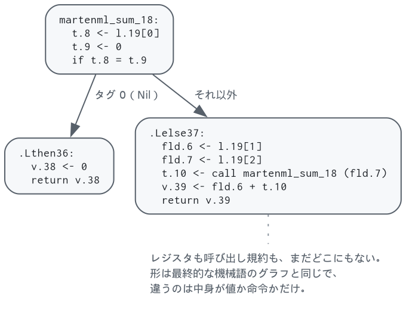
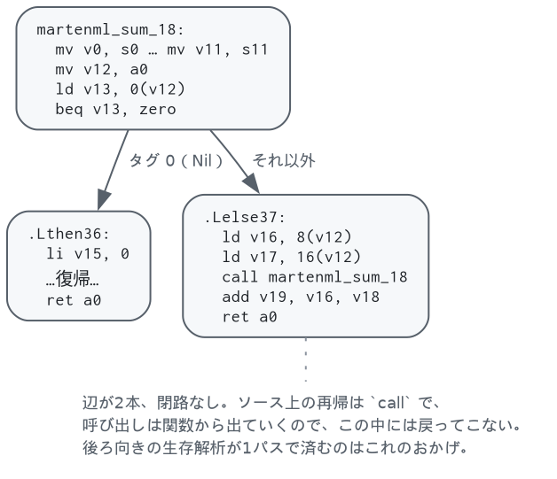

# 線形IRと命令選択 — `linear.ml`, `cfg.ml`, `selection.ml`, `liveness.ml`

まず木をグラフに変え、そのグラフを歩く道具を用意し、それから機械に落とし、最後に生存解析を
足します。出てくるコードは正しいけれど実行できません。レジスタが無制限だからです。実行
できるものに変えるのは[レジスタ割り付け](regalloc.md)です。

**この章に線が1本入っています。** §1 と §2 は対象機械を何も知りません。§3 から下だけが
RISC-V を知っています。グラフを作るのも歩くのも機械の手前で済む、というのがこの章の言い分
です。

## 1. 線形IR — `linear.ml`

クロージャ変換済みのコードはまだ**木**です。`if` は2つの枝を中に抱えていて、関数の値は
本体を評価した結果です。機械語は**グラフ**です。ブロックが並び、終端命令が後続を名指しします。
誰かが木をグラフに変えなければならず、それがこのパスです。

**線形**というのはブロックの中身の形です。被演算子を名指しした命令が一列に並んでいて、
`Closure` が渡してくる木ではありません。ブロックどうしはグラフなので、Cooper と Torczon の
分類でいえば線形とグラフの合いの子で、たいていの処理系が落ち着く形でもあります。

```
$ martenmlc --dump-linear -o /dev/null examples/sum.mml
function martenml_sum_18 (l.19)
  martenml_sum_18:
    t.8.21 <- l.19[0]
    t.9.22 <- 0
    if t.8.21 = t.9.22 then .Lthen36 else .Lelse37
  .Lthen36:
    v.38 <- 0
    return v.38
  .Lelse37:
    fld.6.23 <- l.19[1]
    fld.7.24 <- l.19[2]
    t.10.27 <- call martenml_sum_18 (fld.7.24)
    v.39 <- fld.6.23 + t.10.27
    return v.39
```



### なぜ機械の手前で作るのか

命令選択と一緒にやってしまうこともできます。その場合、制御フローグラフはコードが RISC-V に
なるまで存在しません。分けておくと、ここに線が引けます。

| | |
|---|---|
| `Linear` | ブロック、値、呼び出し。レジスタも呼び出し規約も、対象機械の命令も知らない |
| `Riscv` | 命令、物理レジスタ、`a0`、callee-saved、`t6` |

**線の上が SSA の居場所で、線の下が ABI の居場所です。** 入口で callee-saved を12本写す
`mv` の列は呼び出し規約そのもので、機械独立の表現に出てきてはいけないものです。

### 比較は2通りに落ちる

分岐の条件に現れた比較は**終端命令**になり、値として使われた比較は **`Cmp` という命令**に
なります。

```
if t.8.21 = t.9.22 then .Lthen36 else .Lelse37   ← 終端命令
v.12 <- x.9 <= y.10                              ← 値
```

値のほうを分けておくのが大事です。先に平らにしてしまうと、値として使われた比較は
「1を返すブロック」「0を返すブロック」「合流ブロック」のダイヤモンドになり、命令選択が
それを**見つけ直して** `slt` 1命令に潰す羽目になります。`Cmp` があれば、ダイヤモンドは
最初から生まれません。

### ゼロ除算の検査もここにある

RISC-V はゼロ除算で例外を出しません。`-1` を返して何事もなく続きます。だから検査は
プログラムの側に要ります。

置き場所がここなのは、**「ゼロ除算はエラー」がこの言語の規則**であって機械の都合ではない
からです。機械の側にあるのは「RISC-V は捕まえてくれない」という事実だけで、検査そのものは
言語の意味論です。しかも検査は分岐なので、ブロックを作れる場所に置くしかありません。

### SSA まであとどれくらいか

α変換のおかげで、**値はすでにほぼ単一代入**です。名前が定義を指しています。足りないのは
**合流**だけです。

```
let x = if c then a else b in ...
```

これは `x` への代入を両方の枝に置き、合流ブロックがそれを読みます。**どちらの代入が届いたかを
グラフは言っていません。** それを言う節点が φ で、まだありません。

このことは `check` の形にそのまま出ています。使われている値について検査できるのは
「定義がどこかにある」までで、「定義が使用を**支配する**」は検査できません。上の `x` は
どちらの枝も合流ブロックを支配しないので、支配関係で検査したら落ちます。

**φ を入れた日に、この検査は支配関係の検査に変わります。**それがこの中間表現と SSA の
距離の、いちばん正直な物差しです。

### 検査するもの

```
$ martenmlc --check-linear -o /dev/null examples/queens.mml
```

- 入口ブロックが先頭で、そのラベルが関数のラベル
- 同じラベルのブロックが2つない
- 終端命令が名指しする後続が実在する
- 入口から到達できないブロックがない
- **閉路がない**（§2）
- どの値も、どこかで定義されている（上のとおり、支配関係はまだ言えない）

テストが例題9本に対して走らせます。

## 2. グラフを歩く — `cfg.ml`

**制御フローグラフはこの章に2つあります。** §1 の `Linear.func` と、§3 が作る `Riscv.func` で、
どちらも「ブロックの列と、後続を名指しする終端命令」です。歩くのに要るものも同じ —
ラベルから番号、前任者、入口から到達できるブロック、訪問順。

だから `cfg.ml` は**ブロックの型を決めていません**。知りようのない2つを引数で受け取ります。

```ocaml
let build ~label ~successors blocks = ...
```

`Linear` と `Riscv` がそれぞれ自分の `cfg` を用意し、中身は共有します。**`cfg.ml` は
`Linear` にも `Riscv` にも触れません** — 触れば、機械独立な側が機械に依存してしまいます。

深さ優先の走査1回で3つが出ます。

- **後行順**（自分より先に、到達できるものを全部見る順）。後ろ向きの解析はこれで1パスです
- **到達可能性**
- **閉路の有無** — 走査中のスタックに戻る辺があれば閉路です

3つ目が効いてきます。バックエンドは**関数の制御フローグラフに閉路がないこと**を2箇所で
当てにしています（[レジスタ割り付け §11](regalloc.md#11-この実装で効いている単純化)）。
ソース上のループは再帰呼び出しで、呼び出しは関数から出ていくのでそうなります。

**当てにする以上は確かめます。**性質が生まれるのは `Linear` の側なので `--check-linear` が
そこで見て、実際に読むのは `Riscv` の側なので `--check-cfg` がそこでも見ます。命令選択は
ブロックを1つも作らないので2つは必ず一致しますが、一致することのほうが仮定です。

```
$ martenmlc --check-linear -o /dev/null examples/queens.mml
$ martenmlc --check-cfg    -o /dev/null examples/queens.mml
```

同じグラフから**ブロックの並べ方**も決まりますが、それが得になるのは印字のときなので
[9章](emit.md#ブロックの並べ替え)に置いてあります。

## 3. 命令選択 — `selection.ml`

**ここから機械の側です。**ブロックの並びは §1 で決まり、歩き方は §2 にあるので、残るのは
対象機械が決めることだけ — どの命令でやるか、即値に収まるか、呼び出し規約。

```
$ martenmlc --dump-riscv -o /dev/null examples/sum.mml
function martenml_sum_18 (20 registers, 0 spill slots)
  martenml_sum_18:
    mv v0, s0            ┐
    mv v1, s1            │ callee-saved を仮想レジスタに退避
    ...                  │ （12本ぶん）
    mv v11, s11          ┘
    mv v12, a0           ← 引数
    ld v13, 0(v12)
    beq v13, zero, .Lthen36 else .Lelse37
  .Lthen36:
    li v15, 0
    mv a0, v15
    mv s0, v0            ┐
    ...                  │ 復帰
    mv s11, v11          ┘
    ret a0
  .Lelse37:
    ld v16, 8(v12)
    ld v17, 16(v12)
    mv a0, v17
    call martenml_sum_18(a0)
    mv v18, a0
    add v19, v16, v18
    mv a0, v19
    mv s0, v0
    ...
    ret a0
```

**§1 の図と同じ形**です。ブロック3つ、辺2本。変わったのは中身が値から命令になったことと、
呼び出し規約のコードが増えたことだけです。



ここで確立される2つの規約が、次のパスを可能にしています。

**引数は普通の `mv` で `a0..` に移し、結果は `a0` から `mv` で取り出します。**
アロケータはこれらを融合の候補として見るので、たいていは消えます。消せなかったとしても
正しいコードのままです。

**callee-saved レジスタは、入口で仮想レジスタにコピーし、各 `ret` の直前で書き戻します。**
関数がそのレジスタを他のことに使わなければ融合で両方消えます。使うなら仮想レジスタが
スピルされ、**そのスピルがそのまま退避・復帰**になります。葉関数は何も払わず、5本使う
関数はちょうど5本ぶん払います。

定数はすでに畳まれています。ANF にあった `let t.6 = 0` は不要になります。比較がハードワイヤの `zero` レジスタを
使えるからです（`beq v13, zero`）。読み手を失った `li` は、次のパスのデッドコード除去で
消えます。上のダンプで `v14` が欠番なのがその跡です。

素直に落とす以上のことをしている箇所が4つあります。

**0 を読む位置には `zero` レジスタを使う。** 値が 0 だと分かっていれば、比較に限らず
ストアでも算術でも `zero` で読みます。多くの場合これで `li` に読み手がいなくなり、
デッドコード除去が命令ごとレジスタごと持っていきます。

**値として使われた比較は `slt` にする。** K正規化は比較を「1 か 0 を返す `if`」にします。
その結果を分岐のテストではなく値として使ったとき、素直に落とすとブロック2つとジャンプ1つの
ダイヤモンドになります。両方の枝が 1 と 0 の `if` はそれと分かるので、分岐せずに組みます。

| 式 | 出るもの |
|---|---|
| `x < y` | `slt d, x, y` |
| `x <= y` | `slt t, y, x` ; `xori d, t, 1` |
| `x = y` | `xor t, x, y` ; `sltiu d, t, 1` |
| `x <> y` | `xor t, x, y` ; `sltu d, zero, t` |

`x = 0` や `x <> 0` は片側が `zero` なので `xor` も要らず1命令です。効き方は大きく、
真偽値を配列に入れるだけの関数がこうなります。

```
	blt a1, a2, .Lelse51          	slt t1, a1, a2
.Lthen50:                             	slli t0, a0, 3
	li t1, 0                  →   	add t0, t2, t0
	j .Ljoin52                    	sd t1, 0(t0)
.Lelse51:
	li t1, 1
.Ljoin52:
	slli t0, a0, 3
	...
```

**2の冪の乗算はシフトにする。** 除算は意図的に触っていません。`div` はゼロ方向に切り捨て、
算術シフトは負の無限大方向に丸めるので、負数で答えが食い違います。補正を入れると節約より
高くつきます。

**タグ判定は 0 から並べる。** 決定木でコンストラクタを振り分けるとき、網羅していれば最後の
1つは判定せずに済みます。タグ 0 の判定は `zero` レジスタで無料になるので、それを最後に
残すのは損です（`match_compile.ml`）。この並べ替えだけで、例題群の `li` が791個から786個に
減ります。

## 4. 生存解析 — `liveness.ml`

後ろ向きのデータフローです。あるレジスタが「その地点から先のどこかで、書かれる前に
読まれる」なら生きている、というだけの定義ですが、アロケータのすべてがこの上に載ります。
2つの値が干渉するのは、片方が生きている地点でもう片方が定義されるとき、ちょうどそのとき
です。

ついでにデッドコード除去も行います。判定は命令の**実際の宛先レジスタ**に対して行います。
ここがやや微妙です。`mv t6, x`（クロージャレジスタへの書き込み）はアロケータの管理外の
レジスタを書くので、消してはいけません。

なお `ret` と末尾呼び出しは callee-saved レジスタを**読む**ものとして扱っています。そこは
呼び出し元の値がそれらに戻っていなければならない地点だからです。これを言っておくことが、
復帰の `mv` を生かし、呼び出しをまたぐ値に正しい干渉を与えます。

## 参考文献

制御フローグラフ上のデータフロー解析は、[8章の参考文献](regalloc.md#参考文献)に挙げた
Appel の *Modern Compiler Implementation* が10章で扱っています。生存解析の定式化も
そこと同じです。命令選択のほうは辿るだけなので、特に拠っているものはありません。

§1 で入れた線 — 機械独立の制御フローグラフと、対象機械の制御フローグラフを別の型にする —
は、LLVM（LLVM IR と MachineIR）と Cranelift（CLIF と VCode）が同じ分け方をしています。

## 実装の地図

| | |
|---|---|
| `linear.ml` 32–92行 | 型。`op`・`instr`・`terminator`・`block`・`func` |
| `linear.ml` 94–100行 | `cfg` — Cfg に渡す2つの関数 |
| `linear.ml` 126–148行 | ブロックを組み立てる builder |
| `linear.ml` 150–288行 | `translate` — クロージャ変換済みの木 → ブロック。分岐は `generate_branch`（239行） |
| `linear.ml` 290–354行 | `check` — 整った形かどうか。`--check-linear` |
| `riscv.ml` | 命令と制御フローの型、レジスタファイル、呼び出し規約。対象機械を1つだけ知っている側です |
| `selection.ml` | `Linear.func` → `Riscv.func` |
| `cfg.ml` 34–70行 | `build` — 深さ優先1回で後行順・到達可能性・閉路の有無。ブロックの型は問わない |
| `riscv.ml` 272–280行 | `cfg` — 機械側のグラフの作り方 |
| `liveness.ml` | 後ろ向きデータフローと、そのついでのデッドコード除去 |

---

[← 6. クロージャ変換](closure.md) ／ [目次](index.md) ／ [8. レジスタ割り付け →](regalloc.md)
