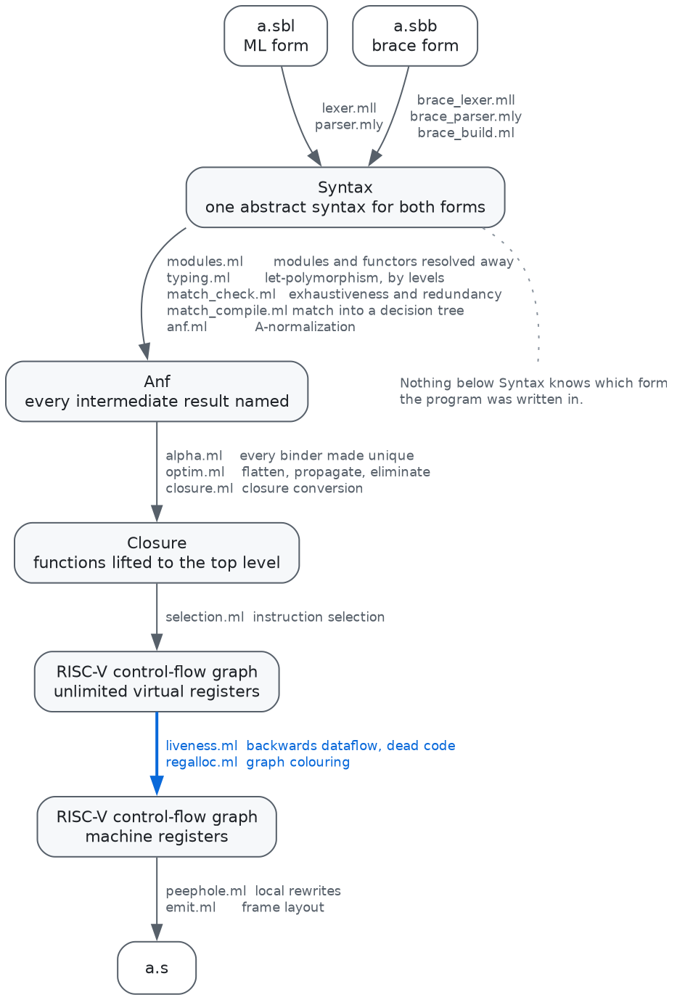

# Sable

A compiler from an ML-like language to RISC-V (RV64I/M), written in OCaml.
Register allocation is by graph colouring.

```
dune build          # build the compiler
dune test           # compile, link and run every example under qemu
./sable examples/tour.sbl
```

`./sable` builds the program, links it against `runtime/sable_runtime.c` with
`riscv64-linux-gnu-gcc`, and runs it under `qemu-riscv64`. `./sable -S` prints
the assembly instead.

```
sablec [options] <file.sbl>
  -o <file>          write the assembly here (default: stdout)
  -nregs <n>         allocate out of n registers only (10..25, default 25)
  -O <n>             run the optimizer n times (default 3)
  --dump-anf     print the A-normalized program
  --dump-closure     print the closure-converted program
  --dump-riscv          print the RISC-V code before register allocation
  --dump-regalloc    report rounds, coalesced moves and spills per function
```

`-nregs` shrinks the machine on purpose. Every test runs twice, with 25
registers and with 10, and the two runs must agree — which is how the spiller
gets tested.

Longer write-ups, in Japanese. The first is the tour; the other three go into
one pass each.

- [doc/pipeline.md](doc/pipeline.md) — 1本のプログラムが全パスを通り抜けるまでを、
  実際のダンプで追ったもの
- [doc/typing.md](doc/typing.md) — 型推論の詳説。単一化、レベル方式の一般化、
  値制限、シグネチャ照合の rigid な型変数
- [doc/matching.md](doc/matching.md) — パターンマッチの詳説。網羅性・到達不能の
  判定、決定木の作り方、合流点
- [doc/regalloc.md](doc/regalloc.md) — レジスタ割り付けの詳説。干渉グラフの実例、
  融合・スピル・callee-saved の扱い

## Two forms

One language, written two ways. The **ML form** (`.sbl`) is what the rest of
this file uses; the **brace form** (`.sbb`) delimits blocks with braces and
separates statements with `;`. The compiler picks by extension, and the two
parsers build the same abstract syntax — the type checker, the optimizer and the
back end never learn which form a program was written in, and the generated code
is identical.

```
let rec length l =                    fun length(l): int = match (l) {
  match l with                            [] -> 0;
  | [] -> 0                               _ :: rest -> 1 + length(rest)
  | _ :: rest -> 1 + length rest      }
in
```

See [`examples/tour.sbb`](examples/tour.sbb) for the whole surface, and
"[The brace form](#the-brace-form)" below for the correspondence.

## The language

A small ML. Functions take all their arguments at once (no currying), and `type`
declarations come before the program body.

```
type tree = Leaf | Node of tree * int * tree

let rec insert t x =
  match t with
  | Leaf -> Node (Leaf, x, Leaf)
  | Node (l, v, r) ->
      if x < v then Node (insert l x, v, r)
      else if x > v then Node (l, v, insert r x)
      else t
in
let rec walk t =
  match t with
  | Leaf -> ()
  | Node (l, v, r) -> (walk l; print_int v; print_char 32; walk r)
in
walk (insert (insert Leaf 2) 1); print_newline ()
```

| | |
|---|---|
| types | `int`, `bool`, `unit`, `string`, `'a list`, tuples, arrays, functions, `type t = A \| B of int * t` |
| binding | `let`, `let rec ... and ...`, `let (a, b) = e`, `fun x y -> e` |
| modules | `module M = struct ... end in e`, nested, `M.x`, `M.N.x`, `M.A`, `M.t`, `open M in e` |
| signatures | `module type S = sig type t val f : t -> int end in e`, sealing with `module M : S = ...` |
| functors | `module F (X : S) = struct ... end in e`, applied as `module M = F (Arg)` |
| control | `if`/`then`/`else` (the `else` may be left out when the branch is `unit`), `e1; e2`, `begin`/`end` |
| matching | `match e with p -> e \| ...`, over literals, wildcards, variables, tuples, lists and constructors, nested |
| operators | `+ - * / mod`, `= <> < <= > >=`, `&& \|\| not`, unary `-`, `::`, `^` |
| lists | `[]`, `x :: xs`, `[a; b; c]`, and the same in patterns |
| strings | `"text"` with `\n \t \r \\ \"`, `String.length s`, `s.[i]`, `s1 ^ s2`, `String.equal` |
| arrays | `Array.make n init`, `a.(i)`, `a.(i) <- e` |
| runtime | `print_int`, `print_char`, `print_string`, `print_newline`, `read_int` |

Type inference is Hindley–Milner with let-polymorphism, generalized by levels.
One compiled `length` serves `int list`, `string list` and `int list list`: every
value is one machine word, so a function that never looks inside its elements
does not care what they are, and no specialization is needed. Only syntactic
values are generalized — the usual value restriction, without which a
polymorphic value held in a mutable array would let a program store an integer
and read back a pointer.

`unit`, `bool` and `int` are all one machine word, so `=` is a single
instruction. It is restricted to those three types rather than silently
comparing addresses, and its operands are held back from generalization so that
they settle on a type that can be compared that way. `String.equal` compares
strings.

Pattern matching is checked for exhaustiveness and for unreachable cases, with a
witness:

```
Warning: this match is not exhaustive; no case matches (Blue, Dot)
Warning: this match case is unused: Blue
```

A non-exhaustive match that actually falls through aborts the program rather
than continuing with a wrong answer.

## The brace form

Every construct of the language, in both forms.

| | ML form (`.sbl`) | brace form (`.sbb`) |
|---|---|---|
| value | `let x = e in ...` | `val x = e` |
| function | `let rec f a b = e in ...` | `fun f(a, b) = e` or `fun f(a, b) { ... }` |
| mutual recursion | `let rec f ... and g ...` | adjacent `fun`s |
| anonymous function | `fun x y -> e` | `fun(x, y) = e` |
| annotation | — | `val x: int = e`, `fun f(a: int): int = e` |
| condition | `if c then a else b` | `if (c) a else b` |
| matching | `match e with p -> e \| ...` | `match (e) { p -> e; ... }` |
| datatype | `type t = A \| B of int` | `type T { A; B(int) }` |
| list | `[]`, `x :: xs`, `[a; b]` | `[]`, `x :: xs`, `[a, b]` |
| string | `s.[i]`, `String.length s`, `a ^ b` | `s.at(i)`, `s.length`, `a ++ b` |
| array | `Array.make n init`, `a.(i) <- v` | `array(n, init)`, `a[i] = v` |
| equality | `=`, `<>`, `not` | `==`, `!=`, `!` |
| types | `int`, `int list`, `int array` | `int`, `list<int>`, `array<int>` |
| module | `module M = struct ... end in ...` | `module M { ... }` |
| signature | `module type S = sig ... end` | `signature S { ... }` |
| sealing | `module M : S = struct ... end` | `module M : S { ... }` |
| functor | `module F (X : S) = struct ... end` | `module F<X : S> { ... }` |
| application | `module M = F (Arg)` | `module M = F<Arg>` |
| open | `open M in ...` | `open M` |
| entry point | the program is one expression | `fun main() { ... }` |

Three things about the brace form are worth saying outright, since each is a
decision rather than an accident.

**Statements are separated by `;`.** The lexer is not newline-sensitive, and
without a separator the parser cannot tell where `val x = f` ends and `(a)`
begins.

**An anonymous function is `fun(x) = e`, not a braced form.** `{ x -> e }` and
`{ stmt; e }` cannot be told apart from the token that opens them, so the brace
form spells a function the same way whether or not it has a name.

**Adjacent `fun` declarations see one another**, so mutual recursion needs no
keyword — but they are not all put in one recursive group. A run of them is
split into the strongly connected components of its call graph first: putting
them in one group would make them monomorphic in each other, and a `length`
used at two element types would stop working. The dependency analysis gives
mutual recursion and polymorphism both. The ML form leaves the same decision to
the programmer, who writes `and` for exactly the functions that need it.

The two forms name the same things the same way: `type`, `module`, `signature`,
`match`, `open`. Lists are `[]` and `::` in both, and a pattern needs no keyword
to say whether a name is a constructor or a binding, because a capitalised name
is always the first and a lower-case one always the second. What differs is
punctuation and shape: braces where the ML form has `in` and `end`, parentheses
around a condition, commas where it has spaces.

## The pipeline



| pass | file | what it does |
|---|---|---|
| lexing, parsing | `lexer.mll`, `parser.mly` | ocamllex and menhir |
| — the brace form | `brace_lexer.mll`, `brace_parser.mly`, `brace_build.ml` | the same abstract syntax, from the other form |
| name resolution | `modules.ml` | modules, functors and type declarations into path-carrying names |
| type inference | `typing.ml` | let-polymorphism, generalized by levels |
| match checking | `match_check.ml` | usefulness: exhaustiveness and redundancy |
| match compilation | `match_compile.ml` | `match` into a decision tree |
| A-normalization (ANF) | `anf.ml` | name every intermediate result |
| α-conversion | `alpha.ml` | make every binder unique |
| optimization | `optim.ml` | let-flattening, copy and constant propagation, dead-let elimination |
| closure conversion | `closure.ml` | lift functions to the top level |
| instruction selection | `selection.ml` | RISC-V CFG over unlimited virtual registers |
| liveness | `liveness.ml` | backwards dataflow; also dead-code elimination |
| **register allocation** | **`regalloc.ml`** | **graph colouring with iterated coalescing** |
| peephole | `peephole.ml` | local rewrites once registers are assigned |
| assembly | `emit.ml` | frame layout and instruction printing |

`bitset.ml` holds the sets the allocator lives on -- the worklists and the
interference itself, a bit per pair. It is the one data-structure choice that
shows up in the wall clock: see [the write-up](doc/regalloc.md), section 10.

The last five rows sit on `riscv.ml`, which holds the instruction and
control-flow types, the register file and the calling convention. It is
deliberately not called `ir.ml`: it knows exactly one target, down to which
operations take a 12-bit immediate. `liveness.ml` and `regalloc.ml` are the
parts that do not — they use only uses, definitions, successors and register
substitution, so retargeting would mean rewriting `riscv.ml`, `emit.ml` and the
instruction-selection half of `selection.ml`, and leaving the allocator alone.

### Representation

Everything is a 64-bit word. Tuples and constructor arguments are heap blocks; a
datatype block keeps its tag in word 0, so `Node (l, v, r)` is `[1 | l | v | r]`
and `Leaf` is the address of a read-only `[0]` emitted once into `.rodata`.
Lists are built in but represented no differently: `[]` is a shared `[0]` and
`x :: xs` is `[1 | x | xs]`. Keeping constant constructors boxed costs an
indirection and buys a back end that never has to ask whether a word is a
pointer — which is also what makes polymorphism free.

A string is `[length | bytes...]`, packed, immutable, and literals with the same
text share one block. `s.[i]` is the only place the compiler emits a byte-sized
load; everything else moves whole words.

A closure is `[code pointer | captured values...]`. A function that captures
nothing is called directly and has no runtime representation at all; closure
conversion decides which is which by optimistically assuming a whole `let rec`
group is directly callable and checking afterwards whether anything is still
free.

The heap is a bump allocator in the runtime and nothing is freed. A collector
would need the compiler to describe where the pointers are, which is a different
project.

### Calling convention

The standard RISC-V one, plus one addition: `t6` carries the closure into a call
through a closure, and `t5` is reserved for the emitter, which needs a register
to materialize offsets that do not fit in a 12-bit immediate. That leaves 25
registers for the allocator — `a0`–`a7`, `t0`–`t4`, `s0`–`s11`.

Tail calls are real: the frame is torn down and the call becomes a jump, so a
loop written as tail recursion costs no stack.

## Register allocation

This is the part the rest of the compiler exists to feed.

Instruction selection emits code in which every value has its own virtual
register, and hands the allocator a graph whose nodes are registers and whose
edges join values that are live at the same time. The 25 machine registers are
pre-coloured nodes of infinite degree. Then, following [George and Appel's
iterated coalescing][iterated] over [Chaitin's][chaitin] colouring and
[Briggs'][briggs] conservative merge:

- **simplify** — remove a node with fewer than K neighbours and push it on a
  stack. [Kempe's][kempe] observation is that such a node can always be coloured later,
  whatever happens to the rest of the graph.
- **coalesce** — merge the two ends of a `mv` when Briggs' or George's test
  proves the merge cannot make the graph harder to colour. The move then
  disappears.
- **freeze** — when nothing can be simplified or safely coalesced, give up on
  some move so that its nodes become ordinary again.
- **spill** — when everything left has K or more neighbours, guess that the
  value used least and interfering most will not get a register.
- **select** — pop the stack and hand out colours. A node that finds none was a
  bad guess: it gets a stack slot, the program is rewritten to load and store it
  around each use, and the whole thing runs again.

Two things fall out of this that are worth pointing at.

**The calling convention is just edges.** A call defines every caller-saved
register, so anything live across it interferes with all of them and is pushed
into a callee-saved register or onto the stack — without a single special case
in the allocator.

**Saving callee-saved registers is just spilling.** `selection.ml` copies every
callee-saved register into a virtual register on entry and copies it back before
each return. If the function does not need that register, coalescing merges the
two ends and both moves vanish. If it does, the virtual gets spilled — and the
spill *is* the save/restore. A leaf function pays nothing; a function that uses
five saved registers saves exactly five.

Here is `fib` before allocation (`--dump-riscv`), 22 virtual registers and 12
callee-saved copies:

```
function sable_fib (22 registers, 0 spill slots)
  sable_fib:
    mv v0, s0
    ...                       (one for each callee-saved register)
    mv v11, s11
    mv v12, a0
    li v13, 2
    bge v12, v13, .Lthen else .Lelse
  .Lthen:
    addi v15, v12, -1
    mv a0, v15
    call sable_fib(a0)
    mv v16, a0
    addi v18, v12, -2
    mv a0, v18
    call sable_fib(a0)
    mv v19, a0
    add v20, v16, v19
    mv a0, v20
    mv s0, v0
    ...
    ret a0
```

and after:

```
sable_fib:
	addi sp, sp, -32
	sd ra, 24(sp)
	sd s0, 0(sp)          # v0 spilled: this is the save of s0
	mv s0, a0             # n lives across two calls, so it needs a saved register
	li t0, 2
	blt s0, t0, .Lelse
.Lthen:
	addi a0, s0, -1
	call sable_fib
	sd a0, 8(sp)          # fib(n-1) is live across the second call
	addi a0, s0, -2
	call sable_fib
	ld t0, 8(sp)
	add a0, t0, a0
	ld s0, 0(sp)
	ld ra, 24(sp)
	addi sp, sp, 32
	ret
```

Eleven of the twelve callee-saved copies coalesced away, along with every
argument and result move; the one that survived became the two instructions that
save and restore `s0`. Two values ended up in memory: `v0`, which is the saved
`s0`, and the result of `fib (n-1)`, which is live across the second call. For a
function that needs nothing, the whole thing collapses:

```
$ echo 'let rec f x = x + 1 in print_int (f 1)' > add.sbl && ./sable -S add.sbl
sable_f_4:
	addi a0, a0, 1
	ret
```

(Labels carry the numeric suffix α-conversion gave the name, so that two `f`s in
different scopes do not collide. The listings above drop it for readability.)

`--dump-regalloc` reports what happened:

```
$ ./sable --dump-regalloc examples/pressure.sbl
sable_blend:      1 round(s), 27/27 moves coalesced, 0 spill slot(s)
sable_pressure:   2 round(s), 46/75 moves coalesced, 16 spill slot(s) [spilled ...]
sable_accumulate: 2 round(s), 42/44 moves coalesced, 2 spill slot(s) [spilled ...]
sable_main:       1 round(s), 26/26 moves coalesced, 0 spill slot(s)
```

`examples/pressure.sbl` is written to make this happen: sixteen values, all live
across the same sixteen calls. Run it with `-nregs 10` and the spill count goes
up while the answer does not change.

One simplification is worth stating because it would not survive contact with a
bigger language: the control-flow graph of a Sable function is acyclic, since a
loop in the source is a recursive call and a call leaves the function. So the
liveness fixed point converges in one backwards pass, and the spill-cost
heuristic needs no loop-nesting estimate — every basic block genuinely weighs
the same.

## Limitations

Deliberate, and each one is a place the project could go next.

- No garbage collector; the heap is a bump allocator.
- Functors are elaborated, not compiled: `F (Arg)` re-resolves the body with the
  parameter bound to that argument, so each application costs a copy of the
  definitions. That is [defunctorization][elsman], as MLton does it, and it is why
  functors need no runtime representation. It also means the body is checked per
  application rather than once, and sees the argument's real types rather than
  the signature's view of them.
- Type declarations are not parameterized: there is `type tree = ...`, not
  `type 'a tree = ...`. Built-in lists are the only polymorphic data type.
- Sealing hides constructors, which is all abstraction needs here because every
  user type is nominal — there is no type equation to hide and so no `with type
  t = ...` to write. Two structures sealed by the same signature still have
  distinct types.
- Functors take one structure argument and return a structure; no currying, and
  no functors inside functors.
- `String.length`, `String.concat`, `String.equal` and `Array.make` are
  recognized by the lexer as whole tokens, so a user module named `String` or
  `Array` cannot override those particular spellings.
- No polymorphic comparison: `=` works on `int`, `bool` and `unit` only.
- Strings are immutable and there is no `String.sub` or `String.make`; the
  runtime offers length, indexing, concatenation and equality.
- Functions are uncurried and take at most eight arguments (they arrive in
  `a0`–`a7`); more should be a tuple.
- No bounds checking on arrays or strings. Arrays do not carry their length, so
  adding it would mean a word per array and a load and a branch per access;
  strings do carry one, so checking them is the cheaper half and is still not
  done.
- No inlining, and no instruction scheduling.
- Allocation is a call into the runtime. Inlining the bump pointer would save
  the call and, more to the point, stop every allocation from destroying the
  caller-saved registers and forcing values onto the stack.

## References

Each write-up carries the reading its own subject rests on:
[the pipeline](doc/pipeline.md#参考文献) for ANF, modules and the rest,
[type inference](doc/typing.md#参考文献), [pattern matching](doc/matching.md#参考文献),
and [register allocation](doc/regalloc.md#参考文献). The four the code follows
most closely:

- L. George, A. W. Appel, [*Iterated register coalescing*][iterated],
  ACM TOPLAS 18(3), 1996 — the allocator.
- L. Maranget, [*Warnings for pattern matching*][warnings], JFP 17(3), 2007 —
  exhaustiveness and redundancy, with a witness.
- O. Kiselyov, [*Efficient and Insightful Generalization*][levels] — Rémy's
  levels, which is how `let` generalizes here.
- M. Elsman, [*Static interpretation of modules*][elsman], ICFP 1999 — modules
  and functors resolved away before the type checker sees them.

[iterated]: https://doi.org/10.1145/229542.229546
[chaitin]: https://dl.acm.org/doi/10.1145/872726.806984
[briggs]: https://doi.org/10.1145/177492.177575
[kempe]: https://archive.org/details/jstor-2369235
[warnings]: https://doi.org/10.1017/S0956796807006223
[levels]: https://okmij.org/ftp/ML/generalization.html
[elsman]: https://doi.org/10.1145/317636.317800

## Layout

```
src/          the compiler
runtime/      sable_runtime.c: entry point, heap, primitives
examples/     programs, all run by the test suite
tests/        golden tests, including the compile-error messages
doc/          the write-ups, and the graphviz sources for their figures
sable         compile + link + run under qemu
```

The figures are generated: edit `doc/figures/*.dot` and run
`doc/figures/render.sh`, which needs graphviz. The PNGs are committed so that
the documents render without it.
