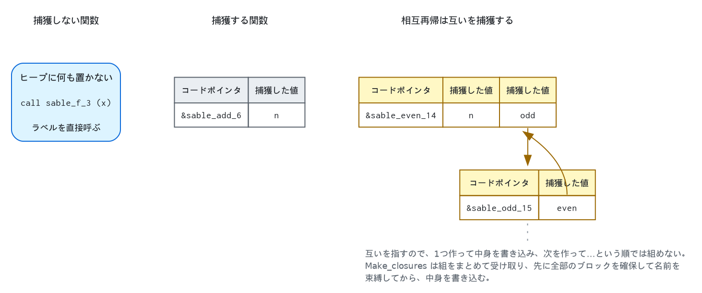

# クロージャ変換 — `closure.ml`

## 1. 何を解決するパスか

ソースの関数は入れ子にできて、**内側の関数は外側の変数を参照できます**。

```
let rec adder n =
  let rec add x = x + n in     ← n は add の引数でも局所変数でもない
  add
in
let f = adder 10 in
print_int (f 5)
```

機械語に入れ子はありません。関数はどれもトップレベルのラベルで、参照できるのは自分の引数と
自分で作った値だけです。`add` をそのまま外へ出すと、**`n` を見失います**。

しかも `n` は `adder` が返ったあとも生きていなければなりません。`f 5` を呼ぶ時点で
`adder` のフレームはもう存在しないので、スタックに置いておくこともできません。

そこで、**外から取ってくる値を関数と一緒に持ち歩く形に変えてから、関数を外へ出します**。
その「一緒に持ち歩く塊」がクロージャです。このパスを抜けると、入れ子の関数定義は存在
しません。

## 2. 2つの表現

持ち歩くものがあるかどうかで、形が2つに分かれます。

**何も捕獲しない関数は、実行時表現を一切持ちません。** ラベルへの直接呼び出し
（`Call_direct`）になります。ヒープに何も置かれず、値としてどこかに入ることもありません。

**捕獲する関数はヒープブロックになります。**

```
[ コードポインタ | 捕獲した値 | 捕獲した値 | ... ]
```

呼ぶ側（`Call_closure`）は先頭からコードポインタを読んで飛び、**ブロック自体を専用レジスタ
`t6` で渡します**。呼ばれた側はそこから捕獲を読みます。`t6` を割り付けから外してあるのは
このためです（[レジスタ割り付け §1](regalloc.md#1-問題)）。



さきほどの `adder` を通すとこうなります。

```
$ sablec --dump-closure -o /dev/null a.sbl
sable_add_6 (x.7) capturing (n.5) =      ← n が引数の隣に並んだ
  x.7 + n.5
sable_adder_4 (n.5) =
  let add.6 = closure sable_add_6 capturing (n.5)   ← ここでブロックを確保
  in
  add.6
sable_main () =
  ...
  let t.3.9 : int =
    call closure f.8 (t.2.10)            ← f が何かは実行時にしか分からない
  in
```

`add` はトップレベルの `sable_add_6` になり、`n` は捕獲として受け取ります。`adder` の中に
残るのは、そのブロックを1つ作る仕事だけです。

## 3. どちらになるかを決める

捕獲が要るかどうかは、本体を変換してみるまで分かりません。本体の中の呼び出しが
`Call_direct` になるか `Call_closure` になるかで、その本体の自由変数が変わるからです。

そこで**楽観的な不動点**にします。`let rec` の組を1つ見るたびに、

1. 組の全員が直接呼べると**仮定して**本体を変換する。
2. 変換した本体に、組の名前でも引数でもない自由変数が残っていないか調べる。
3. 残っていなければ仮定は当たり。全員が `Call_direct` で呼ばれ、クロージャは作られません。
4. 残っていれば**捨ててやり直します** — 今度はクロージャが要ると分かった状態で変換します。

4 が「直せばよい」ではなく「捨てる」なのには理由があります。**仮定が外れると、組の内側の
呼び出しまで変わる**からです。1回目は `even` から `odd` をラベルで直接呼んでいますが、
クロージャが要ると分かった時点でその呼び出しもクロージャ経由になります。部分的に直しようが
ないので、`lifted` を巻き戻してから変換し直します。

`sum` は何も捕獲しないので、再帰呼び出しはラベルへの直接呼び出しです。

```
$ sablec --dump-closure -o /dev/null doc/sum.sbl
sable_sum_18 (l.19) =
  ...
    let t.10.27 : int =
      call sable_sum_18 (fld.7.24)   ← 直接呼び出し。クロージャなし
```

例外が1つあります。**直接呼べる関数を、呼ばずに値として使ったとき**は、その場で
コードポインタだけのクロージャを作ります（`close_over`）。渡すには渡せる形が要るからです。

## 4. 自分自身と、兄弟を捕獲する

自己再帰かつ捕獲もする関数は、**自分自身を捕獲します**。トップレベルのラベルは知って
いますが、それは捕獲を持たない裸のコードで、`n` を持っていません。自分を呼ぶには自分の
ブロックが要ります。

```
sable_go_12 (k.13) capturing (go.12 n.11) =   let rec make n =
  ...                                           let rec go k =
    call closure go.12 (t.4.15)                   if k = 0 then n else go (k - 1)
                                                in go
```

相互再帰なら、互いを捕獲します。

```
sable_even_14 (k.16) capturing (n.13 odd.15) = ...
sable_odd_15 (k.20) capturing (even.14) = ...
```

`even` のブロックには `odd` のブロックのアドレスが、`odd` のブロックには `even` の
アドレスが入ります。**互いを指す循環**なので、ブロックを1つ作って中身を書き込み、次を
作って…という順では組めません。片方を作る時点で、もう片方のアドレスがまだないからです。

そのために `Make_closures` は**組をまとめて受け取ります**。先に全部のブロックを確保して
名前を束縛し、それから中身を書き込みます。自己参照も兄弟への参照も、これで閉じます。

捕獲する例をまとめて見るなら `examples/queens.sbl` を同じフラグで。`safe`・`place`・
`try_column` はどれも盤面や行を捕獲するので、すべてクロージャになります。

## 5. していないこと

- **捕獲は値のコピーです。** 変数を共有する（参照セルにする）ことはありません。この言語で
  変数を書き換える手段は配列だけで、配列そのものは1ワードの参照なので、コピーで足ります。
- **クロージャの共有も再利用もしません。** 同じ `let rec` に2度到達すれば、ブロックは2つ
  できます。
- **捕獲する値を絞っていません。** 本体の自由変数をそのまま全部持ちます。使われ方によっては
  もっと減らせます。

## 参考文献

- E. Sumii, [*MinCaml: a simple and efficient compiler for a minimal functional
  language*][mincaml], FDPE 2005（[PDF][mincaml-pdf]）。既知関数の楽観的な判定は
  これに倣っています。

[mincaml]: https://doi.org/10.1145/1085114.1085122
[mincaml-pdf]: https://esumii.github.io/min-caml/paper.pdf

## 実装の地図

| | |
|---|---|
| 14–46行 | `closure`・`t`・`fundef`・`program` |
| 49–78行 | `free_vars` |
| 80–88行 | `close_over` — 直接呼べる関数を値として使うときのクロージャ |
| 90–116行 | `convert_exp` — `App` が `Call_direct` か `Call_closure` かを決めるところ |
| 118–200行 | `convert_group` — 楽観的な不動点 |

---

[← 5. K正規化とその後](knormal.md) ／ [目次](index.md) ／ [7. 制御フローグラフと命令選択 →](selection.md)
