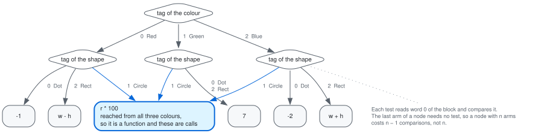

# パターンマッチ — 検査と決定木

`match` の扱いは2つのパスに分かれています。

- `match_check.ml`（238行） — 網羅性と到達不能ケースの警告
- `match_compile.ml`（273行） — `match` を `if` と `let` だけの木に落とす

前者は [Maranget の *Warnings for pattern matching*][warnings]、後者は同じ著者の
[*Compiling pattern matching to good decision trees*][trees] に従っています。
2つのパスは行列を操作する部品を共有していて、`specialize`・`default_matrix`・
`complete_signature` は `match_check.ml` に置いて `match_compile.ml` から使います。

この文書の例はすべて実際にコンパイラに通したものです。題材は主にこれです。

```
type colour = Red | Green | Blue
type shape = Dot | Circle of int | Rect of int * int
let rec score c s =
  match (c, s) with
  | (Red, Rect (w, h)) -> w - h
  | (_, Circle r) -> r * 100
  | (Green, _) -> 7
  | (Blue, Rect (w, h)) -> w + h
  | (Red, Dot) -> 0 - 1
  | (Blue, Dot) -> 0 - 2
in print_int (score Red Dot); print_newline ()
```

---

## 1. 2つの問いは、じつは1つ

「網羅されているか」と「この行は到達するか」は、別々のアルゴリズムを要しません。
どちらも次の1つの問いです。

> **有用性（usefulness）** — ある行は、その上の行が全部拒否する値を受理するか？

- 上の行に対して**有用でない**行は、到達しない。
- ワイルドカードだけの行が**有用でなければ**、網羅されている。

この2つを `check`（`match_check.ml:223`）が続けて呼びます。到達不能の判定は
`is_useful` をそのまま、網羅性は同じ再帰を「反例を返す形」にした `find_missing` です。

```ocaml
let rec scan seen = function
  | [] -> ()
  | case :: rest ->
    if not (is_useful seen [ case.pat ] [ ty ]) then
      warn "this match case is unused: %s" (string_of_pattern case.pat);
    scan (seen @ [ [ case.pat ] ]) rest
```

網羅性のほうは真偽値ではなく**反例を返す形**（`find_missing`）で回します。同じ再帰で、
返り値が「なし」ではなく「これが漏れている値」になるだけです。

## 2. パターン行列と、3つの操作

行が `match` のケース、列が「今調べている値」です。最初は1列（マッチ対象、scrutinee が
1つ）で、分岐するたびに列が増減します。

判定は「列の先頭のコンストラクタ」だけを見ます。これが `head_of`
（`match_check.ml:28`）で、変数とワイルドカードは `None`（何でも受ける）です。

操作は3つです。

**`specialize h`**（`match_check.ml:75`） — 第1列が `h` だと分かったときに生き残る行。
`h` で始まる行はその引数に展開され、ワイルドカードの行は `h` の引数の数だけの
ワイルドカードに展開されます。

**`default_matrix`**（`match_check.ml:89`） — 第1列が「そこに現れるどのコンストラクタ
でもない」と分かったときに生き残る行。ワイルドカードの行だけです。

**`complete_signature`**（`match_check.ml:111`） — 列に現れるコンストラクタが、その型の
コンストラクタを**すべて**覆っているか。覆っていれば全部を返し、そうでなければ `None`
です。`None` なら既定の枝が要ります。

`score` は `match (c, s) with` なので、最初の列はタプル1つです。タプルの
コンストラクタは1つしかないので `complete_signature` は即座に完全と答え、
**判定を1つも出さずに**2列（`colour` と `shape`）へ開きます。`colour` の列には
`Red`・`Green`・`Blue` が、`shape` の列には `Dot`・`Circle`・`Rect` が全部出るので、
どちらも完全です — つまりこの `match` に既定の枝は要りません。

## 3. 反例を返す

`find_missing`（`match_check.ml:176`）は、`complete_signature` が

- **完全なら** — コンストラクタごとに `specialize` して潜り、どれかで漏れが見つかれば
  そのコンストラクタで包み直して返す（`rebuild`）。
- **不完全なら** — `default_matrix` で潜り、見つかれば
  `uncovered_witness`（`match_check.ml:127`）が「列に出ていないコンストラクタ」を
  1つ選んで前に付ける。

包み直しが再帰の各段で起きるので、反例は**入れ子のまま**出てきます。

```
$ cat a.sbl
type colour = Red | Green | Blue
type shape = Dot | Circle of int | Rect of int * int
let rec f p =
  match p with
  | (Red, Dot) -> 1
  | (Red, _) -> 2
  | (Green, _) -> 3
  | (Blue, Circle r) -> r
in print_int (f (Red, Dot)); print_newline ()

$ ./sable a.sbl
Warning: this match is not exhaustive; no case matches (Blue, Dot)
1
```

リストでも同じ再帰が働きます。`[]` と `x :: []` があるとき、漏れているのは
「2要素以上」で、それは `_ :: (_ :: _)` として組み上がります。

```
$ cat a.sbl
let rec f xs = match xs with [] -> 0 | x :: [] -> x in
print_int (f [1]); print_newline ()

$ ./sable a.sbl
Warning: this match is not exhaustive; no case matches _ :: _ :: _
1
```

到達不能のほうは `is_useful`（`match_check.ml:198`）が拾います。

```
$ cat a.sbl
type colour = Red | Green | Blue
let rec name c =
  match c with
  | Red -> 1
  | _ -> 0
  | Blue -> 2
in print_int (name Blue); print_newline ()

$ ./sable a.sbl
Warning: this match case is unused: Blue
0
```

## 4. `int` の列は完全にならない

`complete_signature` は `Types.Int` に対して常に `None` を返します。`int` の
コンストラクタは数え切れないので、`match n with 0 -> ... | 1 -> ...` は必ず
既定の枝を必要とします。反例は「列に出ていない最小の非負整数」を探して作ります
（`match_check.ml:148`）。

```ocaml
| Types.Int ->
  let rec first n = if absent (Hint n) then Pint n else first (n + 1) in
  first 0
```

```
$ cat a.sbl
let rec f n = match n with 0 -> 10 | 1 -> 11 in print_int (f 0); print_newline ()

$ ./sable a.sbl
Warning: this match is not exhaustive; no case matches 2
10
```

`0` と `1` が塞がっているので `2` が出ます。

## 5. 決定木を作る

`build`（`match_compile.ml:102`）は行列を上から見て、

1. 先頭行が全部ワイルドカードなら **葉**（そのケースに到達）。
2. そうでなければ、**先頭行が実際に調べている一番左の列**で分岐する。

```ocaml
(* Split on the leftmost column the first row actually inspects: matching
   it is necessary, so the work is never wasted. *)
```

列の選び方はこれだけです。先頭行が見ている列は、そのケースに当たるためには
どうせ調べなければならないので、**無駄になることがない**という理由です
（Maranget が挙げるヒューリスティクスのうち一番単純なもの。§9）。

枝ごとに、露出したフィールドを新しい名前に束縛します（`branch`、`match_compile.ml:124`）。

```ocaml
(* A datatype block keeps its tag in word 0, so its fields start at 1;
   a tuple has no tag. *)
let offset = match head with Check.Hconstr _ | Check.Hcons -> 1 | _ -> 0 in
let fields = List.map (fun t -> (Ident.fresh "fld", t)) field_types in
```

束縛は枝に**1つ**なので、その枝の下で何行がそのフィールドを見ても、**ヒープから
読むのは1回**です。

`score` の木はこうなります。



実際の A正規形（`--dump-anf`）の先頭は次のとおりで、図と一致します。

```
$ sablec --dump-anf -o /dev/null score.sbl
let rec score.44 c.45 s.46 =
  let match.10.47 : (colour * shape) =
    (c.45, s.46)
  in
  let rec case.20.48 r.49 =        ← 合流点。§7 で作られたもの
    let t.21.50 : int =
      100
    in
    r.49 * t.21.50
  in
  let fld.11.51 : colour =
    match.10.47[0]                 ← タプルを開くのは1回だけ
  in
  let fld.12.52 : shape =
    match.10.47[1]
  in
  let t.22.53 : int =
    fld.11.51[0]                   ← colour のタグ。ここから判定が始まる
  in
  ...
```

## 6. 最後の1本はテストしない、タグ0は先にテストする

列が完全（§2 の `complete_signature` が `Some`）なら、コンストラクタが n 個あっても
比較は **n − 1 回**です。最後の1本は「他が全部外れた」ことが証明になるからです
（`chain`、`match_compile.ml:152`）。完全でなければ n 回比較して、外れたら既定の枝へ
落ちます。

```ocaml
let rec chain = function
  | [] -> fallback
  | [ head ] when signature <> None -> branch head
  | head :: rest -> Test (test_for head occ, branch head, chain rest)
```

どれを最後に回すかは選べます。ここで1つ得をします。

```ocaml
(* When the signature is complete, the head left for last needs no test at
   all.  A tag of zero is the one head whose test would have been free
   anyway -- machines have a register hard-wired to zero -- so it should be
   tested rather than saved for last. *)
```

RISC-V には `zero` レジスタがあるので、タグ0との比較は `bne t0, zero, ...` の1命令に
なります。ほかのタグは `li t0, 2` で定数を作ってから `bne` なので2命令です。
つまり**タグ0のテストはもともとタダ**で、これを「テストしない1本」に選ぶのは
一番もったいない。そこで `tests_against_zero`（`match_compile.ml:94`）で前に出します。

出力に出ています。

```
.Lthen87:
	ld t0, 0(t2)
	bne t0, zero, .Lelse90     ← Dot（タグ0）: 1命令
.Lthen89:
	li a0, -1
	...
.Lelse90:
	ld t1, 0(t2)
	li t0, 2
	bne t1, t0, .Lelse92       ← Rect（タグ2）: 2命令
.Lthen91:
	...
.Lelse92:
	ld a0, 8(t2)               ← Circle: テストなし
	...
	tail sable_case_20_48
```

## 7. 合流点 — 同じケースに複数の葉から来る

決定木は同じケースに複数の葉から到達しえます。`score` の `(_, Circle r)` は
`Red`・`Green`・`Blue` の3つすべてから届きます。素直に木を展開すると、ケースの本体が
**3回複製**されます。ケースが深く入れ子だと、これは指数的に効きます。

そこで `compile_match`（`match_compile.ml:169`）は、まず葉を数え、

```ocaml
let counts = Array.make (List.length cases) 0 in
count_leaves counts tree;
(* Cases reachable from several leaves become local functions. *)
let join_of = Array.mapi (fun i _ -> if counts.(i) > 1 then Some (Ident.fresh "case") else None) cases in
```

2回以上到達されるケースを**局所関数として1回だけ出し、葉はそこへの呼び出しにします**。
関数の引数はそのケースのパターン変数です（変数を1つも束縛しないケースには
`unit` を1つ渡します — 引数0個の関数を作らないため）。

`score` は6ケースで、決定木の葉は8つ。差の2つが複製になるはずのところです。実際に
関数が1つ生成され、呼び出しは3か所です。

```
$ ./sable -S score.sbl | grep '\.globl'
	.globl sable_case_20_48       ← (_, Circle r) -> r * 100 の本体
	.globl sable_score_44
	.globl sable_main

$ ./sable -S score.sbl | grep -n 'tail sable_case_20_48'
53:	tail sable_case_20_48
66:	tail sable_case_20_48
88:	tail sable_case_20_48

$ ./sable -S score.sbl | sed -n '/^sable_case_20_48:/,/^$/p'
sable_case_20_48:
	li t0, 100
	mul a0, a0, t0
	ret
```

この例では `match` が `score` の本体そのものなので、3つの呼び出しはすべて末尾位置に
来ます。`selection.ml` がこれを `tail` にするので、**合流点の代償はジャンプ1つ**です。
戻り先を積むこともスタックを伸ばすこともありません。`match` の結果を使う位置に書けば
普通の `call` になりますが、そのときでも払うのは呼び出し1回ぶんで、複製した本体を
持ち歩くよりは安く済みます。

## 8. 穴に落ちたら

`build` が `Fail` を返した場所には `Match_failure` が置かれ、これはランタイムの
`sable_match_failure` を呼びます。

```
$ cat a.sbl
let rec f n = match n with 0 -> 10 | 1 -> 11 in print_int (f 7); print_newline ()

$ ./sable a.sbl
Warning: this match is not exhaustive; no case matches 2
sable: match failure
$ echo $?
2
```

網羅性は**警告であってエラーではありません**。`int` の `match` は原理的に網羅
できないので、エラーにすると書けないプログラムができてしまいます。

## 9. していないこと

- **列の選び方のヒューリスティクスがありません。** 最左の、先頭行が見ている列を
  取るだけです。Maranget の論文は必要性（necessity）に基づく指標をいくつか比較して
  います。ただし [Scott と Ramsey の測定][heuristics]によれば、人が書いたプログラム
  では「ほとんどの場合どの指標でも木の大きさは同じ、違っても数％」で、差が出るのは
  機械生成されたコード（そこでは2〜20倍）です。ここは差し替えやすい場所で、
  `build` の `col` を決める8行（`match_compile.ml:111`）だけが関係します。
- **タグを毎回読み直します。** `test_for`（`match_compile.ml:82`）が判定ごとに
  `Field (Var occ, 0, _)` を作るので、同じ値のタグが連鎖の各段で `ld` されます。
  `score` は `shape` のタグを5回読みます。`peephole.ml` の局所値番号付けは基本ブロック
  内でしか効かず、判定はブロックを分けるので消えません。**連鎖に入る前にタグを1度
  束縛すれば済む**話で、判定を1つでも出す節点では必ず得になります（k 段たどれば
  現状 k 回、束縛すれば1回）。やっていないだけです。
- **多分岐が比較の連鎖のままです。** コンストラクタが多い型でも `bne` を並べます。
  ジャンプ表にはしていません。
- **or パターン（`A | B ->`）、as パターン、ガード（`when`）、範囲パターンが
  ありません。** `head_of` が1つの頭しか返さない形なので、or パターンを入れると
  行列アルゴリズム側も行が増える形に直す必要があります。
- **文字列のパターンがありません。** 文字列は1ワードに収まらないので、
  [型推論の文書](typing.md#7-比較の被演算子は量化しない)にあるとおり `=` でも
  比較できません。
- パターン変数は1つのパターンに1回だけ、という検査は `typing.ml:123` の
  `check_linear` が持っていて、こちらのパスにはありません。

## 参考文献

- L. Maranget, [*Warnings for pattern matching*][warnings],
  JFP 17(3), 2007（[PDF][warnings-pdf]）。**`match_check.ml` が従っているもの。**
  網羅性と到達不能を1つの有用性判定で、しかも反例つきで出す方法。
- L. Maranget, [*Compiling pattern matching to good decision trees*][trees],
  ML Workshop 2008（[PDF][trees-pdf]）。**`match_compile.ml` が従っているもの。**
  行列アルゴリズムと、列選択のヒューリスティクスの比較（§9 のとおり後者は
  追っていません）。
- M. Baudinet, D. MacQueen, [*Tree pattern matching for ML*][baudinet]（extended
  abstract、1985年12月、未刊）。決定木でパターンマッチをコンパイルする方式の出どころ。
  リンク先は SML の歴史アーカイブにある原稿です。
- P. Wadler, *Efficient compilation of pattern-matching*, in S. L. Peyton Jones,
  [*The Implementation of Functional Programming Languages*][slpj],
  Prentice Hall, 1987, 5章. 教科書の形。こちらは後戻りする方式で、この実装が
  採らなかったほう。リンク先に PDF 全文があります。
- K. Scott, N. Ramsey, [*When do match-compilation heuristics matter?*][heuristics],
  University of Virginia 技術報告, 2000. 列選択の指標を SML/NJ で実測したもの。
  §9 でヒューリスティクスを入れていない言い訳に使っています。

[warnings]: https://doi.org/10.1017/S0956796807006223
[warnings-pdf]: http://moscova.inria.fr/~maranget/papers/warn/warn.pdf
[trees]: https://doi.org/10.1145/1411304.1411311
[trees-pdf]: http://moscova.inria.fr/~maranget/papers/ml05e-maranget.pdf
[baudinet]: https://smlfamily.github.io/history/Baudinet-DM-tree-pat-match-12-85.pdf
[slpj]: https://www.microsoft.com/en-us/research/publication/the-implementation-of-functional-programming-languages/
[heuristics]: https://www.cs.tufts.edu/~nr/pubs/match-abstract.html

## 実装の地図

`match_check.ml` — 行列の部品と、警告。

| | |
|---|---|
| 19–51行 | `head`、`head_of`、`head_eq`、`head_arity` |
| 54–71行 | `sub_types`、`sub_patterns`、`wildcards` — 頭を展開したときの列 |
| 75–85行 | **`specialize`** |
| 89–95行 | **`default_matrix`** |
| 97–106行 | `column_heads` |
| 111–123行 | **`complete_signature`** — 既定の枝が要るかどうか |
| 127–151行 | **`uncovered_witness`** — 列に出ていない頭を1つ |
| 162–173行 | `rebuild` — 反例を包み直す |
| 176–195行 | **`find_missing`** — 網羅性、反例つき |
| 198–217行 | **`is_useful`** — 到達不能 |
| 223–238行 | `check` — 入口 |

`match_compile.ml` — 決定木。

| | |
|---|---|
| 17–29行 | `tree`（`Fail` / `Leaf` / `Bind` / `Test`）、`row`、`occurrence` |
| 46–64行 | `specialize_rows` — `specialize` に束縛の持ち回りを足したもの |
| 67–76行 | `default_rows` |
| 82–91行 | `test_for` — 頭を判定する式。単一コンストラクタは判定しない |
| 94–100行 | `tests_against_zero` — §6 |
| 102–157行 | **`build`** — 木を作る本体。列選択は111行、枝は124行、連鎖は152行 |
| 161–167行 | `count_leaves` |
| 169–223行 | **`compile_match`** — 木を構文木に落とし、合流点を関数にする |
| 227–273行 | `compile` — 構文木を辿って `match` を置き換えていく |

読む順番としては `match_check.ml` の `specialize` と `default_matrix` を先に見て、
それから `find_missing` と `build` を並べて読むのが早いです。同じ再帰の骨格が、
片方は「漏れを探す」、もう片方は「コードを吐く」に使われているのが見えます。

---

隣の文書：[パイプライン全体](pipeline.md)、[型推論](typing.md)、
[レジスタ割り付け](regalloc.md)。
