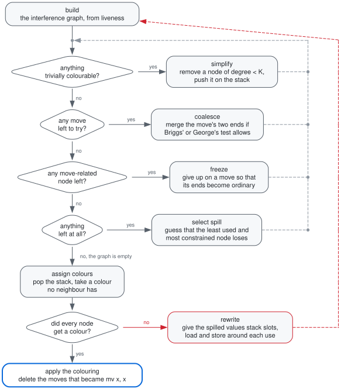
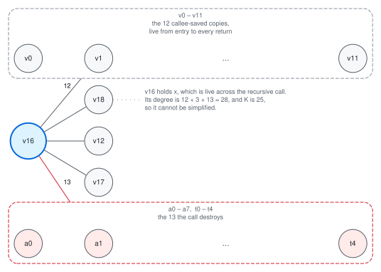

# グラフ彩色によるレジスタ割り付け

`selection.ml` が吐くのは無制限の仮想レジスタの上のコードで、正しいけれど実行できません。
それを実行できるものに変えるのが `regalloc.ml` で、このコンパイラの他の部分はここに食わせる
ために存在しています。

理論は [Chaitin][chaitin] と [Briggs ら][briggs]、実装の形は
[George と Appel の反復合体][iterated]（iterated register coalescing）、およびそれを
教科書の形にした Appel の *Modern Compiler Implementation* 11章に従っています。

以下、題材は[パイプライン解説](pipeline.md)と同じ `doc/sum.sbl` です。

全体の流れを先に示します。4つの判定が縦に並んでいるのは `regalloc.ml` の `work ()` の
`if ... else if ...` の連鎖そのもので、**上ほど優先**します。細部は §3 以降で。



---

## 1. 問題

**同時に生きている値は同じレジスタに置けない**。それだけです。

これをグラフにします。節点はレジスタ（仮想・物理の両方）、辺は「この2つは同時に生きている」。
すると割り付けは、隣り合う節点が同じ色にならないように K 色で塗る問題になります。K は機械が
持つレジスタの本数、ここでは25です。

```
a0–a7   8本   引数と戻り値。呼び出しで壊れる
t0–t4   5本   一時。呼び出しで壊れる
s0–s11 12本   呼ばれた側が保存する義務を負う
────────────
       25本  = K
```

`zero`・`ra`・`sp`・`gp`・`tp` と、予約した `t5`（出力器の作業用）・`t6`（クロージャ運搬用）は
色になりません。これらは命令には現れますが、彩色には一切参加しません。

## 2. 干渉グラフを実際に作る

`sum` の `.Lelse34` ブロックを後ろから歩いてみます（割り付け前のコード）。

```
.Lelse34:
    ld v16, 8(v12)          ; x
    ld v17, 16(v12)         ; rest
    mv a0, v17
    call sable_sum_15(a0)
    mv v18, a0
    add v19, v16, v18
    mv a0, v19
    mv s0, v0 … mv s11, v11 ; callee-saved の復帰
    ret a0
```

`ret` は `a0` と callee-saved 12本を読むので、そこから生存集合は `{a0, s0..s11}` で始まります。
逆順に、命令ごとに「**定義される節点と、その時点で生きている全節点のあいだに辺を張る**」を
繰り返します。

ここで `mv` だけは例外です。`mv d, s` は d と s を干渉させません — 同じ値なのだから同じ
レジスタでよく、まさにその自由が次節の合体を可能にします。

歩き終えると `v16`（`x`）の隣接はこうなります。

| 相手 | 本数 | 理由 |
|---|---|---|
| `v0`–`v11` | 12 | 入口で退避した callee-saved の値。関数全体で生きている |
| `v12`, `v17`, `v18` | 3 | `v16` が生きているあいだに定義される |
| `a0`–`a7`, `t0`–`t4` | 13 | **`call` が caller-saved を全部定義する** |

合計28本。K = 25 を超えているので、`v16` は「隣接が K 未満なら必ず塗れる」枠には入りません。



破線の枠へ伸びる1本の辺は、**枠の中の各節点への辺**を表します（`12` と `13` はその本数）。

最後の行が重要です。呼び出しは caller-saved レジスタをすべて破壊するので、**呼び出しをまたいで
生きる値はそれら全部と干渉する**。この辺のおかげで、そういう値は自動的に callee-saved
レジスタか、スタックへ追いやられます。アロケータの中に「呼び出し規約」という名前の特別扱いは
1行もありません。

## 3. Kempe の観察 — simplify と select

グラフを K 色で塗るのは一般には難しい問題ですが、[Kempe][kempe] の観察が実用を可能にします。

> **隣接が K 未満の節点は、残りのグラフに何が起きようと必ず塗れる。**

隣が K−1 本以下なら、K 色のうち少なくとも1色は必ず余るからです。なので：

- **simplify** — 隣接が K 未満の節点をグラフから外し、スタックに積む。外すと隣の次数が減るので、
  今度は別の節点が K 未満になり、連鎖する。
- **select** — グラフが空になったらスタックを逆に降ろし、隣が使っていない色を与える。

物理レジスタは**あらかじめ色が塗られた次数無限の節点**として置いてあります。だから simplify で
外れることはなく、`v16` を塗る段になると「`a0`–`a7` と `t0`–`t4` は既に埋まっている」と分かる、
という仕組みです。

## 4. 合体 — このアロケータがここで働く理由

命令選択は `mv` を大量に出します。引数ごと、結果ごと、callee-saved レジスタごと。`sum` の
割り付け前のコードには41個ありました。素朴に彩色すればそれが41個の `mv` 命令として残ります。

**合体**は `mv d, s` の両端を1つの節点に融合します。融合できれば d と s は同じレジスタになり、
`mv` は消えます。

ただし無条件に融合すると次数の高い節点ができ、塗れたはずのグラフが塗れなくなります。そこで
**融合しても悪化しないと証明できるときだけ**融合します。判定は2つ。

- **Briggs** — 融合後の節点の隣接のうち、次数が K 以上のものが K 個未満なら安全。
- **George** — 片方が物理レジスタ `r` のとき、もう片方のすべての隣接が「次数 K 未満」か
  「もともと `r` と干渉している」なら安全。

どちらも通らない move は**保留**にしておき、simplify が進んで次数が下がったら再検討します。
再検討しても駄目なら **freeze** — その move を諦めて、両端を普通の節点として simplify に流す。
この simplify → 合体 → freeze → スピル → select の入れ替わりが「反復」合体です。

効きます。`sum` では41個の move が41個とも消えました。

```
$ sablec --dump-regalloc -o /dev/null doc/sum.sbl
sable_sum_15: 2 round(s), 41/41 moves coalesced, 1 spill slot(s) [spilled v16]
```

何も要らない関数だと、全体が畳まれます。

```
$ echo 'let rec f a b = a * b + a in print_int (f 2 3)' > /tmp/leaf.sbl
$ ./sable -S /tmp/leaf.sbl
sable_f_5:
	mul t0, a0, a1
	add a0, t0, a0
	ret
```

割り付け前は16本の仮想レジスタと12本の callee-saved 退避があり、そのすべてが消えています。

## 5. スピル

simplify も合体も freeze もできない — 残った節点がすべて K 以上の隣接を持つ — という状態に
なったら、どれか1つを選んで「**これは塗れないだろう**」と賭け、外して先に進みます。

選ぶのは**使われる回数が少なく、干渉が多い値**です。長くレジスタを占有するわりに働かない
ものから落とす、という素直な指標（使用・定義の回数 ÷ 次数の最小）です。

賭けが当たって select で色が付けば、それで終わり。付かなかったら、その値に**スタックスロットを
割り当て、触る命令の直前で読み・直後で書く**ようにプログラムを書き換えて、全部やり直します。
書き換えで生まれた一時変数は生存区間が1命令しかないので必ず塗れ、次のラウンドは確実に前進
します（そのために、これらは二度とスピル候補にしないよう印を付けてあります）。

`sum` のラウンド数が 2 なのは、1回目で `v16` の賭けを外し、書き換えて2回目で成功したからです。

書き換えは機械的なので、定義のすぐ後で使われる値には「書いて、すぐ読み戻す」という無駄が
残ります。これは割り付けが終わってから[のぞき穴最適化](pipeline.md)が拾います。`sum` の
スピルは書き込みと読み出しのあいだに呼び出しを挟むので、そちらは残ります — 挟まれた時点で
レジスタはどのみち壊れているので、残っているのが正しい姿です。

結果を見ると気づくことがあります。

```
.Lelse34:
	ld t0, 8(a0)      ; x
	sd t0, 0(sp)      ; ← スピル
	ld a0, 16(a0)     ; rest
	call sable_sum_15
	ld t0, 0(sp)      ; ← 復元
	add a0, t0, a0
```

`x` は呼び出しをまたぐので callee-saved レジスタに入れることもできたはずです。ですがそうすると
そのレジスタの元の値を退避する必要があり、**プロローグとエピローグで1回ずつメモリに触る** —
スピルとまったく同じ費用です。12本の callee-saved を使いたい値（`v0`–`v11`）と `x` の計13個が
12本のレジスタを取り合っているので、どうやっても1つはメモリに行きます。どれを落としても
費用が同じなので、この結果は取りうる最良のものです。

## 6. callee-saved の退避は、スピルそのもの

これがこの実装でいちばん気に入っている点です。

`selection.ml` は、関数の入口で callee-saved レジスタ12本を仮想レジスタにコピーし、各 `ret` の
直前で書き戻すコードを出します。

```
sable_sum_15:
    mv v0, s0
    ...
    mv v11, s11
    …本体…
    mv s0, v0
    ...
    mv s11, v11
    ret a0
```

そのうえで、`ret` と末尾呼び出しは callee-saved レジスタを**読む**ものとして扱います
（`Riscv.terminator_uses`）。呼び出し元の値がそこに戻っていなければならない地点だからです。

あとはアロケータに任せます。

- 関数がそのレジスタを他に使わなければ、`mv v_i, s_i` は合体で消え、`mv s_i, v_i` も消える。
  **葉関数は何も払いません。**
- 使いたければ `v_i` がスピルされる。そのスピルは `sd s_i, N(sp)` と `ld s_i, N(sp)` になる
  — つまり**退避と復帰そのもの**です。

「5本使う関数はちょうど5本ぶん払う」が、専用のコードなしに出てきます。同じプログラムの2つの
関数で対照的に現れます。

```
sable_sum_15: 41/41 moves coalesced, 1 spill slot(s) [spilled v16]
sable_main:   30/31 moves coalesced, 3 spill slot(s) [spilled v0 v1 v2]
```

`sum` は callee-saved を1本も使わないので退避ゼロ。`main` は呼び出しをまたぐ値が3つあるので
`s0`/`s1`/`s2` を使い、その3本ぶんの退避（`v0`/`v1`/`v2` のスピル）が出ています。

```
sable_main:
	addi sp, sp, -32
	sd ra, 24(sp)
	sd s0, 0(sp)      ┐
	sd s1, 8(sp)      │ v0 v1 v2 のスピル = s0 s1 s2 の退避
	sd s2, 16(sp)     ┘
	li s1, 1
	li s2, 2
	la s0, sable_const_list_Nil
	...
```

## 7. 機械を縮めてみる

`-nregs n` は割り当て可能なレジスタを n 本に絞ります。引数レジスタ `a0`–`a7` は呼び出し規約が
成り立たなくなるので常に残し、削るのはそれ以外です（下限10本）。

これは意地悪のためではなくテストのためにあります。**すべての例題は25本と10本の両方でビルドされ、
出力が一致することを要求されます**（`tests/run.sh`）。スピラを検査する手段がこれです。

`sum` は3本しか要らないので、10本に絞っても生成コードは1バイトも変わりません。変わるのは
`main` のほうです。

```
--- 25本                          --- 10本
	sd s0, 0(sp)                    	li t0, 1
	sd s1, 8(sp)                    	sd t0, 0(sp)
	sd s2, 16(sp)                   	li t0, 2
	li s1, 1                        	sd t0, 8(sp)
	li s2, 2                        	la t0, sable_const_list_Nil
	la s0, sable_const_list_Nil     	sd t0, 16(sp)
	...                             	...
	sd s2, 8(a0)                    	ld t0, 8(sp)
	sd s0, 16(a0)                   	sd t0, 8(a0)
```

callee-saved が2本しか残らないので、値がレジスタに居座れず全部スタックを経由しています。
遅くはなりますが、答えは同じです。

意図的に負荷をかけた例が `examples/pressure.sbl` です。16個の値が同じ16回の呼び出しを
またいで生きるように書いてあります。

```
$ ./sable --dump-regalloc examples/pressure.sbl
sable_blend:      1 round(s), 27/27 moves coalesced, 0 spill slot(s)
sable_pressure:   2 round(s), 46/75 moves coalesced, 16 spill slot(s)
sable_accumulate: 2 round(s), 42/44 moves coalesced, 2 spill slot(s)
sable_main:       1 round(s), 26/26 moves coalesced, 0 spill slot(s)
```

16スロット。callee-saved が12本しかないところに、呼び出しをまたぐ値が16個あるためです。

## 8. この実装で効いている単純化

正直に書いておくと、**Sable の関数の制御フローグラフには閉路がありません**。ソース上のループは
再帰呼び出しであり、呼び出しは関数から出ていくからです。

そのおかげで2つ楽をしています。

- 後ろ向きの生存解析が1回の逆順走査で収束します（一般の不動点ループとして書いてはありますが、
  実際には回りません）。
- **スピル費用の重み付けにループ深さの推定が要りません。** 普通のコンパイラは「ループの中で
  使われる値は10倍重い」といった補正を入れますが、ここでは全基本ブロックが本当に等価なので、
  使用回数をそのまま数えるのが正確です。

より大きな言語に移すなら最初に壊れるのがここです。

## 9. していないこと

- **生存区間の分割（live-range splitting）** がありません。値は「全体をレジスタに置く」か
  「全体をスタックに置く」かの二択です。分割できれば、混んでいる区間だけメモリに逃がせます。
- **再実体化（rematerialization）** もありません。`li a0, 5` のように再計算のほうが安い値でも、
  スピルすればメモリに書きます。
- スピル選択は使用回数 ÷ 次数の一発勝負で、選び直しはしません。
- 合体は Briggs と George の保守的な判定のみです。楽観的合体（融合してから駄目なら剥がす）は
  実装していません。
- 命令スケジューリングはしません。割り付けの前後どちらでもやっていないので、ロード直後の
  使用が並んだままです。

いずれも「入れれば良くなるがアルゴリズムの骨格は変わらない」種類のもので、骨格のほうを読める
ようにするのがこの実装の目的です。

## 参考文献

- A. B. Kempe, *On the geographical problem of the four colours*, American Journal
  of Mathematics 2(3), 1879. 「隣接が K 未満の節点は必ず塗れる」の出どころ。
  [PDF][kempe]（Internet Archive）
- G. J. Chaitin, *Register allocation and spilling via graph coloring*,
  SIGPLAN Notices 17(6), 1982. グラフ彩色によるレジスタ割り付けそのもの。[ACM][chaitin]
- P. Briggs, K. D. Cooper, L. Torczon,
  [*Improvements to graph coloring register allocation*][briggs],
  ACM TOPLAS 16(3), 1994. 保守的合体（Briggs の判定）と楽観的スピル。
- L. George, A. W. Appel, [*Iterated register coalescing*][iterated],
  ACM TOPLAS 18(3), 1996. **この実装が従っているアルゴリズム。** George の判定と、
  simplify・合体・freeze を交互に回す形。
- A. W. Appel, *Modern Compiler Implementation in ML*, Cambridge University
  Press, 1998, 11章. 上の論文を擬似コードに落としたもので、`regalloc.ml` の
  worklist の構成はこれに対応します（読まれない集合を落とした点は本文のとおり）。

[kempe]: https://archive.org/details/jstor-2369235
[chaitin]: https://dl.acm.org/doi/10.1145/872726.806984
[briggs]: https://doi.org/10.1145/177492.177575
[iterated]: https://doi.org/10.1145/229542.229546

## 実装の地図

`regalloc.ml` は447行、`allocate`（48行）1つの中に閉じています。

| | |
|---|---|
| 70–113行 | グラフの表現。辺集合（`Hashtbl`）、節点ごとの隣接集合、次数、別名、色 |
| 128–153行 | **build** — 生存解析の結果を後ろから歩いて辺を張る |
| 155–198行 | 補助（`adjacent`、`node_moves`、`decrement_degree`、`enable_moves`） |
| 200–216行 | **simplify** |
| 218–285行 | **coalesce** — George と Briggs の判定、`combine` |
| 287–296行 | **freeze** |
| 298–315行 | **select_spill** — 費用最小の節点を選ぶ |
| 317–341行 | **assign_colours** — スタックを降ろして色を配る |
| 368–422行 | **rewrite** — スピルした値をスタックに落としてプログラムを書き換える |
| 424–437行 | **apply_colours** — 仮想レジスタを物理に置換し、`mv x, x` を消す |

読む順番としては、`round ()` の末尾（343行）にある

```ocaml
let rec work () =
  if not (RegSet.is_empty !simplify_worklist) then (simplify (); work ())
  else if not (RegSet.is_empty !worklist_moves) then (coalesce (); work ())
  else if not (RegSet.is_empty !freeze_worklist) then (freeze (); work ())
  else if not (RegSet.is_empty !spill_worklist) then (select_spill (); work ())
in
```

から始めるのが早いです。優先順位がそのまま書いてあります — 塗れると分かっているものから
外し、次に安全な合体、それも尽きたら move を諦め、最後にやむなく賭ける。
