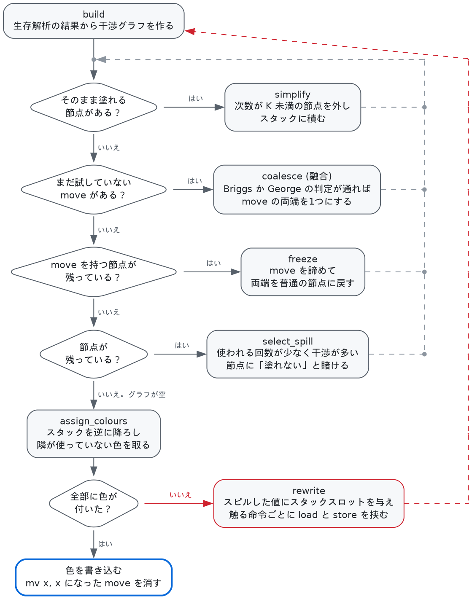
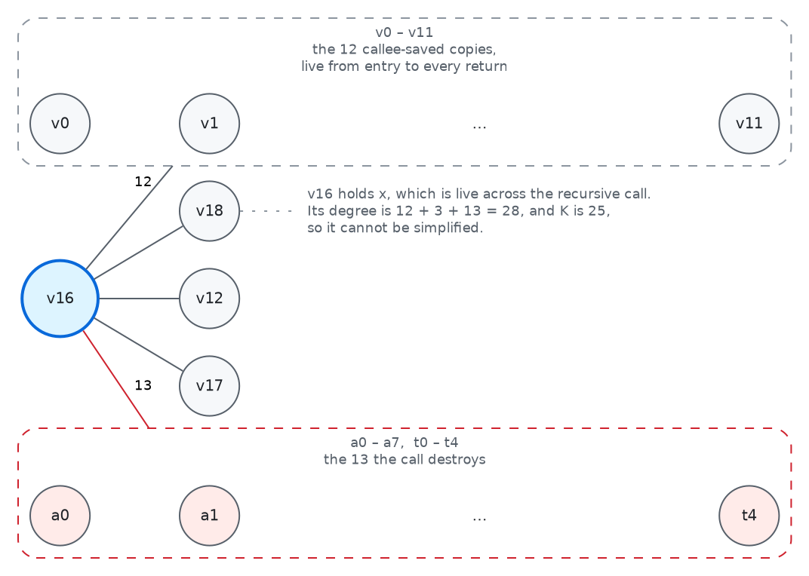
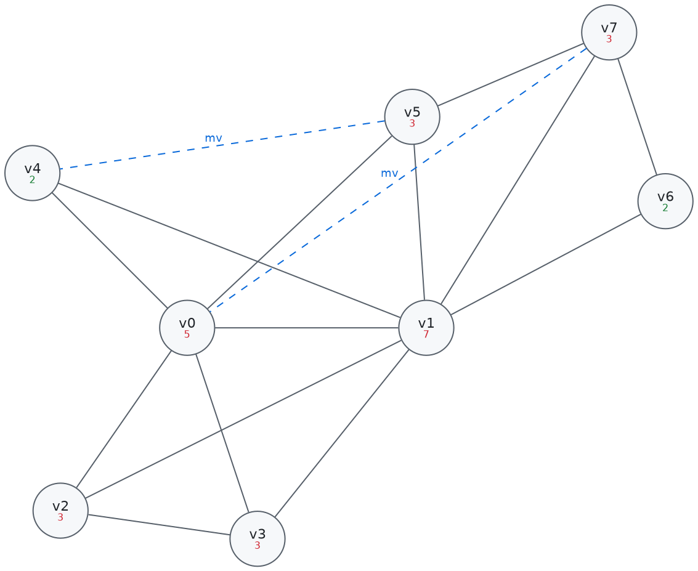
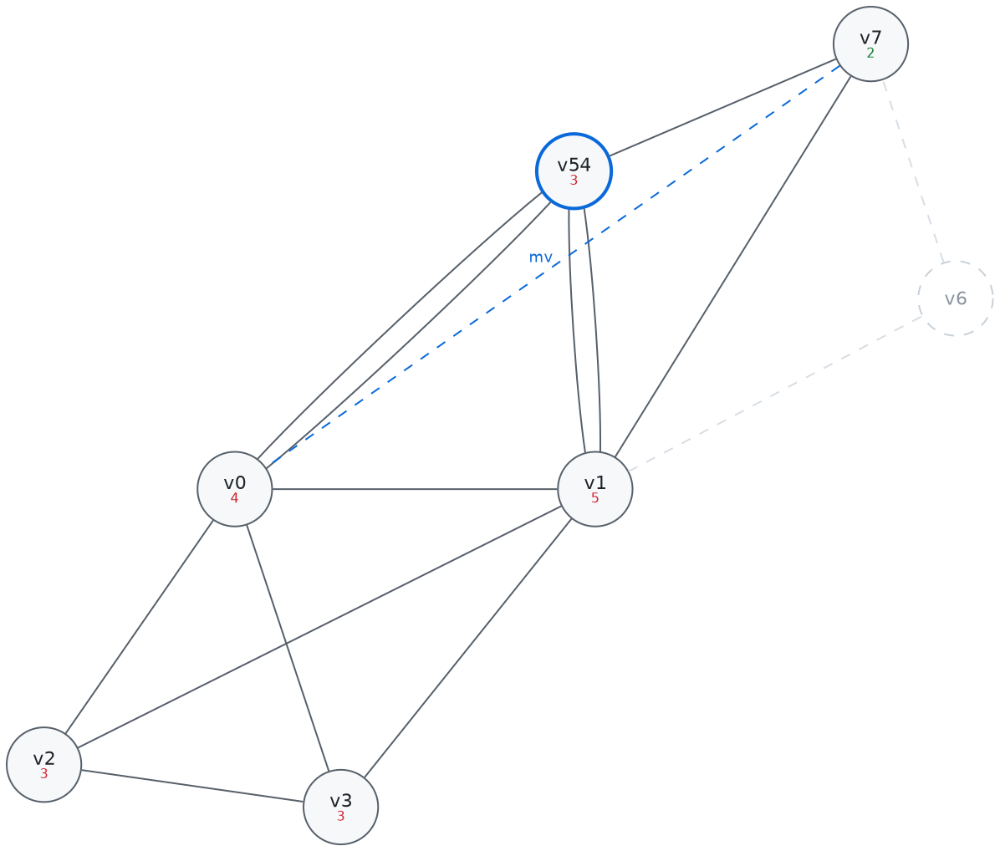
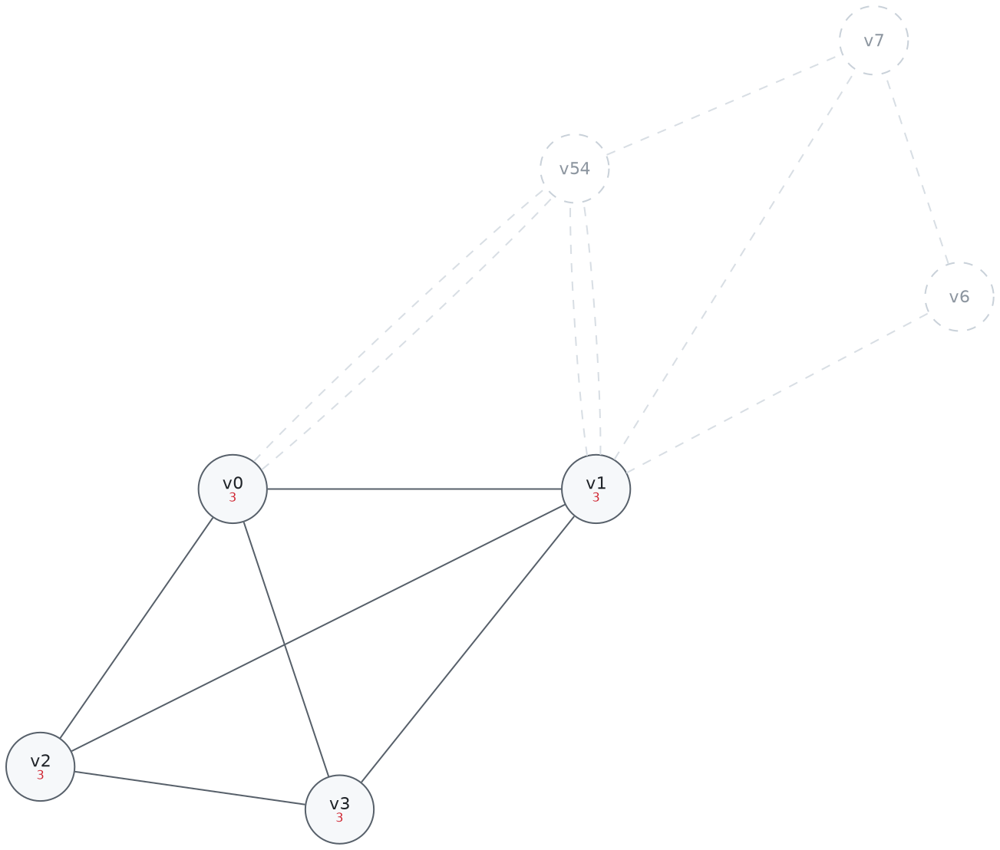
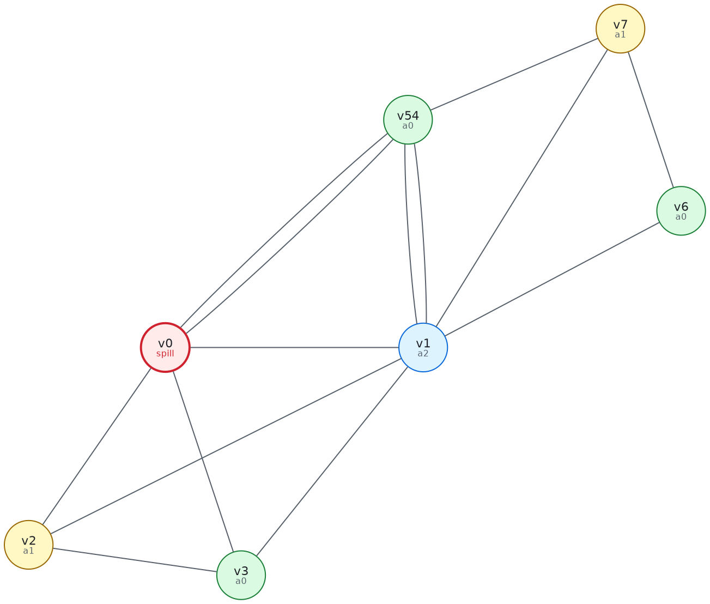
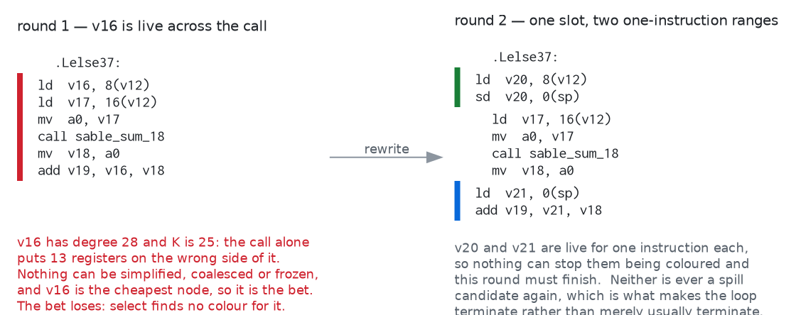
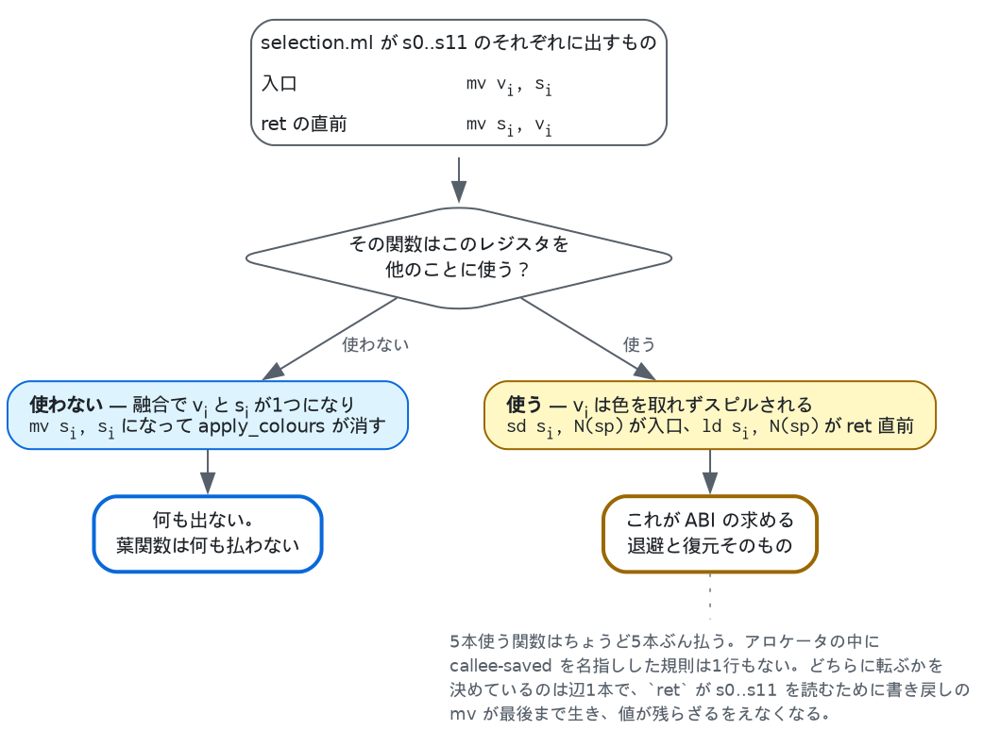

# グラフ彩色によるレジスタ割り付け

`selection.ml` が吐くのは無制限の仮想レジスタの上のコードで、正しいけれど実行できません。
それを実行できるものに変えるのが `regalloc.ml` で、このコンパイラの他の部分はここに食わせる
ために存在しています。

理論は [Chaitin][chaitin] と [Briggs ら][briggs]、実装の形は
[George と Appel の反復融合][iterated]（iterated register coalescing）、およびそれを
教科書の形にした [Appel の *Modern Compiler Implementation*][appel] 11章に従っています。

以下、題材は[パイプライン解説](pipeline.md)と同じ `doc/sum.sbl` です。

全体の流れを先に示します。4つの判定が縦に並んでいるのは `regalloc.ml` の `work ()` の
`if ... else if ...` の連鎖そのもので、**上ほど優先**します。細部は §3 以降で。



---

## 1. 問題

**同時に生きている値は同じレジスタに置けない**。それだけです。

これをグラフにします。節点はレジスタ（仮想・物理の両方）、辺は「この2つは同時に生きている」。
すると割り付けは、隣り合う節点が同じ色にならないように K 色で塗る問題になります。K は機械が
持つレジスタの本数、ここでは25です。

```
a0–a7   8本   引数と戻り値。呼び出しで壊れる
t0–t4   5本   一時。呼び出しで壊れる
s0–s11 12本   呼ばれた側が保存する義務を負う
────────────
       25本  = K
```

`zero`・`ra`・`sp`・`gp`・`tp` と、予約した `t5`（アセンブリ出力の作業用）・`t6`（クロージャ運搬用）は
色になりません。これらは命令には現れますが、彩色には一切参加しません。

## 2. 干渉グラフを実際に作る

`sum` の `.Lelse34` ブロックを後ろから辿ってみます（割り付け前のコード）。

```
.Lelse34:
    ld v16, 8(v12)          ; x
    ld v17, 16(v12)         ; rest
    mv a0, v17
    call sable_sum_15(a0)
    mv v18, a0
    add v19, v16, v18
    mv a0, v19
    mv s0, v0 … mv s11, v11 ; callee-saved の復帰
    ret a0
```

`ret` は `a0` と callee-saved 12本を読むので、そこから生存集合は `{a0, s0..s11}` で始まります。
逆順に、命令ごとに「**定義される節点と、その時点で生きている全節点のあいだに辺を張る**」を
繰り返します。

ここで `mv` だけは例外です。`mv d, s` は d と s を干渉させません — 同じ値なのだから同じ
レジスタでよく、まさにその自由が次節の融合を可能にします。

辿り終えると `v16`（`x`）の隣接はこうなります。

| 相手 | 本数 | 理由 |
|---|---|---|
| `v0`–`v11` | 12 | 入口で退避した callee-saved の値。関数全体で生きている |
| `v12`, `v17`, `v18` | 3 | `v16` が生きているあいだに定義される |
| `a0`–`a7`, `t0`–`t4` | 13 | **`call` が caller-saved を全部定義する** |

合計28本。K = 25 を超えているので、`v16` は「隣接が K 未満なら必ず塗れる」という条件には
当てはまりません。



破線の枠へ伸びる1本の辺は、**枠の中の各節点への辺**を表します（`12` と `13` はその本数）。

最後の行が重要です。呼び出しは caller-saved レジスタをすべて破壊するので、**呼び出しをまたいで
生きる値はそれら全部と干渉する**。この辺のおかげで、そういう値は自動的に callee-saved
レジスタか、スタックへ追いやられます。アロケータの中に「呼び出し規約」という名前の特別扱いは
1行もありません。

## 3. 次数が K 未満なら必ず塗れる — simplify と select

グラフを K 色で塗るのは一般には難しい問題ですが、[Kempe][kempe] が示した次の事実が実用を
可能にします。

> **隣接が K 未満の節点は、残りのグラフに何が起きようと必ず塗れる。**

隣接する節点が K−1 個以下なら、K 色のうち少なくとも1色は必ず余るからです。これを2つの操作に
します。

- **simplify** — 隣接が K 未満の節点をグラフから外し、スタックに積みます。外すというのは
  その節点の色を決めるのを最後に回すという意味で、値が消えるわけではありません。グラフの
  ほうで変わるのは隣の次数が1ずつ減ることだけです（`decrement_degree`）。次数が K 以上で
  手が出せなかった節点も、隣が1つ外れれば K−1 になって外せるようになるので、減った隣を見る
  だけでよく、残り全体を測り直す必要はありません。
- **select** — グラフが空になったらスタックを逆に降ろし、隣が使っていない色を与えます。
  逆順であることが効きます。外した時点で隣は K 個未満だったので、戻すときにグラフにいる隣が
  それより増えていることはなく、色は必ず余ります。

物理レジスタは**あらかじめ色が塗られた次数無限の節点**として置いてあります。次数が無限なので
simplify で外れることはなく、`v16` を塗る段では `a0`–`a7` と `t0`–`t4` が既に埋まっていること
が分かります。

## 4. 融合 — このアロケータの働きどころ

命令選択は `mv` を大量に出します。引数ごと、結果ごと、callee-saved レジスタごと。`sum` の
割り付け前のコードには41個ありました。素朴に彩色すればそれが41個の `mv` 命令として残ります。

**融合**は `mv d, s` の両端を1つの節点に融合します。融合できれば d と s は同じレジスタになり、
`mv` は消えます。

ただし無条件に融合すると次数の高い節点ができ、塗れたはずのグラフが塗れなくなります。そこで
**融合しても悪化しないと証明できるときだけ**融合します。判定は2つ。

- **Briggs** — 融合後の節点の隣接のうち、次数が K 以上のものが K 個未満なら安全。
- **George** — 片方が物理レジスタ `r` のとき、もう片方のすべての隣接が「次数 K 未満」か
  「もともと `r` と干渉している」なら安全。

どちらも通らない move は**保留**にしておき、simplify が進んで次数が下がったら再検討します。

### freeze — move を諦める

保留のままだと行き詰まることがあります。**move を持つ節点は、次数が K 未満でも simplify に
回りません**（`regalloc.ml:214` の `make_worklists`）。融合できるかもしれない相手を先に外して
しまうと融合の機会が消えるので、待ち行列を分けてあるからです。ところが判定がどちらも通らない
まま move が残ると、その節点は次数が低いのに simplify されず、simplify・融合の両方が空という
状態になります。

そこで **freeze** です。節点を1つ選び、それが関わる move を全部諦めます。諦めるというのは
move を生きている集合から落とすことで、`node_moves` から見えなくなるので、その節点は move を
持たないただの節点として simplify に回ります。move の相手側も、これで move を1つも持たなく
なり次数が K 未満なら、一緒に simplify へ移ります（`regalloc.ml:299` の `freeze_moves`）。

**諦めた move は消えません。** `mv` 命令としてそのまま出力に残ります。freeze が捨てているのは
融合の機会だけで、正しさには何も触りません。これがないと、次数が低いだけの節点をスピルする
はめになります — メモリに触るほうがはるかに高くつきます。

freeze が融合より後ろに置かれているのはこのためです。simplify も融合も尽きて、他に打つ手が
なくなってから、1つだけ諦める。

この simplify → 融合 → freeze → スピル → select を交互に繰り返すのが「反復」融合です。

### 通してみる — 8つの値、K = 3

ここまでの5つの操作が1つの関数の上でどう噛み合うかを、最初から最後まで追います。以下の
グラフ・次数・手順はすべて `tests/walkthrough.exe` の出力で、手で解いたものではありません。

```
$ dune exec tests/walkthrough.exe
```

実際の関数では K を8より小さくできません（引数レジスタ8本は呼び出し規約のために常に
割り当て可能）。K = 25 のグラフは紙に載りません。そこでこのプログラムは、コマンドラインでは
指定できない**3レジスタの機械**でアロケータを直接動かします。

題材はこの1ブロックです。値は4つ同時に生きていて、機械は3本しかありません。

```
    ld  v0, 0(sp)
    ld  v1, 8(sp)
    ld  v2, 16(sp)
    ld  v3, 24(sp)
    add v4, v2, v3
    mv  v5, v4         ← 両端を融合できる move
    mv  v7, v0         ← 融合できない move
    add v6, v7, v5
    sd  v6, 32(sp)
    add a0, v7, v1
    ret a0
```

`build` が作るグラフです。丸の下段が次数で、**赤が K 以上（そのままでは外せない）、緑が
K 未満**。破線が2本の move です。



**1. simplify v6。** 次数が K 未満で move も持たない節点は `v6` だけです。外すと隣の `v1` と
`v7` の次数が1ずつ下がります。

**2. 融合の判定が2回。** simplify が尽きたので move を見にいきます。

- `v7 -- v0` — 融合後の隣接で次数が K 以上のものを数えると `v1`・`v2`・`v3`・`v5` の4つ。
  3以上なので Briggs は通りません。George も `v7` が物理レジスタでないので使えず、**保留**に
  回ります。
- `v5 -- v4` — こちらは `v0` と `v1` の2つだけ。2 < 3 で通るので**融合**します。



**3. freeze v7。** move が尽き、simplify も空です。`v7` は次数2で外せるはずなのに、保留中の
move を持っているせいで動けません。ここで freeze が効きます — `v7` の move を諦めると、
`v7` はただの節点になり、続いて `v5` も外れます。

**4. select_spill v0。** 残った `v0`・`v1`・`v2`・`v3` は全部が次数3。simplify も融合も freeze
もできません。使用回数 ÷ 次数がいちばん小さい `v0`（0.67）に「塗れない」と賭けて外します。
外した拍子に残りの次数が落ち、連鎖して空になります。



**5. 色を配る。** スタックを逆に降ろすと `v3`・`v2`・`v1` が3色を取り、`v0` の番には隣が
3色とも使っていて**空きがありません**。賭けは外れです。



**6. rewrite して2周目。** `v0` にスタックスロットを1つ与え、触る命令の直前と直後に `ld` と
`sd` を挟んで、最初からやり直します。2周目は誰もスピルせずに終わります。そして**1周目に
諦めた move が、今度は融合されます** — 書き換えで `v0` の長い生存区間が消え、Briggs が通る
ようになったからです。

```
walkthrough: 2 round(s), 2/2 moves coalesced, 1 spill slot(s) [spilled v0]
```

出てきたコードです。3本のレジスタと1つのスロットに収まっています。

```
    ld  a0, 0(sp)
    sd  a0, 0(sp)      ← v0 のスピル
    ld  a1, 8(sp)
    ld  a2, 16(sp)
    ld  a0, 24(sp)
    add a0, a2, a0
    ld  a2, 0(sp)      ← v0 の復元
    add a0, a2, a0
    sd  a0, 32(sp)
    add a0, a2, a1
    ret a0
```

`mv` は1つも残っていません。

実物でも同じです。`sum` では41個の move が41個とも消えました。

```
$ sablec --dump-regalloc -o /dev/null doc/sum.sbl
sable_sum_15: 2 round(s), 41/41 moves coalesced, 1 spill slot(s) [spilled v16]
```

何も要らない関数だと、全体が畳まれます。

```
$ echo 'let rec f a b = a * b + a in print_int (f 2 3)' > /tmp/leaf.sbl
$ ./sable -S /tmp/leaf.sbl
sable_f_5:
	mul t0, a0, a1
	add a0, t0, a0
	ret
```

割り付け前は16本の仮想レジスタと12本の callee-saved 退避があり、そのすべてが消えています。

## 5. スピル

simplify も融合も freeze もできない — 残った節点がすべて K 以上の隣接を持つ — という状態に
なったら、どれか1つを選んで「**これは塗れないだろう**」と賭け、外して先に進みます。

選ぶのは**使われる回数が少なく、干渉が多い値**です。長くレジスタを占有するわりに働かない
ものから落とす、という素直な指標（使用・定義の回数 ÷ 次数の最小）です。

賭けが当たって select で色が付けば、それで終わり。付かなかったら、その値に**スタックスロットを
割り当て、触る命令の直前で読み・直後で書く**ようにプログラムを書き換えて、全部やり直します。
書き換えで生まれた一時変数は生存区間が1命令しかないので必ず塗れ、次のラウンドは確実に前進
します（そのために、これらは二度とスピル候補にしないよう印を付けてあります）。

`sum` のラウンド数が 2 なのは、1回目で `v16` の賭けを外し、書き換えて2回目で成功したからです。
1回目と2回目のコードを並べます。



書き換えが変えているのは生存区間の長さです。`v16` は呼び出しをまたいで6命令ぶん生きて
いました。書き換え後の `v20` と `v21` はそれぞれ1命令です。1命令しか生きていない値は、その
命令の中で同時に生きている値としか干渉しないので、次数が K に届きません。次のラウンドが
必ず前進するのはこのためです。

書き換えは機械的なので、定義のすぐ後で使われる値には「書いて、すぐ読み戻す」という無駄が
残ります。これは割り付けが終わってから[のぞき穴最適化](pipeline.md)が拾います。`sum` の
スピルは書き込みと読み出しのあいだに呼び出しを挟むので、そちらは残ります — 挟まれた時点で
レジスタはどのみち壊れているので、残っているのが正しい姿です。

結果を見ると気づくことがあります。

```
.Lelse34:
	ld t0, 8(a0)      ; x
	sd t0, 0(sp)      ; ← スピル
	ld a0, 16(a0)     ; rest
	call sable_sum_15
	ld t0, 0(sp)      ; ← 復元
	add a0, t0, a0
```

`x` は呼び出しをまたぐので callee-saved レジスタに入れることもできたはずです。ですがそうすると
そのレジスタの元の値を退避する必要があり、**プロローグとエピローグで1回ずつメモリに触る** —
スピルとまったく同じ費用です。12本の callee-saved を使いたい値（`v0`–`v11`）と `x` の計13個が
12本のレジスタを取り合っているので、どうやっても1つはメモリに行きます。どれを落としても
費用が同じなので、この結果は取りうる最良のものです。

## 6. callee-saved の退避は、スピルそのもの

これがこの実装でいちばん気に入っている点です。

`selection.ml` は、関数の入口で callee-saved レジスタ12本を仮想レジスタにコピーし、各 `ret` の
直前で書き戻すコードを出します。

```
sable_sum_15:
    mv v0, s0
    ...
    mv v11, s11
    …本体…
    mv s0, v0
    ...
    mv s11, v11
    ret a0
```

そのうえで、`ret` と末尾呼び出しは callee-saved レジスタを**読む**ものとして扱います
（`Riscv.terminator_uses`）。呼び出し元の値がそこに戻っていなければならない地点だからです。

あとはアロケータに任せます。この `mv` の組がどちらに転ぶかで、退避が出るかどうかが
決まります。



- 関数がそのレジスタを他に使わなければ、`mv v_i, s_i` は融合で消え、`mv s_i, v_i` も消える。
  **葉関数は何も払いません。**
- 使いたければ `v_i` がスピルされる。そのスピルは `sd s_i, N(sp)` と `ld s_i, N(sp)` になる
  — つまり**退避と復帰そのもの**です。

「5本使う関数はちょうど5本ぶん払う」が、専用のコードなしに出てきます。同じプログラムの2つの
関数で対照的に現れます。

```
sable_sum_15: 41/41 moves coalesced, 1 spill slot(s) [spilled v16]
sable_main:   30/31 moves coalesced, 3 spill slot(s) [spilled v0 v1 v2]
```

`sum` は callee-saved を1本も使わないので退避ゼロ。`main` は呼び出しをまたぐ値が3つあるので
`s0`/`s1`/`s2` を使い、その3本ぶんの退避（`v0`/`v1`/`v2` のスピル）が出ています。

```
sable_main:
	addi sp, sp, -32
	sd ra, 24(sp)
	sd s0, 0(sp)      ┐
	sd s1, 8(sp)      │ v0 v1 v2 のスピル = s0 s1 s2 の退避
	sd s2, 16(sp)     ┘
	li s1, 1
	li s2, 2
	la s0, sable_const_list_Nil
	...
```

## 7. 機械を縮めてみる

`-nregs n` は割り当て可能なレジスタを n 本に絞ります。引数レジスタ `a0`–`a7` は呼び出し規約が
成り立たなくなるので常に残し、削るのはそれ以外です（下限10本）。

これは意地悪のためではなくテストのためにあります。**すべての例題は25本と10本の両方でビルドされ、
出力が一致することを要求されます**（`tests/run.sh`）。スピル処理を検査する手段がこれです。

`sum` は3本しか要らないので、10本に絞っても生成コードは1バイトも変わりません。変わるのは
`main` のほうです。

```
--- 25本                          --- 10本
	sd s0, 0(sp)                    	li t0, 1
	sd s1, 8(sp)                    	sd t0, 0(sp)
	sd s2, 16(sp)                   	li t0, 2
	li s1, 1                        	sd t0, 8(sp)
	li s2, 2                        	la t0, sable_const_list_Nil
	la s0, sable_const_list_Nil     	sd t0, 16(sp)
	...                             	...
	sd s2, 8(a0)                    	ld t0, 8(sp)
	sd s0, 16(a0)                   	sd t0, 8(a0)
```

callee-saved が2本しか残らないので、値がレジスタに居座れず全部スタックを経由しています。
遅くはなりますが、答えは同じです。

意図的に負荷をかけた例が `examples/pressure.sbl` です。16個の値が、いずれも同じ16回の
呼び出しをまたいで生き続けるように書いてあります。

```
$ ./sable --dump-regalloc examples/pressure.sbl
sable_blend:      1 round(s), 27/27 moves coalesced, 0 spill slot(s)
sable_pressure:   2 round(s), 46/75 moves coalesced, 16 spill slot(s)
sable_accumulate: 2 round(s), 42/44 moves coalesced, 2 spill slot(s)
sable_main:       1 round(s), 26/26 moves coalesced, 0 spill slot(s)
```

16スロット。callee-saved が12本しかないところに、呼び出しをまたぐ値が16個あるためです。

## 8. この実装で効いている単純化

正直に書いておくと、**Sable の関数の制御フローグラフには閉路がありません**。ソース上のループは
再帰呼び出しであり、呼び出しは関数から出ていくからです。

そのおかげで2つ楽をしています。

- 後ろ向きの生存解析が1回の逆順走査で収束します（一般の不動点ループとして書いてはありますが、
  実際には回りません）。
- **スピル費用の重み付けにループ深さの推定が要りません。** 普通のコンパイラは「ループの中で
  使われる値は10倍重い」といった補正を入れますが、ここでは全基本ブロックが本当に等価なので、
  使用回数をそのまま数えるのが正確です。

より大きな言語に移すなら最初に壊れるのがここです。

## 9. していないこと

- **生存区間の分割（live-range splitting）** がありません。値は「全体をレジスタに置く」か
  「全体をスタックに置く」かの二択です。分割できれば、混んでいる区間だけメモリに逃がせます。
- **再実体化（rematerialization）** もありません。`li a0, 5` のように再計算のほうが安い値でも、
  スピルすればメモリに書きます。
- スピル選択は使用回数 ÷ 次数の一発勝負で、選び直しはしません。
- 融合は Briggs と George の保守的な判定のみです。楽観的融合（融合してから駄目なら剥がす）は
  実装していません。
- 命令スケジューリングはしません。割り付けの前後どちらでもやっていないので、ロード直後の
  使用が並んだままです。

いずれも「入れれば良くなるがアルゴリズムの骨格は変わらない」種類のもので、骨格のほうを読める
ようにするのがこの実装の目的です。

## 10. 集合の持ち方 — ビット行列

ここまではアルゴリズムの話で、以下は表現の話です。このパスの速さはほぼここで決まります。

待ち行列も隣接も、聞かれることは4つだけです。これは入っているか、最小の要素は何か、順に
見たい、和集合。しかも要素はどれも密な範囲の添字です。平衡木（`Set.Make(Int)`）はこれらに
O(log n) で答えますが、更新のたびに木を作り直します。1要素1ビットなら、答えるのはワード
演算1つで、集合ができたあとは何も確保しません。

`bitset.ml` を用意して、次のものをこれに載せました。

- 4つの待ち行列（simplify・freeze・spill・spilled）と、move の2つの集合
- 各節点の `move_list`
- 干渉そのもの — 節点ごとに n ビットの行を持ち、辺は両向きに立てます

効くのは3つ目です。以前は辺を `(u, v)` を鍵にした `Hashtbl` に入れ、隣接集合を別に持って
いました。ビット行にすれば「この2つは干渉するか」は配列参照とシフト1つで済み、`Hashtbl` は
丸ごと要らなくなります。隣接をたどるのも同じ行を読むだけです。

`adjacent` と `node_moves` は集合を作って返すのをやめ、行を順に見て飛ばすようにしました。
順序は同じで、確保がなくなります。Briggs の判定だけは本物の和集合が要るので、使い回しの
作業用の行に組み立てています。

実測です（既定の設定、7回の最小値。生成アセンブリは42ファイルすべて1バイトも変わりません）。
下の4つは、1つの関数の中に n 個の値を作り、全部が同じ呼び出しをまたぐように書いた合成例です。

| | 木 | ビット | |
|---|---|---|---|
| `doc/sum.sbl` | 3.8 ms | 2.4 ms | 1.6× |
| `examples/queens.sbl` | 6.5 ms | 4.0 ms | 1.6× |
| `examples/pressure.sbl` | 5.7 ms | 3.7 ms | 1.5× |
| `examples/sort.sbl` | 7.8 ms | 4.1 ms | 1.9× |
| 合成、値120個 | 46.5 ms | 10.1 ms | 4.6× |
| 合成、値200個 | 71.1 ms | 17.6 ms | 4.0× |
| 合成、値400個 | 271.5 ms | 46.8 ms | 5.8× |
| 合成、値800個 | 1320.6 ms | 143.8 ms | **9.2×** |

グラフが大きいほど差が開きます。木の側は節点数に対して超線形に崩れていました。

メモリも減りました。干渉行列は n² ビット、つまり関数の大きさの2乗です。それでも実測は
下がります。密なグラフでは辺の数がそもそも n² のオーダーで、`Hashtbl` の1エントリはビット
1つよりはるかに大きいからです。

| ピーク RSS | 木 | ビット |
|---|---|---|
| 合成、値400個 | 48.2 MB | 10.0 MB |
| 合成、値800個 | 176.9 MB | 14.2 MB |

逆転するのは、節点が非常に多くてしかもグラフが疎なときです。ここのグラフは疎ではありません。
呼び出しをまたぐ値は caller-saved レジスタ13本すべてと一度に干渉するからです（§2）。節点が
数万に届く言語に移すなら、まずここを疑うべきです。

速くなったあとも、時間の大半は割り付けです。値800個の例は全体144 ms のうち割り付けが120 ms
で、その多くは `build` です。密なグラフの辺は本当に n² 本あるので、そこは表現では消えません。

## 参考文献

- A. B. Kempe, *On the geographical problem of the four colours*, American Journal
  of Mathematics 2(3), 1879. 「隣接が K 未満の節点は必ず塗れる」の出どころ。
  [PDF][kempe]（Internet Archive）
- G. J. Chaitin, *Register allocation and spilling via graph coloring*,
  SIGPLAN Notices 17(6), 1982. グラフ彩色によるレジスタ割り付けそのもの。[ACM][chaitin]
- P. Briggs, K. D. Cooper, L. Torczon,
  [*Improvements to graph coloring register allocation*][briggs],
  ACM TOPLAS 16(3), 1994. 保守的融合（Briggs の判定）と楽観的スピル。
- L. George, A. W. Appel, [*Iterated register coalescing*][iterated],
  ACM TOPLAS 18(3), 1996. **この実装が従っているアルゴリズム。** George の判定と、
  simplify・融合・freeze を交互に回す形。
- A. W. Appel, [*Modern Compiler Implementation in ML*][appel], Cambridge
  University Press, 1998, 11章. 上の論文を擬似コードに落としたもので、
  **`regalloc.ml` の worklist の構成はこれに直接対応します**（読まれない集合を
  落とした点は本文のとおり）。リンク先は著者自身のページで、目次・正誤表があります。

[kempe]: https://archive.org/details/jstor-2369235
[chaitin]: https://dl.acm.org/doi/10.1145/872726.806984
[briggs]: https://doi.org/10.1145/177492.177575
[iterated]: https://doi.org/10.1145/229542.229546
[appel]: https://www.cs.princeton.edu/~appel/modern/ml/index.html

## 実装の地図

`regalloc.ml` は `allocate` 1つの中に閉じています。集合は `bitset.ml` で、§10 のとおりです。
`Regalloc.trace` に関数を差すと各ステップが報告され、§4 の通し例（`tests/walkthrough.ml`）と
その図はそこから作っています。

| | |
|---|---|
| 68–100行 | グラフの表現。干渉のビット行列、次数、別名、色 |
| 102–133行 | 待ち行列と move の記録 |
| 141–170行 | **build** — 生存解析の結果を後ろから辿って辺を張る |
| 172–212行 | 補助（`iter_adjacent`、`iter_node_moves`、`decrement_degree`、`enable_move`） |
| 214–238行 | **make_worklists**、**simplify** |
| 240–309行 | **coalesce** — George と Briggs の判定、`combine` |
| 311–320行 | **freeze** |
| 322–339行 | **select_spill** — 費用最小の節点を選ぶ |
| 341–364行 | **assign_colours** — スタックを降ろして色を配る |
| 391–447行 | **rewrite** — スピルした値をスタックに落としてプログラムを書き換える |
| 449–464行 | **apply_colours** — 仮想レジスタを物理に置換し、`mv x, x` を消す |

読む順番としては、`round ()` の末尾（366行）にある

```ocaml
let rec work () =
  if not (Bitset.is_empty simplify_worklist) then (simplify (); work ())
  else if not (Bitset.is_empty worklist_moves) then (coalesce (); work ())
  else if not (Bitset.is_empty freeze_worklist) then (freeze (); work ())
  else if not (Bitset.is_empty spill_worklist) then (select_spill (); work ())
in
```

から始めるのが早いです。優先順位がそのまま書いてあります — 塗れると分かっているものから
外し、次に安全な融合、それも尽きたら move を諦め、最後にやむなく賭ける。

---

隣の文書：[パイプライン全体](pipeline.md)、[型推論](typing.md)、
[パターンマッチ](matching.md)。
