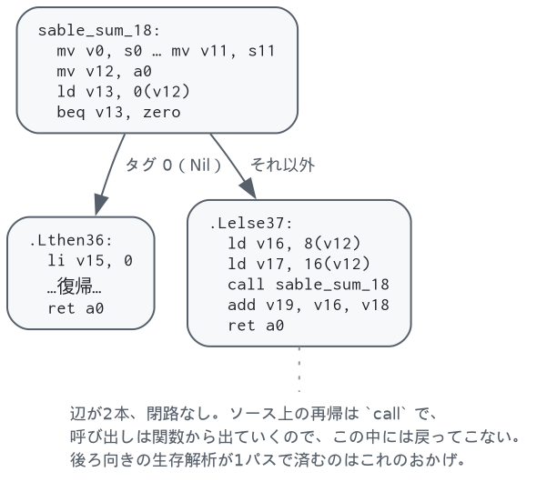

# 命令選択と制御フロー — `selection.ml`, `cfg.ml`, `liveness.ml`

ここから機械の側です。クロージャ変換済みのコードを **RISC-V の制御フローグラフ**に落とし、
その上を歩く2つの解析を用意します。出てくるコードは正しいけれど実行できません — レジスタが
無制限だからです。実行できるものに変えるのは[レジスタ割り付け](regalloc.md)です。

## 1. 命令選択 — `selection.ml`

```
$ sablec --dump-riscv -o /dev/null doc/sum.sbl
function sable_sum_18 (20 registers, 0 spill slots)
  sable_sum_18:
    mv v0, s0            ┐
    mv v1, s1            │ callee-saved を仮想レジスタに退避
    ...                  │ （12本ぶん）
    mv v11, s11          ┘
    mv v12, a0           ← 引数
    ld v13, 0(v12)
    beq v13, zero, .Lthen36 else .Lelse37
  .Lthen36:
    li v15, 0
    mv a0, v15
    mv s0, v0            ┐
    ...                  │ 復帰
    mv s11, v11          ┘
    ret a0
  .Lelse37:
    ld v16, 8(v12)
    ld v17, 16(v12)
    mv a0, v17
    call sable_sum_18(a0)
    mv v18, a0
    add v19, v16, v18
    mv a0, v19
    mv s0, v0
    ...
    ret a0
```

できあがるのはこの形です。`sum` はブロック3つ、辺2本です。



ここで確立される2つの規約が、次のパスを可能にしています。

**引数は普通の `mv` で `a0..` に移し、結果は `a0` から `mv` で取り出します。**
アロケータはこれらを融合の候補として見るので、たいていは消えます。消せなかったとしても
正しいコードのままです。

**callee-saved レジスタは、入口で仮想レジスタにコピーし、各 `ret` の直前で書き戻します。**
関数がそのレジスタを他のことに使わなければ融合で両方消えます。使うなら仮想レジスタが
スピルされ、**そのスピルがそのまま退避・復帰**になります。葉関数は何も払わず、5本使う
関数はちょうど5本ぶん払います。

定数はすでに畳まれています。ANF にあった `let t.6 = 0` は、比較がハードワイヤの `zero`
レジスタを使えるので不要になり（`beq v13, zero`）、`li` は次のパスのデッドコード除去で
消えます。上のダンプで `v14` が欠番なのがその跡です。

命令の選び方で、素直に落とす以上のことをしている箇所が4つあります。

**0 を読む位置には `zero` レジスタを使う。** 値が 0 だと分かっていれば、比較に限らず
ストアでも算術でも `zero` で読みます。多くの場合これで `li` に読み手がいなくなり、
デッドコード除去が命令ごとレジスタごと持っていきます。

**値として使われた比較は `slt` にする。** A正規化は比較を「1 か 0 を返す `if`」にしますが、
その結果を分岐のテストではなく値として使うと、素直に落とせばブロック2つとジャンプ1つの
ダイヤモンドになります。両方の枝が 1 と 0 の `if` はそれと分かるので、分岐せずに組みます。

| 式 | 出るもの |
|---|---|
| `x < y` | `slt d, x, y` |
| `x <= y` | `slt t, y, x` ; `xori d, t, 1` |
| `x = y` | `xor t, x, y` ; `sltiu d, t, 1` |
| `x <> y` | `xor t, x, y` ; `sltu d, zero, t` |

`x = 0` や `x <> 0` は片側が `zero` なので `xor` も要らず1命令です。効き方は大きく、
真偽値を配列に入れるだけの関数がこうなります。

```
	blt a1, a2, .Lelse51          	slt t1, a1, a2
.Lthen50:                             	slli t0, a0, 3
	li t1, 0                  →   	add t0, t2, t0
	j .Ljoin52                    	sd t1, 0(t0)
.Lelse51:
	li t1, 1
.Ljoin52:
	slli t0, a0, 3
	...
```

**2の冪の乗算はシフトにする。** 除算は意図的に触っていません。`div` はゼロ方向に切り捨て、
算術シフトは負の無限大方向に丸めるので、負数で答えが食い違います。補正を入れると節約より
高くつきます。

**タグ判定は 0 から並べる。** 決定木でコンストラクタを振り分けるとき、網羅していれば最後の
1つは判定せずに済みます。タグ 0 の判定は `zero` レジスタで無料になるので、それを最後に
残すのは損です（`match_compile.ml`）。この並べ替えだけで、例題群のタグ判定用 `li` が
18個から13個に減りました。

## 2. 制御フローグラフ — `cfg.ml`

`Riscv.func` はもともと制御フローグラフです（ブロックの列と、後続を名指しする終端命令）。
`cfg.ml` が足すのは、それを歩くのに要るものだけ — ラベルから番号、前任者、入口から到達
できるブロック、そして訪問順です。

深さ優先の走査1回で3つが出ます。

- **後行順**（自分より先に、到達できるものを全部見る順）。後ろ向きの解析はこれで1パスです
- **到達可能性**
- **閉路の有無** — 走査中のスタックに戻る辺があれば閉路です

3つ目が効いてきます。バックエンドは**関数の制御フローグラフに閉路がないこと**を2箇所で
当てにしています（[レジスタ割り付け §10](regalloc.md#10-この実装で効いている単純化)）。
ソース上のループは再帰呼び出しで、呼び出しは関数から出ていくのでそうなるのですが、
**それを検査するコードがありませんでした**。`--check-cfg` がそれで、テストが全例に対して
走らせます。

```
$ sablec --check-cfg -o /dev/null examples/queens.sbl
```

**ブロック配置**も同じグラフから決めます。終端命令が次のブロックへ落ちれば、ジャンプ命令が
1つ出ずに済みます（[アセンブリ出力](emit.md)）。入口から辺をたどってトレースを作り、**そのブロックからしか
入れない後続**にだけ延ばします。合流点まで引きずると、他の前任者がジャンプする羽目に
なるからです。

正直に書くと、**今のコードでは1バイトも変わりません**。命令選択が既にトレースと同じ順で
ブロックを吐いているからです。合流点の条件を外して腕を貪欲にたどると悪化します — 例題
42ファイルの無条件ジャンプが 20 から 26 に増えました。このパスが買っているのは、
フォールスルーの質が「命令選択がどの順で吐くか」に依存しなくなることです。

## 3. 生存解析 — `liveness.ml`

後ろ向きのデータフローです。あるレジスタが「その地点から先のどこかで、書かれる前に
読まれる」なら生きている、というだけの定義ですが、アロケータのすべてがこの上に載ります。
2つの値が干渉するのは、片方が生きている地点でもう片方が定義されるとき、ちょうどそのとき
です。

ついでにデッドコード除去も行います。判定は命令の**実際の宛先レジスタ**に対して行う点が
やや微妙で、`mv t6, x`（クロージャレジスタへの書き込み）はアロケータの管理外のレジスタを
書くので消してはいけません。

なお `ret` と末尾呼び出しは callee-saved レジスタを**読む**ものとして扱っています。そこは
呼び出し元の値がそれらに戻っていなければならない地点だからです。これを言っておくことが、
復帰の `mv` を生かし、呼び出しをまたぐ値に正しい干渉を与えます。

## 実装の地図

| | |
|---|---|
| `riscv.ml` | 命令と制御フローの型、レジスタファイル、呼び出し規約。`ir.ml` と呼んでいないのは、これが対象機械を1つだけ知っているからです |
| `selection.ml` | クロージャ変換済みの木 → 制御フローグラフ |
| `cfg.ml` 27–67行 | `build` — 深さ優先1回で後行順・到達可能性・閉路の有無 |
| `cfg.ml` 91–128行 | `layout`・`relayout` — フォールスルーを増やすブロック順 |
| `liveness.ml` | 後ろ向きデータフローと、そのついでのデッドコード除去 |

---

隣の文書：[パイプライン全体](pipeline.md)、[クロージャ変換](closure.md)、[レジスタ割り付け](regalloc.md)。
