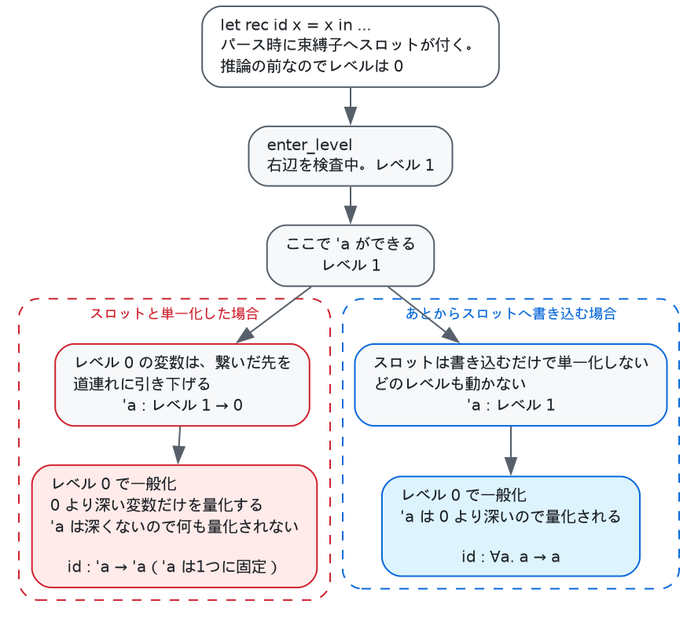

# 型推論 — 単一化とレベル

`typing.ml`（314行）と `types.ml`（190行）で、[Hindley–Milner][damas] の型推論を1回の
ボトムアップ走査として実装しています。注釈は要らず、`let` は多相になり、失敗すれば
位置つきで報告されます。

一般化には**レベル方式**（Rémy の方法。OCaml 自身が使っているもので、
[Kiselyov の解説][levels]が読みやすい）を使っています。

例はすべて実際にコンパイラに通したものです。

---

## 1. 問題

多相とは「1つの定義が複数の型で使える」ことです。

```
let rec id x = x in
let a = id 1 in
let b = id true in
```

`id` の型は推論の途中では `'a -> 'a` の形になりますが、`'a` は**まだ何にでもなれる変数**
です。`id 1` でこれを `int` に潰してしまうと、次の `id true` が通りません。そこで
`let` を抜けるときに `'a` を**量化**して型スキーム `∀a. a -> a` にし、使うたびに新しい
変数で複製します。

難しいのは量化してよい変数の見分け方です。素朴な規則は

> 環境（今見えている束縛の型）に自由に現れる変数は量化してはいけない

で、これは正しいのですが、`let` ごとに環境全体を走査することになります。環境は入れ子の
深さぶん大きくなるので、`let` が深く連なるプログラムでは無視できない量になります。

**レベル方式は、この走査を整数1つの比較に置き換えます。**

## 2. 型の表現

```ocaml
type t =
  | Unit | Bool | Int | String
  | Fun of t list * t
  | Tuple of t list
  | Array of t
  | List of t
  | Named of Ident.t          (* ユーザ定義のデータ型 *)
  | Rigid of int              (* シグネチャの 'a。§8 *)
  | Var of var ref

and var =
  | Unbound of int * int      (* 識別子, レベル *)
  | Link of t
```

型変数は `ref` です。単一化は**破壊的**で、`r := Link other` と書き込みます。置換を
持ち回らないので、推論が終わったあと後続のパスは同じ型を読み直すだけで結果が分かります。
`Match_compile` が「この列にはどのコンストラクタが来うるか」を知るためにマッチ対象
（scrutinee）の型を読むのは、この性質があるからです。

`Link` の連鎖をたどるのが `repr`（`types.ml:56`）です。

```ocaml
let rec repr t = match t with Var { contents = Link t } -> repr t | t -> t
```

Union-Find の経路圧縮はしていません。連鎖は実際には短く、圧縮すると `repr` が型を
書き換える関数になって呼び出し側の制約が増えるので、素直なたどりのままです。

## 3. 単一化

`unify`（`types.ml:77`）は構造をそろえて再帰し、片方が未束縛変数なら書き込みます。

```ocaml
| Var ({ contents = Unbound (id, level) } as r), other
| other, Var ({ contents = Unbound (id, level) } as r) ->
  (try occurs_and_lower id level other with Occurs -> raise (Unify (a, b)));
  r := Link other
```

書き込む前の `occurs_and_lower`（`types.ml:70`）が2つの仕事を1回の走査で片づけます。

1. **出現検査** — 変数が「これからなる型」の中に現れていたら `'a = 'a list` のような
   無限型になるので拒否します。
2. **レベル下げ** — 相手の型の中の変数のレベルを、こちらのレベルまで下げます。

```ocaml
let rec occurs_and_lower id level t =
  match repr t with
  | Var ({ contents = Unbound (id', level') } as r) ->
    if id' = id then raise Occurs;
    if level' > level then r := Unbound (id', level)
  | t -> children (occurs_and_lower id level) t
```

効いてくるのは2つ目です。

## 4. レベル — 一般化を比較1つにする

`current_level` は「今いくつの `let` の右辺の内側にいるか」です。`let` と `let rec` は
右辺に入るとき `enter_level`、出るとき `leave_level` を呼びます
（`typing.ml:172`、`typing.ml:258`）。

```ocaml
| Let ((x, slot), e1, e2) ->
  Types.enter_level ();
  let t1 = infer_exp env e1 in
  Types.leave_level ();
  let scheme = if is_value e1 then Types.generalize t1 else Types.monomorphic t1 in
```

新しい型変数は「作られたときの `current_level`」を憶えます。すると

> **レベル d の変数から到達できるものは、どれもレベル d 以下**

という不変条件が `occurs_and_lower` によって保たれます。外側の何かに結びついた変数は、
そのことがレベルに現れます。したがって深さ d で一般化するときは

```ocaml
let generalize body =
  ...
  | Var { contents = Unbound (id, level) } ->
    if level > !current_level && ... then ids := id :: !ids
```

**レベルが `current_level` より深い変数だけ**を量化すればよく、環境は一切見ません
（`types.ml:112`）。

`id` の例で追うと、

| | `current_level` | 起きること |
|---|---|---|
| `let rec id` に入る | 0 → 1 | `enter_level` |
| `x` の型に `'a` を作る | 1 | `'a` のレベルは 1 |
| 右辺を抜ける | 1 → 0 | `leave_level` |
| 一般化 | 0 | `1 > 0` なので `'a` を量化 → `∀a. a -> a` |

もし `id` が外側の変数 `'b`（レベル0）を使っていれば、`'a` と `'b` の単一化の時点で
`'a` のレベルが0まで下がり、`1 > 0` が成り立たなくなって量化されません。環境を見ずに
正しい答えが出ます。

```
$ cat a.sbl
let rec id x = x in
let a = id 1 in
let b = id true in
print_int (if b then a else 0); print_newline ()

$ ./sable a.sbl
1
```

`id` が `int` と `bool` の両方で使えています。

## 5. パーサが付ける型変数は、書き込み専用のスロット

構文解析器は束縛子・パターン変数・`match` のそれぞれに空の型変数を付けておきます。
後続のパスがそこから型を読むためです。**この変数と単一化してはいけません。**

パース時に作られるので、これらのレベルは0です。推論の途中でこれと単一化すると、
`occurs_and_lower` が働いて推論結果の変数がすべてレベル0まで落ち、一般化で何も
量化されなくなります。



そこで推論は自前の変数で行い、最後に `Types.assign`（`types.ml:102`）で流し込みます。

```ocaml
(* Link a slot the parser created, without disturbing any level.  Sound only
   because nothing ever unifies against these slots; they exist so that the
   passes after Typing can read a type off a binder. *)
let assign slot t =
  match slot with
  | Var ({ contents = Unbound _ } as r) -> r := Link t
  | _ -> ()
```

レベルを触らずに繋ぐだけです。健全なのは「これらのスロットに対して単一化が起きない」という
一方通行を守っているからで、コメントに条件として書いてあるのはそのためです。

## 6. 値制限

一般化するのは**構文的な値**だけです（[Wright の値制限][valuerestriction]、
`typing.ml:75` の `is_value`）。可変配列があると、これがないと壊れます。

```
$ cat a.sbl
let cell = Array.make 1 (fun x -> x) in
let f = cell.(0) in
print_int (f 42); print_newline ();
print_int (if f true then 1 else 0); print_newline ()

$ ./sable a.sbl
a.sbl:4:14: type error in a function application:
  expected: (int -> int)
  but got:  (bool -> 'a)
```

`cell.(0)` は関数適用であって値ではないので `f` は多相になりません。もし多相になれば、
`cell` に整数を書き込んでから関数として読み出せてしまいます。同じものを値として書けば
通ります。

```
$ cat a.sbl
let f = fun x -> x in
print_int (f 42); print_newline ();
print_int (if f true then 1 else 0); print_newline ()

$ ./sable a.sbl
42
1
```

`fun x -> e` は構文木の上では「自分の名前を本体とする1つきりの `let rec`」として
届くので、`is_value` の `Let_rec (_, body) -> is_value body` がこれを拾います。

## 7. 比較の被演算子は量化しない

`=` は機械語1命令に落ちるので、1ワードに収まる型でしか意味を持ちません。
そこで比較を見たら、被演算子の型を**最外レベルに固定**して二度と量化されないように
します（`types.ml:144` の `pin`、`typing.ml:158`）。

```ocaml
| Cmp (op, e1, e2) ->
  let t1 = infer_exp env e1 in
  let t2 = infer_exp env e2 in
  unify_in where t1 t2;
  (* Never quantify what a comparison rests on. *)
  Types.pin t1;
  deferred_comparisons := (t1, string_of_cmp op, !position) :: !deferred_comparisons;
  Types.Bool
```

結果として、比較を含む関数は多相になりません。

```
$ cat a.sbl
let rec eq a b = a = b in
print_int (if eq 1 2 then 1 else 0); print_newline ();
print_int (if eq true false then 1 else 0); print_newline ()

$ ./sable a.sbl
a.sbl:3:14: type error in a function application:
  expected: (int * int -> bool)
  but got:  (bool * bool -> 'a)
```

固定するだけでは足りません。「1ワードに収まる型か」も確かめる必要がありますが、単一化の
途中では被演算子の型がまだ変数であることが多く、その場では決められないからです。そこで
`deferred_comparisons` に位置つきで積んでおき、プログラム全体を検査し終えてから見にいきます
（`typing.ml:291` の `check`）。

```
$ cat a.sbl
let a = (1, 2) in
let b = (1, 2) in
print_int (if a = b then 1 else 0); print_newline ()

$ ./sable a.sbl
a.sbl:3:14: `=` cannot compare values of type (int * int).
Only int, bool and unit compare as a single machine word.
```

タプルの `=` は「アドレスを比べて黙って動く」のではなく、エラーになります。文字列は
専用の案内が出ます（`use String.equal`）。

## 8. rigid な型変数 — シグネチャ照合

シグネチャの `'a` は、普通の型変数とは要求が逆です。

- 普通の変数 — 「何かに決まってよい」
- シグネチャの `'a` — 「**何にも決まってはいけない**」

`val id : 'a -> 'a` は「すべての型で動く関数をよこせ」という意味なので、`int -> int` で
満足されては困ります。そこで構文解析器はシグネチャの型変数を `Types.Rigid` として作り
（`parser.mly:24`）、`unify` は

```ocaml
| Rigid x, Rigid y when x = y -> ()
```

**同じ rigid 変数どうししか受け付けません**。`Rigid` は `Var` ではないので、変数と単一化
されることもありません。

照合そのものは `Modules.match_signature`（`modules.ml:204`）が

```ocaml
let check = Annot (Var internal, substitute assignments declared) in
Let ((Ident.fresh "signature", Types.fresh_var ()), check, rest)
```

という「誰も参照できない名前への束縛」を並べ、型検査に判定させます。検査が済めば
`optim.ml` の不要束縛除去が消すので、実行時には何も残りません。

```
$ cat a.sbl
module type S = sig val id : 'a -> 'a end in
module A = struct let rec id x = x + 0 end in
module F (X : S) = struct let rec go n = X.id n end in
module M = F (A) in print_int (M.go 1)

$ ./sable a.sbl
a.sbl:4:0: type error in a signature:
  expected: ('a -> 'a)
  but got:  (int -> int)
```

`x + 0` があるので `A.id` は `int -> int` にしかならず、拒否されます。`x` にすれば通り、
ファンクタの本体は `X.id` を本当に複数の型で使えます。

```
$ cat a.sbl
module type S = sig val id : 'a -> 'a end in
module A = struct let rec id x = x end in
module F (X : S) = struct
  let rec both s n = (X.id s, X.id n)
end in
module M = F (A) in
let (a, b) = M.both "text" 7 in
print_string a; print_char 32; print_int b; print_newline ()

$ ./sable a.sbl
text 7
```

## 9. 残った変数は `int` にする

プログラム全体を検査し終えてもなお未束縛の変数が残ることがあります
（`let rec loop x = loop x` の戻り値など）。`resolve`（`types.ml:151`）はこれを黙って
`int` にします。

```ocaml
(* Variables still unbound once the whole program is checked are not ambiguous
   in any interesting way -- every value is one machine word -- so pick `int`. *)
```

**コード生成側は何も変わりません。** すべての値が1ワードで、整数かポインタかを
バックエンドが問わない表現を選んであるので、要素を覗かない関数は要素の型を気にせずに
済みます。`length` は1つコンパイルされるだけで `int list` にも `string list` にも
`int list list` にも効きます。多相が実行時表現に一切現れないので、残った変数を何に
決めても構いません。

## 10. していないこと

- **データ型が引数を取れません。** `type 'a box = Box of 'a` は構文エラーです。
  組み込みの `list` と `array` だけが多相で、ユーザのデータ型はすべて単相です。
  `Datatype.constr` が `arg_types : Types.t list` を具体型として持っているので、
  ここを開けるにはコンストラクタ自体をスキームにする必要があります。
- **多相再帰はできません。** `let rec` のグループ内では各関数が単相の変数に束縛され、
  一般化はグループを抜けてからです（`typing.ml:258`）。相互再帰する関数を同じ
  グループの中から複数の型で呼ぶと落ちます。

  ```
  $ cat a.sbl
  let rec f x = x
  and g y = (f 1, f true) in
  print_int 0; print_newline ()

  $ ./sable a.sbl
  a.sbl:2:16: type error in a function application:
    expected: (int -> int)
    but got:  (bool -> 'a)
  ```

- **レコードも、型クラスも、部分型もありません。**
- `repr` に経路圧縮がありません（§2）。
- エラーは「期待した型／得た型」の2行だけで、**どの単一化の連鎖でそうなったかは
  出しません**。位置は式単位で、部分式までは絞れません。
- 型注釈は `Annot` として構文にはありますが、シグネチャ照合が使うためのもので、
  ユーザが書く用の構文は出していません。

## 参考文献

- L. Damas, R. Milner, [*Principal type-schemes for functional programs*][damas],
  POPL 1982. 推論そのもの。`let` 多相と主要型。
- O. Kiselyov, [*Efficient and Insightful Generalization*][levels]. Rémy の
  レベル方式の解説。`types.ml` の `level`、`occurs_and_lower` のレベル下げ、
  `generalize` の `level > !current_level` は**これに直接対応します**。
- A. K. Wright, [*Simple imperative polymorphism*][valuerestriction],
  LISP and Symbolic Computation 8(4), 1995. 値制限。§6 の `is_value` の根拠。
- R. Milner, [*A theory of type polymorphism in programming*][milner],
  JCSS 17(3), 1978. 単一化に基づくアルゴリズム W。出現検査を含む。

[damas]: https://doi.org/10.1145/582153.582176
[levels]: https://okmij.org/ftp/ML/generalization.html
[valuerestriction]: https://doi.org/10.1007/BF01018828
[milner]: https://doi.org/10.1016/0022-0000(78)90014-4

## 実装の地図

`types.ml` — 型と単一化。推論の方針を持たない部分。

| | |
|---|---|
| 19–40行 | `t`、`var`、`scheme` の定義 |
| 42–44行 | `current_level`、`enter_level`、`leave_level` |
| 47–54行 | `fresh_rigid`、`fresh_var` |
| 56–65行 | `repr`、`children`（型の子を辿る共通部品） |
| 70–75行 | **`occurs_and_lower`** — 出現検査とレベル下げ |
| 77–97行 | **`unify`** |
| 102–105行 | **`assign`** — パーサのスロットへの書き込み（§5） |
| 112–121行 | **`generalize`** |
| 124–139行 | **`instantiate`** |
| 144–147行 | **`pin`** — 比較の被演算子を固定（§7） |
| 151–160行 | `resolve` — 残った変数を `int` に |
| 162–190行 | `to_string` — エラーに出す整形 |

`typing.ml` — 構文木の走査。

| | |
|---|---|
| 38–52行 | `externals` — 組み込み関数の型 |
| 54–60行 | `deferred_comparisons`、`unify_in` |
| 75–82行 | **`is_value`** — 値制限（§6） |
| 86–121行 | **`infer_pattern`** — パターンが束縛するものと、列の型 |
| 123–134行 | `check_linear`（同じ変数を2回束縛させない）、`bind_all` |
| 136–256行 | **`infer_exp`** — 本体。`Let` は172行、`Cmp` は158行 |
| 258–290行 | **`infer_letrec`** — グループを単相で通してから一般化 |
| 291–314行 | **`check`** — 入口。最後に `deferred_comparisons` を消化 |

読む順番としては `types.ml` の `occurs_and_lower` と `generalize` を先に見て、
それから `typing.ml:172` の `Let` を見るのが早いです。`enter_level` / `leave_level` /
`generalize` の3行に、この文書のほとんどが入っています。

---

隣の文書：[パイプライン全体](pipeline.md)、[パターンマッチ](matching.md)、
[レジスタ割り付け](regalloc.md)。
