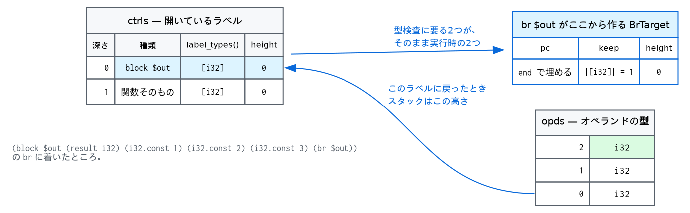
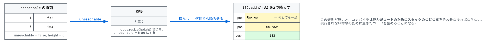

# 3. 型検査 — スタックに型をつける

wasm の検証は、関数の本体を頭から**1回**歩くだけで終わります。逆行も、不動点の反復も、
制約の解決もありません。この章はその歩き方と、その中でただ1つ直感に反する規則
— 到達不能コードの多相スタック — の話です。

計画が落ちてくるのは次の章ですが、それが**この歩き方の副産物である**ことは、
この章を読むと分かるはずです。

## 3.1 スタック型体系

型づけの状態は2つのスタックです。

- `opds` — オペランドの**型**のスタック
- `ctrls` — 開いているラベルのスタック

命令1つの規則は「これこれの型を降ろして、これこれの型を積む」。それだけです。
Weasel はモジュールに依存しない命令の規則を1つの文字列で書いています。

```cpp
case Op::I32Add: ... return "ii:i";
case Op::I64Store: return "iI:";
case Op::F64PromoteF32: return "f:F";
```
（`validate.cppm:88`）

`i I f F` が i32 i64 f32 f64。コロンの左を右から順に降ろし、右を積む。

```cpp
const std::size_t colon = sig.find(':');
for (std::size_t i = colon; i-- > 0;) pop_expect(type_of(sig[i]));
for (std::size_t i = colon + 1; i < sig.size(); ++i) push(type_of(sig[i]));
```
（`validate.cppm:698` 付近）

残りの命令 — 局所変数、大域変数、表、呼び出し、分岐、`select` — は型がモジュールに
依存するので、それぞれ `case` を持ちます。数のうえでは百数十対十数で、圧倒的多数が
この1行で片づきます。

## 3.2 ラベル

`block` `loop` `if` は `[t1*] → [t2*]` という型を持ちます。仕様の言い方では、
入るときに `t1*` を降ろし、ラベルを積み、`t1*` を積み直す。

```cpp
void push_ctrl(Op op, std::vector<ValType> in, std::vector<ValType> out) {
  pop_all(in);
  Ctrl c;
  c.op = op; c.in = std::move(in); c.out = std::move(out);
  c.height = static_cast<u32>(opds.size());   // ← ここが要
  ctrls.push_back(std::move(c));
  push_all(ctrls.back().in);
}
```
（`validate.cppm:275`）



`c.height` が、この本の主役です。**このラベルに戻ってきたとき、オペランドスタックは
この高さになっていなければならない**。型検査はこの数を、ブロックの終わりで残った値が
多すぎないかを見るために持っています。

```
$ echo '(module (func (result i32) i32.const 1 i32.const 2))' > v.wat
$ weasel check v.wat
weasel: v.wat: func[0]: instruction 2: the block's type accounts for 1 result value(s), and 1 more are left over
```

そして分岐が運ぶ値の型は、ラベルの種類で変わります。

```cpp
const std::vector<ValType>& label_types() const { return op == Op::Loop ? in : out; }
```
（`validate.cppm:82`）

`block` へ飛ぶのは「そのブロックを終える」ことなので結果型。`loop` へ飛ぶのは
「もう一周する」ことなので**引数型**です。この1行が `loop` と `block` の違いの全部で、
`br` の規則は共通のままです。

## 3.3 到達不能コード — 多相スタック

ここが仕様のなかで唯一「言われないと思いつかない」ところです。

```wasm
(func (result i32)
  unreachable
  i32.add)
```

これは**通ります**。`i32.add` は i32 を2つ要求しますが、スタックには何もありません。

```
$ echo '(module (func (result i32) unreachable i32.add))' > v.wat
$ weasel check v.wat
$ echo $?
0
```

なぜこれを通す必要があるのか。コンパイラのバックエンドを考えてください。
`if (x) return 1; else return 2;` を出力したあと、その先に到達しないと分かっていても、
何かを出力しなければならないことがあります。そこに置くコードのスタックのつじつまを
合わせろと言われたら、**死んだコードのために生きたコードを歪める**ことになります。

仕様の答えは、到達不能になった時点でスタックを「底なし」にすることです。



```cpp
void mark_unreachable() {
  Ctrl& c = ctrls.back();
  opds.resize(c.height);      // 積んであったものは捨てる
  c.unreachable = true;
}
```
（`validate.cppm:267`）

そして降ろすときに、底に着いたら**「なんでもいい型」**を返します。

```cpp
ValType pop_opd() {
  const Ctrl& c = ctrls.back();
  if (opds.size() == c.height) {
    if (c.unreachable) return kUnknown;    // ← 底なし
    fail("operand stack underflow");
    return kUnknown;
  }
  const ValType t = opds.back();
  opds.pop_back();
  return t;
}
```
（`validate.cppm:235`）

`kUnknown` は「どの型とも一致する」型です。

```cpp
ValType pop_expect(ValType expect) {
  const ValType actual = pop_opd();
  if (actual == kUnknown) return expect;   // 底なしからは期待どおりのものが出てくる
  if (expect == kUnknown) return actual;
  if (actual != expect) { fail(...); }
  return actual;
}
```
（`validate.cppm:247`）

到達不能を作るのは4つの命令だけです — `unreachable`、`br`、`br_table`、`return`
（`Op::Return` は `br` として計画されます）。`br_if` は作りません。条件が偽なら次へ
進むからです。

これで計画にも影響が出ます。到達不能な範囲の命令も**計画には出ます**。

```
$ weasel plan tests/wat/01-control.wat | sed -n '/func\[5\]/,/^$/p'
func[5] : () -> (i32)
  max operand stack 1
     0  unreachable
     1  i32.add
     2  return
```

`i32.add` は残っています。実行されることはないので、残っていても害はありません。
消すこともできますが、消さないほうが計画と本体の位置の対応が単純なままです。

## 3.4 定数式は別の言語

大域変数の初期化式、データ・要素セグメントのオフセット、要素の中身。これらは
**モジュールが存在する前に**評価されるので、命令が5種類しか使えません。

```cpp
case Op::I32Const: ... case Op::F64Const:   // 定数
case Op::RefNull:                           // 空参照
case Op::RefFunc:                           // 関数参照
case Op::GlobalGet:                         // ただし輸入された不変の大域変数だけ
case Op::End:
default:
  d.fail(std::format("{}: `{}` is not allowed in a constant expression", where,
                     op_name(in.op)));
```
（`validate.cppm:708`）

`global.get` に条件が2つついているのが要点です。**輸入されたもの**でなければならないのは、
このモジュール自身の大域変数はまだ初期化されていないかもしれないから。**不変**でなければ
ならないのは、そうでなければ「いつ読んだか」が結果を変えるからです。

```
$ echo '(module (global $a i32 (i32.const 1)) (global $b i32 (global.get $a)))' > v.wat
$ weasel check v.wat
weasel: v.wat: global 1: a constant expression may only read an imported global
```

この制限のおかげで、定数式の「実行」は10行のループで足ります（[5章](05-instantiate.md)）。

## 3.5 モジュール全体の検査

関数の本体のほかに、モジュール自身にも規則があります。Weasel はそれを `validate` の
先頭でまとめて見ます（`validate.cppm:787`）。

- limits は `min <= max` で、メモリは 65536 ページを超えない
- 輸出の名前が重複しない
- `start` は引数も結果も持たない
- 要素セグメントの型がその表の型と一致する
- データカウントがデータセクションと一致する

このうち面白いのは1つだけです。**`ref.func` が指せる関数の制限**。

```
$ weasel check tests/wat/04-tables.wat        # 通る
$ # (elem declare func $add2) を消すと:
weasel: ...: func[8]: instruction 1: function 3 is not declared; export it or add `(elem declare func ...)`
```

`ref.func 3` の 3 は範囲内なのに拒まれます。安全性の話ではありません。
**エンジンが、関数の本体を1つも見ないうちに「どの関数が表に逃げうるか」を知りたい**
からです。関数の本体の**外**に現れた関数添字 — 輸出、要素セグメント、大域変数の
初期化式、`start` — だけがその集合に入ります。

```cpp
std::set<u32> declared_funcs(const Module& m) {
  std::set<u32> refs;
  for (const Export& ex : m.exports)
    if (ex.kind == ExternKind::Func) refs.insert(ex.index);
  for (const Global& g : m.globals) scan(g.init);
  for (const ElemSeg& seg : m.elems)
    for (const Expr& e : seg.init) scan(e);
  if (m.start) refs.insert(*m.start);
  return refs;
}
```
（`validate.cppm:187`）

本体の中からしか参照されない関数は、宣言しなければならない。その宣言のためだけに
存在するのが**宣言的要素セグメント** `(elem declare func $f)` です。表に何も入れず、
オフセットも持たず、インスタンス化の時点で捨てられます。**検証器への申告書**が
実体です。

## 3.6 エラーの言葉

検証の失敗はすべて `Diag` に latch されます。最初の失敗が勝ち、以降のパスは早く抜ける
（`common.cppm:28`）。メッセージには関数と命令の位置が入ります。

```
$ echo '(module (memory 1) (func (result i32) (i32.load align=8 (i32.const 0))))' > v.wat
$ weasel check v.wat
weasel: v.wat: func[0]: instruction 1: alignment 2^3 is larger than the 4 byte access

$ echo '(module (func (result i32) (i32.load (i32.const 0))))' > v.wat
$ weasel check v.wat
weasel: v.wat: func[0]: instruction 1: this instruction needs a memory, and there is none

$ echo '(module (func (result i32) (if (result i32) (i32.const 1) (then (i32.const 1)))))' > v.wat
$ weasel check v.wat
weasel: v.wat: func[0]: instruction 3: an `if` without an `else` must return what it takes
```

最後のものは、**条件が偽のとき何も起きない**という当たり前の帰結です。`else` が無い
`if` は偽のときブロックを素通りするので、ブロックの引数型と結果型が同じでなければ
スタックの高さがそろいません。

「命令の位置」は本体の中の**構造化された**位置です。計画のほうの位置ではありません。
検証はまだ計画の話をしていない — というのが建前ですが、実際にはこの1回の走査が
両方をやっています。それが次の章です。

---

## していないこと

- **2パス以上の解析**。wasm の検証は線形時間で終わるように設計されていて、Weasel も
  1回しか歩きません。データフロー解析も、支配関係も、不動点もありません。
- **部分型**。`funcref` と `externref` に上下関係はなく、`anyref` もありません。
  参照型の部分型は GC 提案が導入するもので、[10章](10-next.md)の話です。
- **`select` の型推論**。注釈のない `select` は数値型にしか使えず、参照には
  `(select (result funcref) ...)` が要ります。仕様がそう決めています — 参照の型を
  スタックから推論すると、GC 提案の部分型で答えが1つに決まらなくなるからです。

## 参考文献

- **WebAssembly Core Specification**, Section 3 "Validation" と Appendix
  "Validation Algorithm"。後者は擬似コードで、`push_ctrl` / `pop_ctrl` / `pop_opd` の
  名前もそこから取っています。
- **Conrad Watt**, *Mechanising and Verifying the WebAssembly Specification*, CPP 2018.
  この型体系が本当に健全かを Isabelle で確かめた仕事。
- Andreas Haas et al., *Bringing the Web up to Speed with WebAssembly*, PLDI 2017,
  §2.3。到達不能コードを多相にした理由がコンパイラ側から書かれています。

## 実装の地図

| 場所 | 何があるか |
|---|---|
| `src/validate.cppm:68` | `kUnknown` — 底なしから出てくる型 |
| `src/validate.cppm:70` | `Ctrl` — 開いているラベル1つ |
| `src/validate.cppm:82` | `label_types` — `loop` だけ引数型 |
| `src/validate.cppm:88` | `simple_sig` — 命令の規則の大半 |
| `src/validate.cppm:187` | `declared_funcs` — `ref.func` が指せるもの |
| `src/validate.cppm:235` | `pop_opd` — 多相スタックの1か所 |
| `src/validate.cppm:267` | `mark_unreachable` |
| `src/validate.cppm:275` | `push_ctrl` / `pop_ctrl` |
| `src/validate.cppm:708` | `check_const_expr` — 5命令の言語 |
| `src/validate.cppm:787` | `validate` — モジュール全体 |

---

[← 2. テキスト形式](02-text.md) · [4. 検証が残すもの →](04-plan.md)
