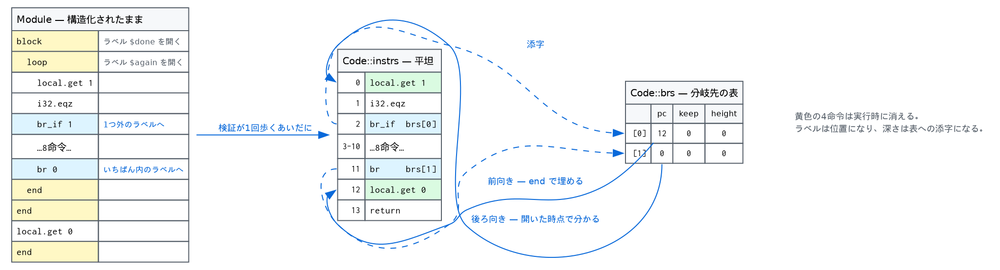
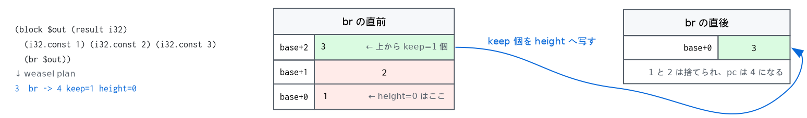

# 4. 検証が残すもの — ラベルが位置になる

前の章の型検査は、可否を返すものとして書かれています。この章は同じ走査を別の側から
見ます。**その走査が終わったとき、実行に必要なものはもう全部そろっている。**



## 4.1 分岐が実行時に必要とする3つの数

`br` を実装するのに何が要るかを、先に決めておきます。

```wasm
(module (func (export "f") (result i32)
  (block $out (result i32)
    (i32.const 1)
    (i32.const 2)
    (i32.const 3)
    (br $out))))          ;; ← ここ
```

`br $out` が起きたとき、スタックには 1 2 3 が積まれています。ブロックの結果は i32 が
1つなので、**3 だけを残して 1 と 2 は捨てる**。そして `$out` の `end` の次へ飛ぶ。

```
$ weasel plan br3.wat
func[0] : () -> (i32)
  max operand stack 3
     0  i32.const 1
     1  i32.const 2
     2  i32.const 3
     3  br -> 4 keep=1 height=0
     4  return
$ weasel run br3.wat --invoke f
3
```

つまり必要なのは3つです。

- **`keep`** — 上から何個の値を持っていくか（ラベルの型の個数）
- **`height`** — 持っていった先のスタックの高さ（ラベルを開いた位置の高さ）
- **`pc`** — 飛び先



`keep` はラベルの型から、`height` は `Ctrl::height` から、そのまま出ます。前の章で
型検査のために持っていた数です。残るのは `pc` だけです。

```cpp
struct BrTarget {
  u32 pc = 0;
  u32 keep = 0;
  u32 height = 0;
};
```
（`validate.cppm:30`）

## 4.2 `branch` — ラベルの深さが表への添字になる

分岐の型づけと計画は同じ関数の中で起きます。

```cpp
u32 branch(u32 depth) {
  if (depth >= ctrls.size()) { fail(...); return 0; }
  Ctrl& target = ctrls[ctrls.size() - 1 - depth];
  const auto& types = target.label_types();
  // 運ぶ値がスタックに載っていることを確かめ、載せたままにする
  for (std::size_t i = types.size(); i-- > 0;) pop_expect(types[i]);
  push_all(types);

  const u32 slot = static_cast<u32>(code->brs.size());
  code->brs.push_back(BrTarget{0, static_cast<u32>(types.size()), target.height});
  if (target.op == Op::Loop)
    code->brs[slot].pc = target.loop_pc;      // 後ろ向き — もう分かっている
  else
    target.br_patches.push_back(slot);        // 前向き — `end` で埋める
  return slot;
}
```
（`validate.cppm:331`）

前半5行が型検査、後半6行が計画です。**同じ `target` から両方が出ています。**

降ろしてすぐ積み直しているのは、`br_if` のためです。条件が偽なら値はスタックに
残るので、型のうえでも残っていなければならない。

`br` 命令自身が持つのは、この `brs` への添字1つだけです。`br_table` は
「連続する n+1 個の先頭」を持ちます。

```cpp
case Op::BrTable: {
  pop_expect(ValType::I32);
  const std::size_t arity = ctrls[ctrls.size() - 1 - in.a].label_types().size();
  const u32 first = static_cast<u32>(code->brs.size());
  for (u32 depth : in.labels) {
    if (ctrls[ctrls.size() - 1 - depth].label_types().size() != arity) {
      fail("br_table arms disagree about how many values they carry");
      return;
    }
    branch(depth);
  }
  branch(in.a);                      // 既定はいちばん最後
  emit(Op::BrTable, first, static_cast<u32>(in.labels.size()));
  mark_unreachable();
```
（`validate.cppm:482`）

腕がすべて同じ個数の値を運ばなければならないのは、実行時に「どの腕か」が決まる前に
スタックを触りたくないからです。既定の腕の型が全体の型を決めます。

## 4.3 後埋めは1か所しかない

前向きの分岐は、飛び先がまだ決まっていません。`end` に着いたときに埋めます。

```cpp
void resolve(const Ctrl& c) {
  const u32 here = static_cast<u32>(code->instrs.size());
  for (u32 i : c.br_patches) code->brs[i].pc = here;
  for (u32 i : c.pc_patches) code->instrs[i].a = here;
}
```
（`validate.cppm:304`）

この6行が、この処理系にある後埋めの全部です。リストは**ラベル1つにつき1本**で、
ラベルが閉じると同時に使い切られます。グローバルな「未解決参照の表」も、
2周目の走査も、可変セルもありません。

構造化制御フローだからこう書けます。飛び先はつねに「今開いているラベルのどれかの
終わり」であって、任意の位置ではない。ラベルはスタックで管理されているので、
未解決の分岐は**必ずスタックのどこかのフレームに属して**います。

## 4.4 `block` と `loop` と `end` は何も生まない

```cpp
case Op::Block: case Op::Loop: {
  std::vector<ValType> params, results;
  if (!block_type(in, params, results)) return;
  push_ctrl(in.op, std::move(params), std::move(results));
  return;  // block and loop plan no instruction at all
}
```
（`validate.cppm:412` の中）

`end` も同じです。ラベルを閉じ、`resolve` を呼び、結果を積み直して終わり。
命令は1つも出しません。

テストがそれを明文で確かめています（`tests/test_weasel.cpp:382`）。

```cpp
const std::string src = "(module (func block nop end))";
...
expect(lm.codes[0].instrs.size() == 1 && lm.codes[0].instrs[0].op == Op::Return,
       "plan", "structured control flow must not survive planning");
```

`block` `nop` `end` の3命令が、`return` 1つになる。`nop` も何も生みません。

## 4.5 `if` だけが2つの命令を必要とする

`br` は表を使いますが、`if` は使いません。飛び先は2つとも静的で、値は運ばないからです。
そこで言語には無い命令を2つ用意してあります（`opcode.cppm:299`）。

- `if.false pc` — i32 を降ろし、0 なら `pc` へ
- `jump pc` — `pc` へ

```cpp
case Op::If: {
  pop_expect(ValType::I32);
  const u32 slot = static_cast<u32>(code->instrs.size());
  emit(Op::IfFalse);                       // 飛び先はまだ空
  push_ctrl(Op::If, std::move(params), std::move(results));
  ctrls.back().if_false = slot;
  return;
}
case Op::Else: {
  Ctrl c = pop_ctrl();
  c.pc_patches.push_back(static_cast<u32>(code->instrs.size()));
  emit(Op::Jump);                          // then 側は else 側を飛び越す
  code->instrs[c.if_false].a = static_cast<u32>(code->instrs.size());  // 偽ならここ
  ... 新しい Ctrl を Else として積み直す ...
}
```
（`validate.cppm:418`, `validate.cppm:428`）

`else` に着いた瞬間に `if.false` の飛び先が確定します。`jump` の飛び先だけが
`end` まで待ちます。

見てみます。

```
$ echo '(module (func (export "f") (param i32) (result i32)
          (if (result i32) (local.get 0) (then (i32.const 1)) (else (i32.const 2)))))' > if.wat
$ weasel plan if.wat
func[0] : (i32) -> (i32)
  max operand stack 1
     0  local.get 0
     1  if.false -> 4
     2  i32.const 1
     3  jump -> 5
     4  i32.const 2
     5  return
```

6命令。`if` `else` `end` の3つが `if.false` と `jump` の2つになりました。

`else` の無い `if` は `jump` すら要りません。`end` のところで `if.false` を
そこへ向けるだけです。

```cpp
case Op::End: {
  Ctrl c = pop_ctrl();
  if (c.op == Op::If) {
    if (c.in != c.out) { fail("an `if` without an `else` must return what it takes"); return; }
    code->instrs[c.if_false].a = static_cast<u32>(code->instrs.size());
  }
  resolve(c);
  push_all(c.out);
```
（`validate.cppm:449`）

## 4.6 `return` は `br` である

一番外側のラベルを、関数そのものにしてあります。

```cpp
Ctrl top;
top.op = Op::Block;
top.out = ft.results;
top.height = 0;
ctrls.push_back(std::move(top));
```
（`validate.cppm:371` の中）

すると `return` に専用の規則は要りません。

```cpp
case Op::Return: {
  const u32 slot = branch(static_cast<u32>(ctrls.size() - 1));
  emit(Op::Br, slot);
  mark_unreachable();
  return;
}
```

「いちばん外へ `br`」。その飛び先は本体の `end` のところ、つまり最後に置かれる
`Return` 命令です（`validate.cppm:371` の末尾で `emit(Op::Return)`）。

だから計画にはつねに `return` が1つ、いちばん最後にあります。関数から抜ける道は
そこしかありません。再帰の例で見ると分かりやすい。

```
$ weasel plan tests/wat/01-control.wat | sed -n '/func\[4\]/,/^$/p'
func[4] : (i64) -> (i64)
  max operand stack 3
     0  local.get 0
     1  i64.eqz
     2  if.false -> 5
     3  i64.const 1
     4  jump -> 11
     5  local.get 0
     6  local.get 0
     7  i64.const 1
     8  i64.sub
     9  call 4
    10  i64.mul
    11  return
```

`fac` の then 側は `i64.const 1` を積んで 11 へ飛び、else 側は掛け算をして落ちてきて、
どちらも同じ `return` を通ります。

## 4.7 `br_table` は連続した表になる

```
$ weasel plan tests/wat/01-control.wat | sed -n '/func\[2\]/,/^$/p'
func[2] : (i32) -> (i32)
  max operand stack 1
     0  local.get 0
     1  br_table 2 4 6 default=8 keep=0 height=0
     2  i32.const 10
     3  br -> 9 keep=1 height=0
     4  i32.const 20
     5  br -> 9 keep=1 height=0
     6  i32.const 30
     7  br -> 9 keep=1 height=0
     8  i32.const 40
     9  return
```

4つの腕が `brs` の連続する4エントリになり、命令はその先頭と個数を持つだけです。
実行時は1回の比較と1回の添字です。

```cpp
case Op::BrTable: {
  const u32 i = pop_u32();
  const u32 which = (i < in.b) ? i : in.b;  // past the end is the default
  take_branch(code->brs[in.a + which]);
```
（`exec.cppm:312`）

範囲外なら既定 — 分岐先の表そのものが範囲検査になっています。

## 4.8 `keep` が 1 より大きくなるとき

ここまでの例では `keep` が 0 か 1 でした。実際そうなることがほとんどです。
2以上になるのは、ブロックが複数の値を返すとき — つまり multi-value を使ったとき
だけです。

```wasm
(func (export "pick2") (param i32) (result i32)
  (i32.const 10)
  (i32.const 20)
  (block $out (param i32 i32) (result i32 i32)
    (br_if $out (local.get 0))
    (drop) (drop)
    (i32.const 30) (i32.const 40))
  (i32.add))
```

```
$ weasel plan tests/wat/08-multivalue.wat | sed -n '/func\[2\]/,/^$/p'
func[2] : (i32) -> (i32)
  max operand stack 3
     0  i32.const 10
     1  i32.const 20
     2  local.get 0
     3  br_if -> 8 keep=2 height=0
     4  drop
     5  drop
     6  i32.const 30
     7  i32.const 40
     8  i32.add
     9  return
```

`br_if -> 8 keep=2 height=0`。条件が真なら、上の2つ（10 と 20）を高さ0へ運んで 8 へ
飛ぶ。偽なら落ちて、その2つを捨てて 30 と 40 を積む。どちらの道でも 8 に着いたときの
スタックは同じ形をしています — それを検証が確かめ、`keep` と `height` に書き留めた。

`height=0` なのは、このブロックのラベルが「引数を降ろした直後」に開かれるからです
（[3章](03-validate.md)の `push_ctrl`）。ブロックの引数はラベルより**上**に積み直され
るので、ラベルの高さは 0 のまま。

## 4.9 ついでに出てくるもの

同じ走査から、もう2つ落ちてきます。

**オペランドスタックの最大の高さ。** `push` のたびに最大値を更新するだけです
（`validate.cppm:220`）。実行前に領域を確保できます。

```cpp
void push(ValType t) {
  opds.push_back(t);
  if (opds.size() > code->max_stack) code->max_stack = static_cast<u32>(opds.size());
}
```

**局所変数の型の並び。** 引数と宣言された局所変数を1本に連結したものです。実行時は
型を見ませんが（値にタグが無いので）、宣言された局所変数を0で初期化する個数がここから
出ます。

## 4.10 これで何が言えるか

計画には次のものが**存在しません**。

- ラベル、ブロックスタック、`end` を探す走査
- 分岐のたびに開いているブロックを数える処理
- 実行時の型
- ジャンプ先の解決

そして計画を作るために余分に払ったものも、次のものだけです。

- `BrTarget` の配列（分岐の**出現**1つにつき1エントリ）
- ラベル1つにつき2本の後埋めリスト（そのラベルが閉じるまで）

型検査は、これを作らなくてもどのみち `Ctrl::height` と `label_types()` を計算します。
**計画は、検証がすでに知っていたことを書き留めただけ**です。

これが、この処理系にコンパイルの段がない理由です。段はあります。検証がそれです。

---

## していないこと

- **最適化**。定数畳み込みも、`local.tee` と `local.get` の組み合わせの融合も、
  スーパーインストラクションもありません。計画は本体と1対1に近い形のままです。
  素早く走らせたいなら、この計画を入力にした JIT を書くのが素直な次の一歩です
  （[10章](10-next.md)）。
- **到達不能コードの削除**。3章のとおり、死んだ命令は計画に残ります。
- **命令のスレッド化**。`Instr` は `switch` で回されます。計算 goto にもテールコール
  ディスパッチにもしていません。

## 参考文献

- **WebAssembly Core Specification**, Appendix "Validation Algorithm"。この章の
  「型検査の側」はここです。計画の側は仕様には書かれていません — 仕様は実行を
  構造化されたままの項書き換えで定義しています。
- **wasm3** と **Wizard Research Engine**。どちらもバイトコードを直接回しながら、
  分岐のための side table を別に持ちます。Weasel が命令列そのものを作り直すのに対し、
  こちらは元のバイト列を残す設計です。
- **Ben L. Titzer**, *A fast in-place interpreter for WebAssembly*, OOPSLA 2022.
  side table を「その場で」作る側の議論。何を前計算し、何をしないかの整理として。

## 実装の地図

| 場所 | 何があるか |
|---|---|
| `src/validate.cppm:30` | `BrTarget` — 飛び先・keep・height |
| `src/validate.cppm:44` | `Instr` — 計画された命令 |
| `src/validate.cppm:52` | `Code` — 1関数ぶんの計画 |
| `src/validate.cppm:304` | `resolve` — 後埋めの唯一の場所 |
| `src/validate.cppm:331` | `branch` — 深さが表の添字になる |
| `src/validate.cppm:371` | `function` — 一番外のラベルと、最後の `return` |
| `src/validate.cppm:418` | `Op::If` — `if.false` を出す |
| `src/validate.cppm:428` | `Op::Else` — 飛び先が半分確定する |
| `src/validate.cppm:449` | `Op::End` — 閉じて、埋める |
| `src/validate.cppm:482` | `Op::BrTable` — 連続した表 |
| `src/dump.cppm:208` | `planned_immediates` — `weasel plan` の右側 |

---

[← 3. 型検査](03-validate.md) · [5. インスタンス化 →](05-instantiate.md)
