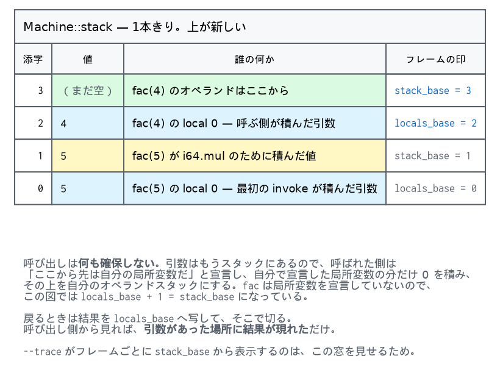

# 6. 実行ループ — 1本のスタック

計画があり、ストアがあれば、あとは回すだけです。この章はその回し方 — とくに
**呼び出しが何も確保しない**ことと、**分岐がラベルを探さない**ことの話です。

## 6.1 機械の全部

```cpp
struct Machine {
  Store& store;
  std::vector<Value> stack;
  std::vector<Frame> frames;

  Trap trap = Trap::None;
  std::string trap_message;
  i32 exit_code = 0;
  ...
};
```
（`exec.cppm:37`）

データは `stack` 1本です。オペランドも局所変数も、全部ここに入ります。
`frames` はその1本のどこからどこまでが誰のものかを覚えているだけで、
値を持ちません。

```cpp
struct Frame {
  const Code* code = nullptr;
  Instance* inst = nullptr;
  MemInst* mem = nullptr;  // memory 0, resolved once per call
  u32 locals_base = 0;
  u32 stack_base = 0;
  u32 pc = 0;
  u32 func_addr = 0;
};
```
（`exec.cppm:27`）

## 6.2 呼び出しは確保しない

呼び出しの直前、引数はもうスタックの上に積まれています。呼ばれた関数がすることは、
**「そこから先は自分の局所変数だ」と宣言すること**だけです。

```cpp
bool push_frame(u32 addr) {
  FuncInst& fi = store.funcs[addr];
  const u32 nparams = static_cast<u32>(fi.type.params.size());
  Frame f;
  f.code = fi.code;
  f.inst = fi.instance;
  f.locals_base = static_cast<u32>(stack.size()) - nparams;   // 引数はもうここにある
  for (std::size_t i = nparams; i < fi.code->locals.size(); ++i) push(Value{0});
  f.stack_base = static_cast<u32>(stack.size());
  f.pc = 0;
  f.mem = ...;
  frames.push_back(f);
  return true;
}
```
（`exec.cppm:178`）

図にするとこうです。`fac(5)` が `fac(4)` を呼んだ直後の1本のスタックです。



局所変数は0で初期化されます。参照型でも0でよいのは、空参照がゼロだからです
（[5章](05-instantiate.md)）。

`local.get i` は `stack[locals_base + i]` です。引数と宣言された局所変数の区別は
実行時にはありません。

`f.mem` は「このインスタンスのメモリ0」を1回だけ引いておくものです。ロードとストアの
たびに `inst->mems[0]` を辿らないための、この処理系で唯一のキャッシュらしいキャッシュ
です。

## 6.3 戻るのも写すだけ

```cpp
case Op::Return: {
  const u32 n = code->n_results;
  const std::size_t base = f->locals_base;
  const std::size_t top = stack.size();
  for (u32 i = 0; i < n; ++i) stack[base + i] = stack[top - n + i];
  stack.resize(base + n);
  frames.pop_back();
  if (frames.empty()) return;
  f = &frames.back();
  code = f->code;
  mem = f->mem;
  pc = f->pc;
  break;
}
```
（`exec.cppm:316`）

結果を `locals_base` へ写して、そこで切る。局所変数も引数も、そのまま消えます。
呼び出し側から見れば、引数があった場所に結果が現れただけです。

[4章](04-plan.md)のとおり、関数から抜ける道はこの `Return` 1つしかありません。
`return` 命令も、本体の終わりも、どちらもここへ来ます。

## 6.4 分岐は3つの数を写すだけ

```cpp
const auto take_branch = [&](const BrTarget& t) {
  const std::size_t dest = f->stack_base + t.height;
  const std::size_t top = stack.size();
  for (u32 i = 0; i < t.keep; ++i) stack[dest + i] = stack[top - t.keep + i];
  stack.resize(dest + t.keep);
  pc = t.pc;
};
```
（`exec.cppm:267`）

6行です。ラベルのスタックも、`end` を探す走査もありません。
**検証がすでに全部数えていた**からです（[4章](04-plan.md)）。

`br` はこれを呼ぶだけ、`br_if` は条件を見てから呼ぶだけ、`br_table` は添字を
足してから呼ぶだけ。

```cpp
case Op::Br:   take_branch(code->brs[in.a]); break;
case Op::BrIf: if (pop_u32() != 0) take_branch(code->brs[in.a]); break;
case Op::BrTable: {
  const u32 i = pop_u32();
  const u32 which = (i < in.b) ? i : in.b;
  take_branch(code->brs[in.a + which]);
  break;
}
```

`keep` が 0 のときは写す作業すら起きません。実際、ほとんどの分岐は `keep=0` です
（[0章](00-overview.md)の `gcd` はすべてそう）。

## 6.5 ループの外側は関数、内側は `switch`

```cpp
void Machine::run() {
  Frame* f = &frames.back();
  const Code* code = f->code;
  MemInst* mem = f->mem;
  u32 pc = f->pc;
  for (;;) {
    const Instr& in = code->instrs[pc];
    ++pc;
    switch (in.op) { ... }
    if (failed()) return;
  }
}
```
（`exec.cppm:250`）

`code` `mem` `pc` はローカル変数に持ち、フレームが変わるときだけ書き戻します。

```cpp
const auto enter = [&](u32 addr) -> bool {
  f->pc = pc;                 // 呼び出しの「次」を保存
  if (!push_frame(addr)) return false;
  f = &frames.back();
  code = f->code;
  mem = f->mem;
  pc = 0;
  return true;
};
```
（`exec.cppm:256`）

`++pc` が `switch` より前にあるので、保存されるのは呼び出しの次の位置です。

計算 goto にもテールコールディスパッチにもしていません。`switch` のままです。
この処理系の目的は速さではなく、[4章](04-plan.md)が本当かどうかを見せることなので。

## 6.6 実行時の型検査は1か所しかない

値にタグはありません。検証が済んでいるので、`i32.add` はスタックの上2つが i32 で
あることを**確かめずに**足します。

例外は `call_indirect` です。表の中身は実行時に変わりうるので、ここだけは型を見ます。

```cpp
case Op::CallIndirect: {
  const u32 i = pop_u32();
  TableInst& tab = store.tables[f->inst->tables[in.b]];
  if (i >= tab.elems.size()) { fail(Trap::OutOfBoundsTable, ...); return; }
  const Value r = tab.elems[i];
  if (r.is_null()) { fail(Trap::UninitializedElement, ...); return; }
  const u32 addr = r.ref_addr();
  if (store.funcs[addr].type != f->inst->module->types[in.a]) {
    fail(Trap::IndirectCallTypeMismatch, ...);
    return;
  }
  ...
```
（`exec.cppm:340`）

3つの失敗が並んでいます。範囲外、空参照、型不一致。テストがその3つを踏みます。

```
$ weasel run tests/wat/04-tables.wat --invoke apply --arg 4 --arg 0
weasel: trap: out of bounds table access: index 4 in a table of 4
$ weasel run tests/wat/04-tables.wat --invoke apply --arg 3 --arg 0
weasel: trap: uninitialized element: table index 3
$ weasel run tests/wat/04-tables.wat --invoke wrong_type
weasel: trap: indirect call type mismatch: table index 3
```

`wrong_type` は、2引数の関数を表に入れてから1引数として呼びます。型は構造で比べる
ので（`FuncType` の `operator==` は既定）、名前は関係ありません。

## 6.7 ホスト関数の呼び出し

`FuncInst` が wasm とホストを1つの型で持っているので（[5章](05-instantiate.md)）、
呼ぶ側の分岐は1つです。

```cpp
case Op::Call: {
  const u32 addr = f->inst->funcs[in.a];
  if (store.funcs[addr].is_host()) {
    call_host(addr);
    if (failed()) return;
  } else if (!enter(addr)) {
    return;
  }
  break;
}
```
（`exec.cppm:330`）

`call_host` はスタックから引数を取り、C++ 側を呼び、結果を積み直します。

```cpp
void call_host(u32 addr) {
  FuncInst& fi = store.funcs[addr];
  const u32 nparams = ..., nresults = ...;
  std::vector<Value> args(stack.end() - nparams, stack.end());
  stack.resize(stack.size() - nparams);
  std::vector<Value> results(nresults);
  Caller caller;
  caller.store = &store;
  caller.instance = frames.empty() ? nullptr : frames.back().inst;
  fi.host(caller, args, results);
  if (caller.trap != Trap::None) { fail(caller.trap, caller.message); ... return; }
  for (Value v : results) push(v);
}
```
（`exec.cppm:200`）

`caller.instance` が**呼び出し側の**インスタンスであることが要点です。ホスト関数が
線形メモリを触るとき、それは呼んだ側のメモリだからです（[9章](09-host.md)）。

## 6.8 止まり方

失敗はすべて `Trap` に latch されます。

```cpp
void fail(Trap t, std::string msg = {}) {
  if (trap == Trap::None) { trap = t; trap_message = std::move(msg); }
}
```

そして `switch` の各 `case` は、失敗したら `return` するか、`break` してループの
末尾の `if (failed()) return;` に拾われるかのどちらかです。例外は投げません。

`Trap::Exit` だけが少し違います。WASI の `proc_exit` は「失敗」ではありませんが、
呼び出しを終わらせなければならないので、トラップとして表現してあります。区別するのは
埋め込む側です。

```cpp
if (!machine.invoke(addr, vals, results)) {
  if (machine.trap == Trap::Exit) return machine.exit_code;
  std::println(std::cerr, "weasel: trap: {}", machine.trap_text());
  return 1;
}
```
（`main.cpp:186`）

無限ループへの備えも1つあります。`fuel` を設定すると、その命令数で止まります
（テストは1億に設定しています）。

```cpp
if (fuel && ++steps > fuel) { fail(Trap::HostError, "out of fuel"); return; }
```

再帰の深さも `max_frames`（既定1024）で止まります。ホストのスタックは使わないので、
深さは C++ の再帰ではなく `frames` の大きさです。

## 6.9 トレース

`--trace` は1命令ごとに、位置・命令・そのフレームのオペランドスタックを出します。

```
$ weasel run tests/wat/01-control.wat --invoke fac --arg 5 --trace 2>&1 | head -20
   0 local.get 0              |
   1 i64.eqz                  | 0x5
   2 if.false -> 5            | 0x0
   5 local.get 0              |
   6 local.get 0              | 0x5
   7 i64.const 1              | 0x5 0x5
   8 i64.sub                  | 0x5 0x5 0x1
   9 call 4                   | 0x5 0x4
   0 local.get 0              |
   1 i64.eqz                  | 0x4
   2 if.false -> 5            | 0x0
   5 local.get 0              |
   6 local.get 0              | 0x4
   7 i64.const 1              | 0x4 0x4
   8 i64.sub                  | 0x4 0x4 0x1
   9 call 4                   | 0x4 0x3
   0 local.get 0              |
   1 i64.eqz                  | 0x3
   2 if.false -> 5            | 0x0
   5 local.get 0              |
```

`call 4` のあと `pc` が 0 に戻り、スタックの表示が**呼ばれた側のもの**に切り替わって
います。表示は `f->stack_base` からなので、呼び出し側に積まれていた `0x5` は
見えなくなる。フレームが「1本のスタックの中の窓」であることが、ここに出ています。

---

## していないこと

- **速さのための工夫**。スーパーインストラクション、計算 goto、レジスタ化された
  スタックトップ、インラインキャッシュ — どれもありません。
- **JIT**。計画は JIT の入力として悪くない形ですが、書いていません
  （[10章](10-next.md)）。
- **ネイティブスタックの利用**。呼び出しは `frames` に積むだけなので、深い再帰でも
  C++ のスタックは伸びません。だから `max_frames` は安全のためではなく、
  「暴走を止めるため」の数です。
- **末尾呼び出し**。`return_call` は入れていません。関数の外へ出る道は
  `Op::Return` 1つ、という [4章](04-plan.md)の性質を崩さずに入れられますが、
  提案の段階のものは全部見送りました。

## 参考文献

- **WebAssembly Core Specification**, Section 4 "Execution"。仕様は構造化されたままの
  項書き換えで実行を定義しています。この章の実装はそれと**外から見て同じ**であることを
  主張しているだけで、形は違います。
- **wasm3**。同じ「1本のスタックとフレーム」の設計を、テールコールディスパッチで
  回す実装。速さを追うとどこが変わるかの見本。
- [`rvemu/doc/exec.md`](../../rvemu/doc/exec.md) — 隣の処理系の実行ループ。
  レジスタ機械と、この節のスタック機械の対比として。

## 実装の地図

| 場所 | 何があるか |
|---|---|
| `src/exec.cppm:27` | `Frame` — 1本のスタックの中の窓 |
| `src/exec.cppm:37` | `Machine` — 状態の全部 |
| `src/exec.cppm:178` | `push_frame` — 確保しない呼び出し |
| `src/exec.cppm:200` | `call_host` — C++ 側へ渡す |
| `src/exec.cppm:226` | `invoke` — 外から呼ぶ入口 |
| `src/exec.cppm:250` | `Machine::run` — ループ |
| `src/exec.cppm:256` | `enter` — フレームを切り替える |
| `src/exec.cppm:267` | `take_branch` — 分岐の6行 |
| `src/exec.cppm:316` | `Op::Return` |
| `src/exec.cppm:340` | `Op::CallIndirect` — 実行時の型検査、唯一の |

---

[← 5. インスタンス化](05-instantiate.md) · [7. 線形メモリ →](07-memory.md)
