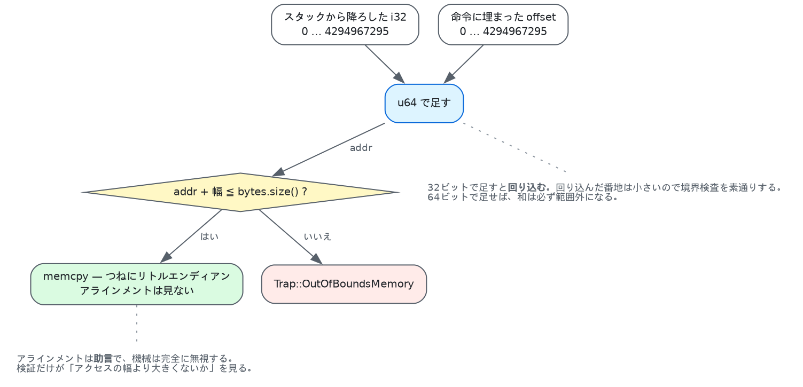

# 7. 線形メモリ — 境界検査とページ

wasm のメモリは、**バイトの連続した配列**です。それだけです。ポインタも、
アドレス空間も、保護属性も、マップされていない穴もありません。

その素朴さが、この言語の安全性のほとんどを引き受けています。この章はその代償と、
仕様が細かく決めているいくつかの点の話です。

## 7.1 番地は i32 と定数の和

すべてのロードとストアは、スタックから i32 を1つ取り、命令に埋め込まれた
オフセットを足します。

```cpp
case Op::I32Load: {
  const u64 addr = u64{pop_u32()} + in.b;
  u32 v{};
  if (!load_raw(*mem, addr, v)) return;
  push(Value::of_i32(v));
  break;
}
```
（`exec.cppm:527` のマクロ展開）



`u64` で足しているのが要点です。i32 の番地は最大 4294967295、オフセットも最大
4294967295 なので、32ビットで足すと**回り込みます**。回り込んだ番地は小さいので、
境界検査を素通りしてしまう。64ビットで足せば、和は必ず範囲外になります。

```cpp
bool bounds(const MemInst& mem, u64 addr, u64 size) {
  if (addr + size > mem.bytes.size()) {
    fail(Trap::OutOfBoundsMemory,
         std::format("{} bytes at {:#x}, memory is {} bytes", size, addr, mem.bytes.size()));
    return false;
  }
  return true;
}
```
（`exec.cppm:81`）

```
$ weasel run tests/wat/02-memory.wat --invoke load --arg 65533
weasel: trap: out of bounds memory access: 4 bytes at 0xfffd, memory is 65536 bytes
```

4バイト読むのに 65533 から始めると、最後の1バイトが1ページの外に出ます。

## 7.2 アラインメントはヒントである

命令にはアラインメントも埋め込まれています。ところがこれは**性能の助言**であって、
守らなければ何かが起きるものではありません。

```wasm
(i32.load align=1 (local.get 0))   ;; 「たぶん揃っていない」
(i32.load align=4 (local.get 0))   ;; 「たぶん4バイト境界」（既定）
```

機械はこれを完全に無視します。揃っていないアクセスも普通に動きます。

検証だけは1つ見ます。**アクセスの幅より大きいアラインメントは書けない**。

```cpp
void check_align(const Inst& in) {
  if (in.a > op_info(in.op).natural_align)
    fail(std::format("alignment 2^{} is larger than the {} byte access", in.a,
                     1u << op_info(in.op).natural_align));
}
```
（`validate.cppm:363`）

```
$ echo '(module (memory 1) (func (result i32) (i32.load align=8 (i32.const 0))))' > a.wat
$ weasel check a.wat
weasel: a.wat: func[0]: instruction 1: alignment 2^3 is larger than the 4 byte access
```

`i32.load align=8` は「4バイト読むが8バイト境界に揃っている」で、意味を成しません。
逆向き（`align=1`）は正当です。「揃っているとは限らない」は、いつでも言えるから。

## 7.3 リトルエンディアン、ホストが何であれ

```cpp
template <typename T>
bool load_raw(const MemInst& mem, u64 addr, T& out) {
  if (!bounds(mem, addr, sizeof(T))) return false;
  T v{};
  std::memcpy(&v, mem.bytes.data() + addr, sizeof(T));
  if constexpr (std::endian::native == std::endian::big) v = std::byteswap(v);
  out = v;
  return true;
}
```
（`exec.cppm:95`）

wasm はリトルエンディアンと決まっています。ホストがビッグエンディアンでも、
プログラムから見える結果は同じでなければならない。

```
$ weasel run tests/wat/02-memory.wat --invoke load --arg 0
67305985
```

`(data (i32.const 0) "\01\02\03\04")` を i32 として読むと 0x04030201 = 67305985。
バイトの並びがそのまま数の下から上へ対応します。

`memcpy` を使っているのは、揃っていないアクセスを未定義動作にしないためです。
最適化されたビルドでは1命令に潰れます。

## 7.4 `grow` は値で失敗する

wasm で**プログラムが対処することを期待されている失敗**は1つだけです。

```cpp
i32 grow(u32 delta) {
  const u32 old = pages();
  const u64 want = u64{old} + delta;
  const u32 ceiling = has_max ? max_pages : kMaxPages;
  if (want > ceiling) return -1;
  bytes.resize(static_cast<std::size_t>(want) * kPageSize, 0);
  return static_cast<i32>(old);
}
```
（`store.cppm:36`）

成功すれば**伸ばす前の**ページ数、失敗すれば -1。

```
$ weasel run tests/wat/02-memory.wat --invoke size
1
$ weasel run tests/wat/02-memory.wat --invoke grow --arg 1
1
```

（それぞれ別のインスタンスなので、2つめの `grow` は「1ページだったものを2ページに
した」と言っています。テストの中では同じインスタンスで続けて呼ぶので、
`size` → 1、`grow 1` → 1、`size` → 2、`grow 1` → -1 と進みます。上限が2ページ
だからです。）

新しいページは**ゼロで埋まります**。これは仕様です。`malloc` が返す領域が未初期化
であるのとは違って、wasm のメモリは伸びた瞬間から観測可能で、そこに前のプログラムの
残骸があってはいけない。

1ページは 64 KiB、最大は 65536 ページ = 4 GiB。i32 の番地で届く範囲がちょうど
それです。

## 7.5 バルクメモリ — `memcpy` を命令にする

`memory.fill` `memory.copy` `memory.init` は、ループを書かずに済ませるためのもの
です。実装はほぼそのまま標準ライブラリです。

```cpp
case Op::MemoryCopy: {
  const u32 n = pop_u32();
  const u32 s = pop_u32();
  const u32 d = pop_u32();
  if (!bounds(*mem, s, n) || !bounds(*mem, d, n)) return;
  std::memmove(mem->bytes.data() + d, mem->bytes.data() + s, n);
  break;
}
```
（`exec.cppm:492`）

`memmove` であって `memcpy` ではありません。重なっていてもよいと仕様が言っている
からです。

境界検査が**先に両方**行われることに注意してください。仕様は「1バイトずつ写して
途中でトラップしてもよい」とは言っていません。長さ0のときは、番地が範囲外でも
トラップしません（`bounds(mem, d, 0)` は `d <= size` を見る）。

`memory.init` はパッシブなデータセグメントから写します。

```cpp
case Op::MemoryInit: {
  const auto& seg = f->inst->datas[in.a];
  const u32 n = pop_u32(), s = pop_u32(), d = pop_u32();
  if (u64{s} + n > seg.size()) { fail(Trap::OutOfBoundsData, ...); return; }
  if (!bounds(*mem, d, n)) return;
  if (n) std::memcpy(mem->bytes.data() + d, seg.data() + s, n);
  break;
}
```
（`exec.cppm:500`）

失敗が2種類あります。セグメントの外を読もうとしたか、メモリの外へ書こうとしたか。
Weasel はそれを別のトラップにしています（`Trap::OutOfBoundsData` と
`Trap::OutOfBoundsMemory`）。仕様は区別しませんが、メッセージが違うほうが助かります。

`data.drop` はセグメントを空にします。

```cpp
case Op::DataDrop:
  f->inst->datas[in.a].clear();
  f->inst->data_dropped[in.a] = true;
  break;
```

落としたあとの `memory.init` は、長さ0なら成功し、それ以外はトラップします。
**「落とした」は「長さ0になった」と同じ**であることが、この短さの理由です。

## 7.6 表も同じ話をする

表はメモリと同じ構造で、単位が `Value` になっただけです（[5章](05-instantiate.md)）。
だから同じ命令がひととおりあります — `table.size` `table.grow` `table.fill`
`table.copy` `table.init` `elem.drop`。

違うのは2つ。

- **要素は1つずつ写す**。`memmove` は使えません（`Value` の配列だから、というより
  重なりの向きを自分で見ています）。
- **型がある**。`table.copy` は同じ参照型どうしでなければならず、検証がそれを見ます
  （`validate.cppm:685`）。

```cpp
if (d <= s)
  for (u32 i = 0; i < n; ++i) dst.elems[d + i] = src.elems[s + i];
else
  for (u32 i = n; i-- > 0;) dst.elems[d + i] = src.elems[s + i];
```
（`exec.cppm:441`）

同じ表の中で重なるときのために、向きを選んでいます。

## 7.7 メモリを持たないモジュール

メモリは必須ではありません。`gcd` にはありません（[0章](00-overview.md)）。
その場合、メモリを触る命令は**検証で**弾かれます。

```
$ echo '(module (func (result i32) (i32.load (i32.const 0))))' > n.wat
$ weasel check n.wat
weasel: n.wat: func[0]: instruction 1: this instruction needs a memory, and there is none
```

実行時に `mem` が null かどうかを見る必要はありません。検証が通ったモジュールなら、
メモリを触る命令がある関数のフレームには必ずメモリがあります。

---

## していないこと

- **複数メモリ**。命令の側の準備（`memarg` の bit 6、`memory.copy` の2つの添字）は
  読めるようにしてありますが、検証が2つ以上を断ります。
- **メモリ64**。番地が i64 になる提案。`bounds` の型はもう `u64` なので、
  変わるのは検証と、`memarg` のオフセットの幅です。
- **共有メモリとアトミック**。`SharedArrayBuffer` の側。1つのメモリを複数のスレッドが
  触るので、この章の話が全部変わります（[10章](10-next.md)）。
- **メモリ保護によるガードページ**。本気の処理系は、4 GiB + ガード領域を予約して
  境界検査を MMU に任せます。Weasel は `std::vector` を使い、毎回比較します。

## 参考文献

- **WebAssembly Core Specification**, Section 4.4.7 "Memory Instructions"。
  境界検査と長さ0の扱いはここに書いてあるとおりです。
- **The Bulk Memory Operations proposal**。`memory.init` と `data.drop` の由来。
- 境界検査をどう消すかは仕様の外の話で、各エンジンの実装記事にあります。64ビットの
  ホストで 4 GiB + ガード領域を予約し、比較を MMU に肩代わりさせる、というのが
  標準的な答えです。

## 実装の地図

| 場所 | 何があるか |
|---|---|
| `src/store.cppm:26` | `MemInst` と `grow` |
| `src/exec.cppm:81` | `bounds` — 64ビットで足してから比べる |
| `src/exec.cppm:95` | `load_raw` / `store_raw` — リトルエンディアン固定 |
| `src/types.cppm:264` | `kPageSize` と `kMaxPages` |
| `src/validate.cppm:360` | `check_memory` / `check_align` |

---

[← 6. 実行ループ](06-exec.md) · [8. 浮動小数点 →](08-float.md)
