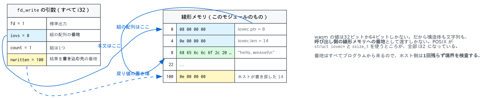

# 9. ホスト関数と WASI — 「システム」に特別なところは無い

wasm のモジュールは、自分では何も外に出せません。数を計算してメモリを書き換えることは
できても、その結果を誰かに見せる手段が言語に無い。

だから輸入するしかありません。そして輸入されたホスト関数は、**呼ぶ側から見れば
普通の関数**です。この章は、その「普通さ」がどこまで本当かの話です。

## 9.1 ホスト関数は署名と `std::function`

```cpp
using HostFn = std::function<void(Caller&, std::span<const Value>, std::span<Value>)>;

u32 add_host(std::string name, FuncType type, HostFn fn) {
  FuncInst f;
  f.type = std::move(type);
  f.host = std::move(fn);
  f.host_name = std::move(name);
  return add_func(std::move(f));
}
```
（`store.cppm:68`, `store.cppm:128`）

これで全部です。署名と、引数の span と結果の span を受け取る関数。
`FuncInst` は wasm の関数と同じ型なので（[5章](05-instantiate.md)）、表に入れて
`call_indirect` で呼ぶこともできます。

呼ぶ側の分岐は1つ、`is_host()` を見るだけ（[6章](06-exec.md)）。

## 9.2 `Caller` — 呼んだ側のメモリ

ホスト関数が触りたいのは、たいてい**呼んだ側の線形メモリ**です。それを渡すのが
`Caller` です。

```cpp
struct Caller {
  Store* store = nullptr;
  Instance* instance = nullptr;
  Trap trap = Trap::None;
  std::string message;
  i32 exit_code = 0;

  MemInst* memory() const {
    if (!instance || instance->mems.empty()) return nullptr;
    return &store->mems[instance->mems[0]];
  }
  void fail(Trap t, std::string msg = {}) { ... }
};
```
（`store.cppm:139`）

`instance` は**呼び出し側**のインスタンスです（`exec.cppm:209`）。ホスト関数自身は
どのインスタンスにも属していないので、メモリを持ちません。

`fail` があるのは、ホスト関数も失敗できるからです。ポインタがメモリの外を指していた
ときなど、トラップさせるしかない。

## 9.3 WASI は5行の考え方でできている

WASI（`wasi_snapshot_preview1`）は、名前が決まっているホスト関数の集まりです。
仕組みは1つしかありません。

**wasm の値は32ビットか64ビットしかないので、それ以外は全部、呼び出し側の線形メモリ
への番地として渡す。**

`fd_write` を見ます。

```wasm
(import "wasi_snapshot_preview1" "fd_write"
  (func $fd_write (param i32 i32 i32 i32) (result i32)))
```

4つの i32 は、順に

1. ファイル記述子
2. `(番地, 長さ)` の組の配列の番地
3. その組の個数
4. 「書けたバイト数」を書き込む先の番地

戻り値は errno です。POSIX が `struct iovec*` と `ssize_t` を使うところが、
全部 i32 になっています。

手で書くとこうなります（`tests/wat/06-wasi.wat`）。

```wasm
(module
  (import "wasi_snapshot_preview1" "fd_write"
    (func $fd_write (param i32 i32 i32 i32) (result i32)))

  (memory (export "memory") 1)
  ;; 0..7 is the iovec: a pointer and a length. 8.. is the text.
  (data (i32.const 0) "\08\00\00\00\0e\00\00\00")
  (data (i32.const 8) "hello, weasel\n")

  (func (export "_start")
    (drop (call $fd_write (i32.const 1) (i32.const 0) (i32.const 1) (i32.const 100))))
)
```

番地0から8バイトが iovec 1つ。リトルエンディアンの u32 が2つで、
`0x00000008`（テキストの番地）と `0x0000000e`（14バイト）。

```
$ weasel run tests/wat/06-wasi.wat
hello, weasel
```



実装側は、その組をたどってバイトを流すだけです。

```cpp
bool for_each_iov(Mem& mem, u32 iovs, u32 count, auto&& fn) {
  for (u32 i = 0; i < count; ++i) {
    u32 ptr = 0, len = 0;
    if (!mem.get32(iovs + i * 8, ptr) || !mem.get32(iovs + i * 8 + 4, len)) return false;
    if (!fn(ptr, len)) return false;
  }
  return true;
}
```
（`wasi.cppm:88`）

`Mem` は「境界を見ながら線形メモリを読み書きする小さな道具」です（`wasi.cppm:49`）。
番地はすべてプログラムから来るので、**1回残らず検査しなければなりません**。
ホスト関数はサンドボックスの穴になりうる唯一の場所です。

## 9.4 `proc_exit` はトラップとして書かれる

ホスト関数は「戻らない」ことができません。C++ の関数だからです。
`proc_exit` は戻ってはいけないので、トラップとして表現します。

```cpp
def("proc_exit", sig({I}, {}),
    [](Caller& c, std::span<const Value> a, std::span<Value>) {
      c.exit_code = static_cast<i32>(a[0].i32());
      c.fail(Trap::Exit);
    });
```
（`wasi.cppm:110`）

`Trap::Exit` は失敗ではありません。埋め込む側がそれを見分けます
（[6章](06-exec.md)、`main.cpp:185`）。

## 9.5 名前が同じ形をしているもの

`args_get` と `environ_get` は、まったく同じ形をしています。ポインタの配列と、
NUL 区切りの文字列を並べた領域。大きさは対になる `*_sizes_get` で先に訊きます。

Weasel はそれを2回書かず、クロージャを返す関数を2つ用意して4つに使い回しています。

```cpp
const auto strings_get = [](std::vector<std::string>* v) {
  return [v](Caller& c, std::span<const Value> a, std::span<Value> r) {
    Mem mem{c.memory(), &c};
    u32 ptrs = a[0].i32();
    u32 buf = a[1].i32();
    for (const auto& s : *v) {
      if (!mem.put32(ptrs, buf)) return;
      ptrs += 4;
      if (!mem.put_bytes(buf, s)) return;
      ...
```
（`wasi.cppm:211`）

```cpp
def("args_sizes_get", sig({I, I}, {I}), strings_sizes(&cfg.args));
def("args_get", sig({I, I}, {I}), strings_get(&cfg.args));
def("environ_sizes_get", sig({I, I}, {I}), strings_sizes(&cfg.env));
def("environ_get", sig({I, I}, {I}), strings_get(&cfg.env));
```

「2段階で訊く」という形が WASI のいたるところに出てきます。呼ぶ側が先に大きさを
知って、自分のメモリを確保してから、もう一度呼ぶ。ホストが呼び出し側のメモリを
勝手に伸ばせない以上、これしかありません。

## 9.6 何を実装し、何を断るか

Weasel の WASI は、標準入出力のためのものだけです。

| 関数 | すること |
|---|---|
| `fd_write` | fd 1 と 2 を stdout / stderr へ。それ以外は `EBADF` |
| `fd_read` | fd 0 を stdin から |
| `fd_close` / `fd_seek` / `fd_fdstat_get` | libc が「これはファイルではない」と結論するのに足りるだけ |
| `args_*` / `environ_*` | 引数と環境変数 |
| `clock_time_get` / `random_get` | 時刻と乱数 |
| `proc_exit` | 終了 |
| `fd_prestat_get` / `path_open` | **断る**（`EBADF` / `ENOTCAPABLE`） |

最後の行が要点です。**断ることも実装のうち**です。

```cpp
def("fd_prestat_get", sig({I, I}, {I}),
    [](Caller&, std::span<const Value>, std::span<Value> r) {
      r[0] = Value::of_i32(kEBadf);  // no preopened directories at all
    });
```
（`wasi.cppm:185`）

wasi-libc は起動時に `fd_prestat_get` を 3, 4, 5, ... と呼んで、
「開いてもらってあるディレクトリ」を数えます。`EBADF` を返せばそこで止まる。
関数が存在しなければ**輸入の解決に失敗してインスタンス化ごと死ぬ**ので、
「あるが、何もできない」と答えるほうがずっとましです。

WASI がケイパビリティベースだというのは、この形のことです。番号で開ける
ディレクトリしか触れない。何も渡さなければ何も触れない。

## 9.7 もう1つのホストモジュール

同じ仕組みで、隣の [`Ferret`](../../Ferret) が輸入する `env` も用意してあります。

```cpp
def("say", FuncType{{I, I}, {}},
    [&log](Caller& c, std::span<const Value> a, std::span<Value>) {
      MemInst* mem = c.memory();
      const u64 ptr = a[0].i32();
      const u64 len = a[1].i32();
      if (!mem || ptr + len > mem->bytes.size()) {
        c.fail(Trap::OutOfBoundsMemory, "say() outside linear memory");
        return;
      }
      std::string s(reinterpret_cast<const char*>(mem->bytes.data() + ptr), len);
      ...
```
（`host.cppm:27`）

`say(ptr, len)` は `fd_write` と同じことを1行でやっています。「テキストを渡す」は
「自分のメモリの一部を指す」ことだ、という点で両者に違いはありません。

ブラウザでは同じ `env` をページが提供します。Ferret のワーカーの中身は
`say: (ptr, len) => new TextDecoder().decode(new Uint8Array(memory.buffer, ptr, len))`
で、上の C++ と同じことをしています。

だから Ferret がコンパイルしたものが、そのまま端末で動きます。

```
$ cd ../Ferret && dune build
$ ./_build/default/compiler/bin/ferretc.exe examples/pi.json -o /tmp/pi.wasm
ferretc: wrote /tmp/pi.wasm (328 bytes)
$ cd ../Weasel && ./build/weasel run /tmp/pi.wasm --invoke main
4
4 (0x4010000000000000)
```

1行目は `log` が出したもの、2行目は `main` の戻り値です。

## 9.8 ホスト関数はサンドボックスの唯一の穴

ここまでの章で見てきた安全性 — 境界検査、型検査、構造化制御フロー — は、
**wasm のコードに対するもの**です。ホスト関数の C++ には何の保証もありません。

`Mem::in_bounds` を1回忘れれば、モジュールは `weasel` のプロセスのメモリを
好きに読めます。

```cpp
bool in_bounds(u64 addr, u64 n) {
  if (!m || addr + n > m->bytes.size()) {
    c->fail(Trap::OutOfBoundsMemory, "WASI argument is outside linear memory");
    return false;
  }
  return true;
}
```
（`wasi.cppm:53`）

`u64` で足しているのは[7章](07-memory.md)と同じ理由です。この関数を通らない
メモリアクセスが `wasi.cppm` に1つも無いこと — それがこのファイルで唯一
気をつけていることです。

---

## していないこと

- **ファイルシステム**。`path_open` は `ENOTCAPABLE` を返します。preopen の仕組みを
  入れるなら、`WasiConfig` にディレクトリの表を足して `fd_prestat_*` から返すのが
  素直な道です。
- **ソケット、ポーリング、シグナル**。`poll_oneoff` は `EINVAL`。
- **WASI preview 2 / コンポーネントモデル**。インターフェイス型と、それを wasm の
  値に落とす規約が入るので、この章の「番地で渡す」は隠れます。仕組みとしては
  同じことをコード生成でやっているだけですが、量が桁違いです。
- **スレッド**。`wasi_thread_spawn` はメモリの共有を前提にします
  （[10章](10-next.md)）。

## 参考文献

- **WASI snapshot preview1** の `witx` 定義。各関数の引数の意味はここにあります。
- **wasi-libc**。実際に何が呼ばれるかは、これを読むのがいちばん早い。
  `fd_prestat_get` のループもここにあります。
- [`Ferret/doc/editor.md`](../../Ferret/doc/editor.md) — 同じ `env` をブラウザ側で
  提供している章。

## 実装の地図

| 場所 | 何があるか |
|---|---|
| `src/store.cppm:68` | `HostFn` — ホスト関数の型 |
| `src/store.cppm:128` | `add_host` |
| `src/store.cppm:139` | `Caller` — 呼び出し側のメモリと、失敗の置き場 |
| `src/wasi.cppm:49` | `Mem` — 境界を見る道具 |
| `src/wasi.cppm:88` | `for_each_iov` — WASI 唯一のデータ構造 |
| `src/wasi.cppm:103` | `add_wasi` — 名前と署名の一覧 |
| `src/host.cppm:27` | `add_env` — Ferret が輸入するもの |
| `src/exec.cppm:200` | `call_host` — 呼ぶ側 |

---

[← 8. 浮動小数点](08-float.md) · [10. あと何が要るか →](10-next.md)
