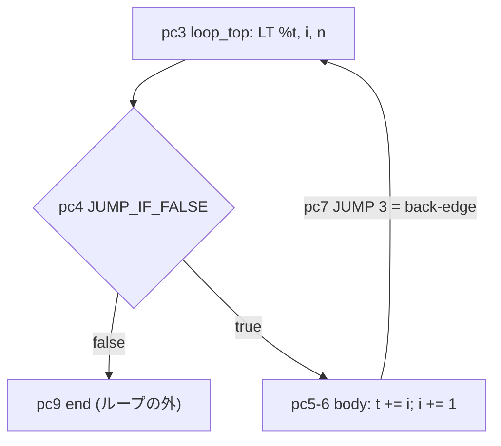
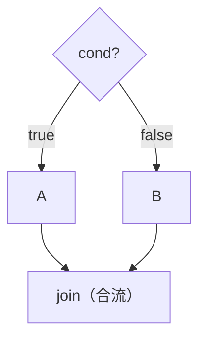
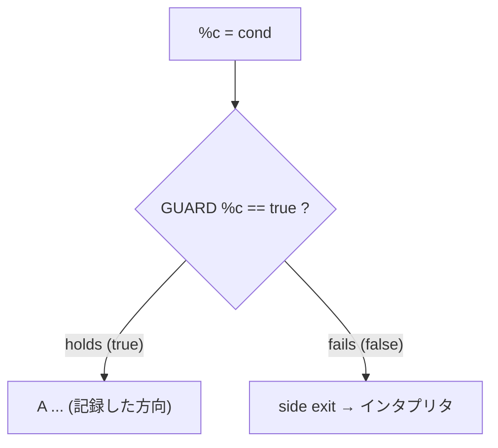
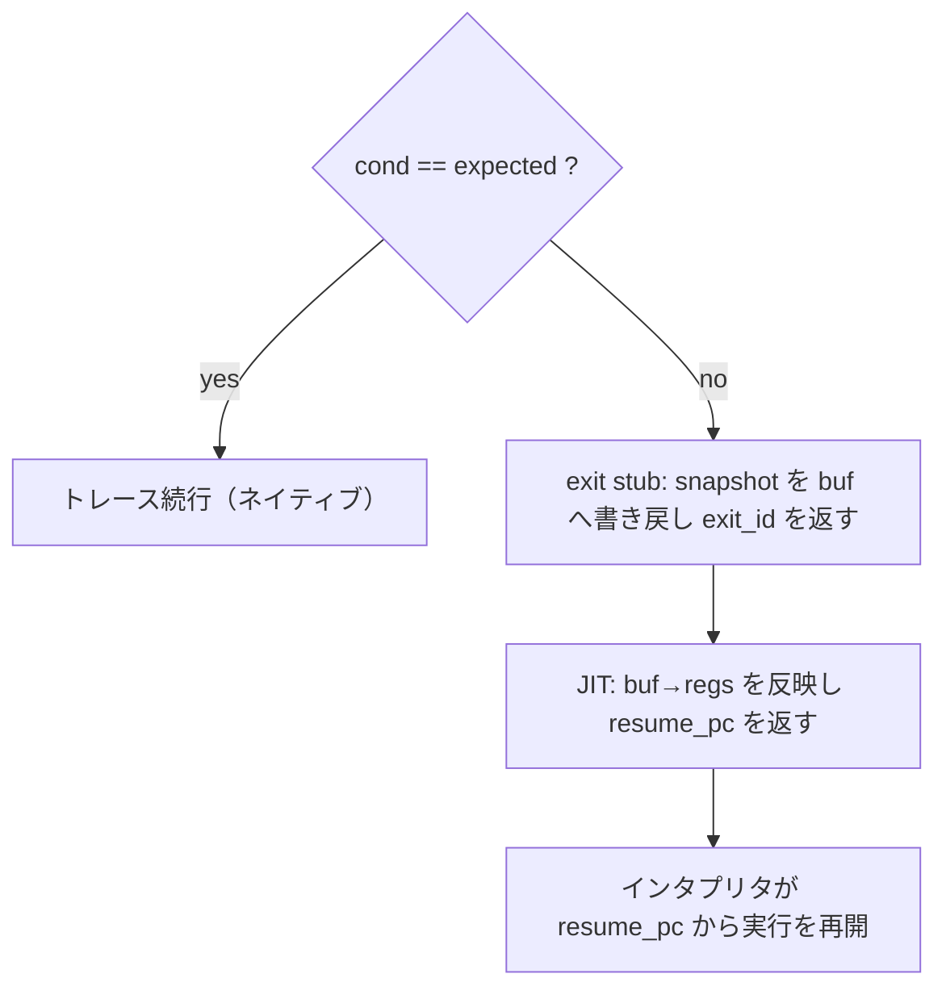

# MinPython JIT 設計解説

レジスタ VM の上に載る3つのネイティブコードコンパイラと、それらが共有する
1つのレジスタアロケータで構成される。

| モジュール | 役割 | トリガ |
|-----------|------|--------|
| `tracing.py` | **トレーシング JIT** — IR + recorder + codegen + `TracingJIT` ドライバ | ホットな `while` の back-edge |
| `method.py` | **メソッド JIT** — 関数まるごとの CFG コンパイラ（`MethodJIT` / `compile_method`） | ホットな関数呼び出し |
| `stencil.py` | **baseline (stencil) JIT** — C テンプレートからの copy-and-patch（`compile_stencil`） | tiered ドライバ経由 |
| `tiered.py` | **`TieredJIT`** — tier1=stencil / tier2=regalloc、バックグラウンドコンパイル | ホットな関数呼び出し |
| `regalloc.py` | 共有の線形スキャンコア（`linear_scan` / `Spill` / `Interval`） | — |

いずれもリポジトリ直下の `jit` パッケージ（x86-64 の `Assembler` / `Runtime`）を
使って機械語を吐く。`minpython.jit` はこの `jit` とは**別パッケージ**で、これらの
モジュール内の `from jit import …` は絶対 import としてアセンブラ側に解決される。

すべて **int 一択**である。JIT 化されたコード中の MinPython 値はすべて 64bit 整数
（bool も整数）なので、型ノードも型 guard も存在せず、あるのは制御フロー guard だけ。
サブセット外（`//`/`%`/`**`、global、print、コンパイラが解決できない呼び出しなど）は
インタプリタへ abort するので、JIT が結果を変えることはない — 差分テストが全
バックエンドを素の VM と突き合わせて保証している。

## バイトコード（`../minpython/bytecode.py`）

スタックマシンではなく**レジスタ**マシン。各 `CodeObject` は関数（あるいは
`<module>` トップレベル）で、フラットなレジスタファイル（下位スロットにローカル、
その上にテンポラリ）、定数プール、グローバル名プール、命令列を持つ。命令は
`Instr(op, a, b, c)` — opcode と最大3オペランド（未使用は 0）。この形のおかげで、
レジスタ演算のトレースが x86-64 命令にほぼ1対1で対応する。

opcode 群（`Op`）:

```
LOAD_CONST a,k    regs[a] = consts[k]        MOVE a,b       regs[a] = regs[b]
LOAD_GLOBAL a,n   regs[a] = globals[names[n]]
STORE_GLOBAL n,b  globals[names[n]] = regs[b]
MAKE_FUNCTION a,k regs[a] = Function(consts[k], globals)
<binop> a,b,c     regs[a] = regs[b] OP regs[c]   (ADD SUB MUL FLOORDIV MOD POW
                                                  BIT_AND BIT_OR BIT_XOR LSHIFT RSHIFT)
<unary> a,b       regs[a] = OP regs[b]           (NEG POS INVERT NOT)
<cmp>   a,b,c     regs[a] = (regs[b] CMP regs[c])  -> bool   (EQ NE LT LE GT GE)
JUMP t                          JUMP_IF_FALSE a,t   JUMP_IF_TRUE a,t
CALL a,f,argc     regs[a] = call(regs[f], regs[f+1 .. f+argc])
RETURN a          PRINT base,argc
```

演算子ごとに opcode を分けている（`BINARY_OP` + 演算子オペランド、ではない）ので、
VM のディスパッチも JIT の codegen も opcode に対するフラットな分岐になる。

### back-edge とは（ループを閉じる後方ジャンプ）

`while` は次のようなバイトコードにコンパイルされる。末尾に**先頭へ戻る `JUMP`** が
1つ入るのがポイント:

```
#  while i < n:  t = t + i;  i = i + 1   をコンパイルすると:

3  loop_top: LT %t, i, n
4            JUMP_IF_FALSE %t, 9   # 前方ジャンプ: 偽なら end へ抜ける
5            ADD t, t, i
6            ADD i, i, 1
7            JUMP 3                # back-edge: 先頭 pc3 へ後方ジャンプ
9  end: ...
```

制御フローで見ると、末尾の `JUMP 3` がヘッダへ戻る **back-edge**（loop を閉じる辺）:



**back-edge** とは、この末尾の `JUMP 3`（＝`JUMP loop_top`）のこと — 命令列上で
**より小さい pc へ戻る後方ジャンプ**で、ループを「閉じている」辺。用語は制御フロー
グラフ由来で、ループヘッダへ戻る辺を back-edge と呼ぶ。バイトコード列では「後方＝
自分より小さい pc への `JUMP`」がそれに対応する（VM は `JUMP` の飛び先 `t <= pc` で
判定している）。

ループの**1反復ごとに必ずここを通る**ので、back-edge は3つの役割を持つ:

* **ホットループ検出のカウント地点** — `vm.loop_counts[(code, target)]` を back-edge
  ごとに +1。上の例なら pc3 が `target`。
* **トレーシング JIT のトリガ兼アンカー** — カウントが閾値を超えたら、その飛び先
  （ヘッダ pc3）から1反復を記録する。
* **「ループが閉じた」判定** — 記録中に、開始した back-edge へ戻ってきたらトレース
  完成。

なお `JUMP_IF_FALSE`（pc4）は**前方**ジャンプ（`end` へ抜ける）で back-edge では
ない。ループ本体を1回だけ流したいトレースは、この pc4 を「ループ継続 guard」に
変える（偽なら `end` へ脱出＝ループの正常終了）。

## トレース IR（`tracing.py` の IR セクション）

**線形・SSA・整数専用**の IR。`Trace` は `IRInst` の直線的なリストで、命令の
インデックスがそのまま SSA 参照になる（オペランドは ref だけ、名前解決は不要）。
値 op はハッシュコンス（＝CSE がタダで効く）。

### なぜ SSA なのに phi ノードが無いのか

古典的 SSA は制御フローの**合流点（join）**で、複数の先行ブロックから来る値を
マージするために **phi** ノードを必要とする。**トレースは1本の直線パスなので
合流点が無い** — 分岐は `GUARD` になってトレースから*脱出*し、両腕が再合流する
ことはない。マージすべきものが無い ⇒ phi も無い。（これはトレース IR の標準的な
性質で LuaJIT も同じ。guard は phi の代わりではなく、`if` を side exit に変える
制御フローである。）

唯一の本当の合流は**ループ back-edge**。ループを跨ぐローカルの「ループ先頭での値」と
「一周してきた末尾での値」がマージされる — これは phi そのものだが、IR ノードでは
なく**暗黙表現**される:

* `LOAD(slot)` — ループ先頭の値（live-in）。読むローカル1つにつき1 ref。
* `carried[slot]` — そのローカルの back-edge 時点の値を持つ ref。
* codegen の **phi move** — back-edge で `reg(LOAD) ← reg(carried)` を発行する
  （レジスタの並列移動。真の swap サイクルのときだけバッファ経由）。

この3点セットが phi の lowering そのもの（＝入辺上のコピー）。コード中では
`phi_slots` / phi register / phi move と呼んでいる部分がこれ。

### guard — 分岐を「トレースからの脱出」に変える

トレースは**1本の実行パスしか記録しない**。recorder は各条件分岐で、具体実行が
どちらへ進んだかを見て、その方向を*断定する* `GUARD(cond, expected)` を吐く。
意味は「実行時に `cond` が記録した向き（`expected`）のままなら、このトレースは
このまま有効。違ったら、この入力に対してトレースはもう正しくない ⇒ **脱出**」。

つまり guard は、2方向の分岐を「**記録した1方向をインライン展開＋もう一方を
side exit**」へと変換する。これがトレースが直線（合流しない）である理由そのもの。

バイトコードの `if` は2方向に分かれて再合流する（ダイヤモンド。合流点は古典 SSA
なら phi が要る形）:



トレースは記録した1方向だけを直線化し、もう一方を guard の side exit にする（B は
トレースに存在しない）:



`cond` は分岐条件の値の ref、`expected` は記録時に取った真偽（True/False）。
codegen は各 guard を `test cond,cond` ＋ `jz`/`jnz exit_stub` に落とす — 条件が
`expected` から外れたら exit stub へジャンプする。

### スナップショットと復帰

guard が外れたときインタプリタへ**正しく引き継ぐ**ために、各 guard は
`Snapshot(resume_pc, {ローカルスロット → ref})` を持つ。exit stub は、この
スナップショットにある「変更済みローカルの現在値」を VM のレジスタバッファへ
書き戻し、`exit_id` を返す。JIT はそれを `resume_pc` に対応付け、`regs` を更新して、
インタプリタを `resume_pc` から続行させる。

実行時に GUARD へ到達したときのフロー:



スナップショットに現れるのは**名前付きローカルだけ**である。コンパイラはどの
テンポラリも jump target を跨いで生存させず、`resume_pc` は必ず jump target なので、
テンポラリはインタプリタが再計算するだけでよい（比較テンポラリの bool/int 問題も
これで回避される）。また guard は**型 guard ではなく制御フロー guard** — int 一択の
不変条件のおかげで、値の型について確認すべきことは何も無い。

### 2種類の guard exit（collatz を例に）

内側ループ:

```python
while y != 1:
    if y & 1:  y = 3*y + 1      # 奇数
    else:      y = y >> 1       # 偶数
    total = total + 1
```

y が奇数のときに記録したトレースはこうなる:

```
loop_top:
   %0 = (y != 1)
   GUARD %0 == true  --[false: y==1]-->    exit_loop   # => ループ終了pc（正常終了!）
   %1 = (y & 1)
   GUARD %1 == true  --[false: y is even]->  exit_even # => else節のpc  <== collatzでホット
   y     = 3*y + 1
   total = total + 1
   jmp loop_top
```

ここに guard exit の2つの役割が両方現れている:

* **ループ条件 guard**（`y != 1`）— 失敗＝ループの**正常終了**。`while` の終了さえ
  guard exit で表現される（`exit_loop` の resume_pc はループ直後の pc）。エレガント。
* **本体内の分岐 guard**（`y & 1`）— 失敗＝記録と違う分岐を取った。resume_pc は
  もう一方の腕（else 節）の pc。collatz はパリティがほぼ半々で反転するので
  `exit_even` が頻繁に失敗する ⇒ ここに**サイドトレース**（後述）が貼られ、
  even 側もネイティブのまま実行され続ける。

## アルゴリズム

**トレーシング**（`record` → `compile_trace` → `TracingJIT`）。back-edge がホットに
なると、recorder はレジスタの*コピー*上でループを1反復実行し（分岐方向が分かり、
実フレームは無傷）、IR と分岐ごとの guard を吐く。開始した back-edge に戻ってきた
時点でループが閉じる。キャッシュ済みトレースは guard 失敗までネイティブでループし、
失敗するとスナップショットがローカルを復元して JIT が resume pc をインタプリタへ返す。

* **LICM** — `loop_invariants` が「入力がすべて不変（定数と非carriedな live-in、
  推移的に）」な ref を印付けし、codegen がそれらを1回だけ走るプリヘッダへ hoist
  してループ生存に印付けする（＝ループ中レジスタ常駐）。
* **サイドトレース** — 頻繁に失敗する guard に、その exit の resume pc からループ
  ヘッダまでを記録した専用トレースを**リンク**する。親の exit がサイドトレースへ
  飛び込み、サイドトレースの終端が本体トレースへ戻る。`_run_chain` がこのリンクを
  辿るので、データ依存の分岐（collatz のパリティ分岐）はインタプリタへ落ちずに
  ネイティブのまま跨げる。

**レジスタ割り当て**（`regalloc.linear_scan`、Poletto & Sarkar）。両コンパイラで共有。
各自が自分の値空間の `Interval(start, end, key)` リストを作って
`linear_scan(intervals, pool) → (loc, used, n_spill)` を呼ぶ。expiry は `<=` を使う
ので、最終使用がある命令の値はその命令の結果にレジスタを譲れる — これが in-place
（two-address）codegen を可能にしている。レジスタ不足時は最も先まで生きる区間を
スピルする。2つの呼び出し側は区間の作り方だけが違う:

* トレース（`_trace_intervals`）— SSA ref 上。反復を跨いで生き残るべきもの
  （live-in phi、carried、スナップショット値、hoist した不変式）は `[0, N]` を与えて
  ループ中ずっと居座らせる。プール は caller-saved（トレース内に call が無いので
  退避不要）。
* メソッド（`_allocate`）— 関数の VM レジスタ上。区間は CFG 生存性から。プールは
  **callee-saved**（RBX/R12–R15）なので、再帰関数が行うネイティブ `call` を跨いでも
  値が保存される。VM レジスタ1つにつき関数全体で1マシン位置なので、分岐合流で移動が
  要らない。

**メソッド JIT**（`compile_method`）。ループの無い関数 CFG まるごとをコンパイル:
後方データフロー生存性解析（`_live_ranges`）、線形スキャン割り当て、per-pc ラベルの
codegen（分岐は実ジャンプ、自己再帰はネイティブ `call entry`）。トレース IR は
**使わない** — トレース IR は*線形*で関数の CFG を表現できないため。2つのコンパイラは
アロケータだけを共有する。

**baseline stencil**（`compile_stencil`、copy-and-patch）。opcode ごとの機械語を C
テンプレートから1回だけコンパイルし、`.text` とリロケーションをオブジェクトファイル
から読む（小さな ELF64 パーサ）。リロケーションが穴の記述そのものになる。関数の
コンパイルは「ステンシルを memcpy して穴（スロット offset・即値・jump/call の rel32）を
パッチ」するだけ — ほぼ即時、スタックスロット品質のコード。フレームポインタは `rbx`
（callee-saved）に固定するので再帰 call を跨いで生存する。

**ティアリング**（`TieredJIT`）。tier1=stencil（コンパイル速い）、tier2=レジスタ
割り当て（実行速い）を、どちらも**バックグラウンド**ワーカースレッドでコンパイル —
ドライバはホット化でキューに積み、インタプリタを止めずに続行し、完成したらロック下で
install（free-threaded 3.14 では真に並列）。tier2 昇格は**密度ゲート**
（`_worth_tier2`）: レジスタ割り当ては算術密度の高いコードでのみ効く（~2.8x）、
呼び出しバウンドな再帰では効かない（~1.2x）ので、呼び出しバウンド関数は安い
baseline のまま据え置く。

## 未着手のスレッド

* バックグラウンドコンパイルは関数 JIT だけにある。共有バックグラウンドコンパイラで
  tracing も対象にできるが、tracing の *record* ステップは live レジスタを読むので
  インタプリタスレッド必須 — 背景化できるのは codegen だけ。
* ネイティブな trace-to-trace リンク（親 exit stub を `jmp` にパッチして Python の
  チェーンホップを除去）、相互再帰 / 関数跨ぎのネイティブ呼び出し、Cython ディスパッチの
  `cdef long` レジスタ化（JIT の固定 64bit オーバーフローと一致させる）。
